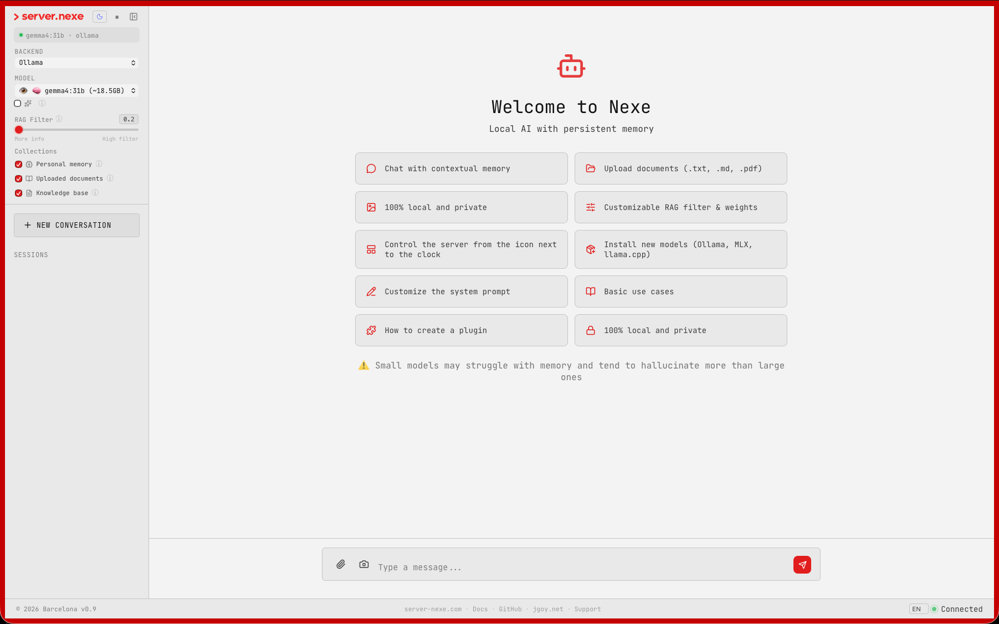
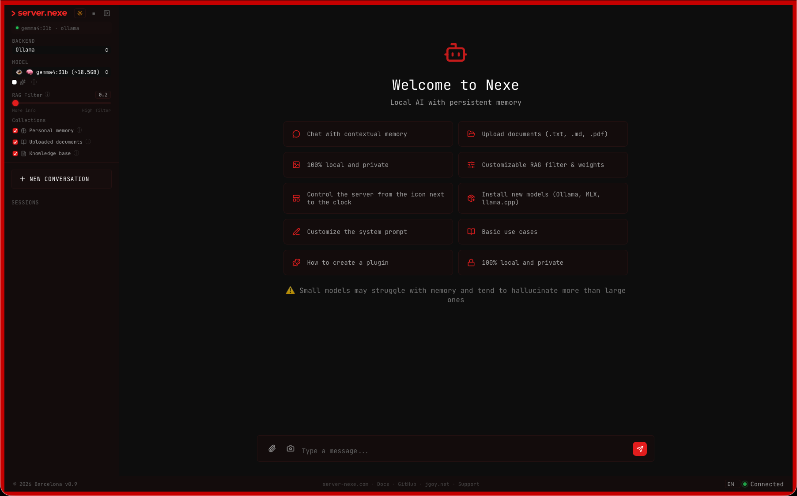
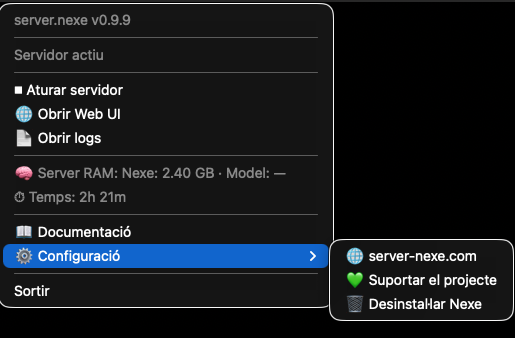
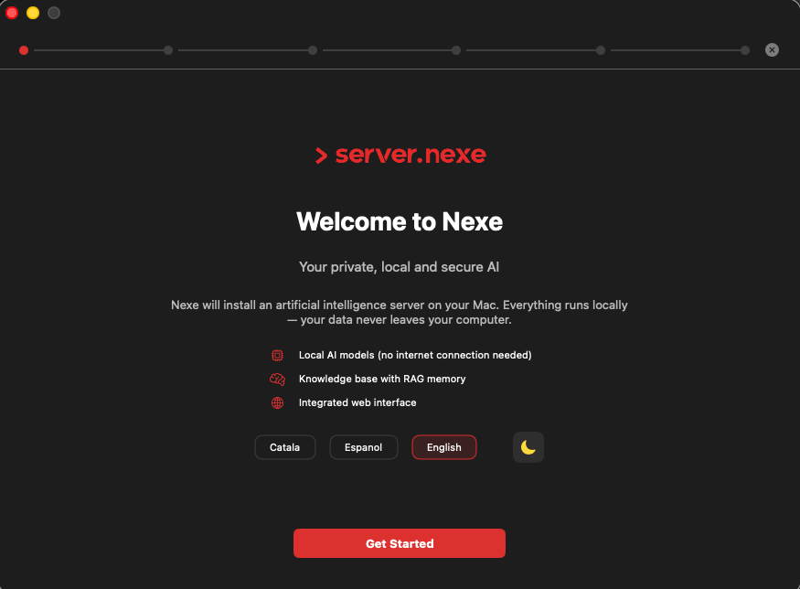

<p align="center">
  
</p>

<p align="center">
  <strong>Servidor d'IA local amb memòria persistent. Zero núvol. Control total.</strong>
</p>

<p align="center">
  <em>He arribat al mínim viable per al món real, però falta feedback. 🚀</em>
</p>

<p align="center">
  <a href="https://github.com/jgoy-labs/server-nexe/actions/workflows/ci.yml"></a>
  
  <a href="LICENSE"></a>
  <a href="https://www.python.org"></a>
  <a href="https://fastapi.tiangolo.com"></a>
</p>

<p align="center">
  <a href="https://qdrant.tech"></a>
  <a href="https://github.com/ml-explore/mlx"></a>
  <a href="https://ollama.com"></a>
  <a href="https://github.com/ggerganov/llama.cpp"></a>
  <a href="https://github.com/jgoy-labs/server-nexe"></a>
  <a href="https://github.com/sponsors/jgoy-labs"></a>
</p>

<p align="center">
  <a href="https://server-nexe.org"><strong>Documentació</strong></a> ·
  <a href="#-inici-ràpid"><strong>Instal·lar</strong></a> ·
  <a href="#-arquitectura"><strong>Arquitectura</strong></a> ·
  <a href="https://github.com/jgoy-labs/server-nexe/releases"><strong>Releases</strong></a>
</p>

<p align="center">
  <a href="README.md"><strong>English</strong></a> ·
  <a href="README-es.md"><strong>Español</strong></a>
</p>

---

## Taula de continguts

- [La Història](#la-història)
- [Captures](#captures)
- [Per Què Server Nexe?](#per-què-server-nexe)
- [Inici Ràpid](#inici-ràpid)
  - [Opció A: Instal·lador DMG (macOS)](#opció-a-installador-dmg-macos)
  - [Opció B: Línia de comandes](#opció-b-línia-de-comandes)
  - [Opció C: Headless (servidors, scripts, CI)](#opció-c-headless-servidors-scripts-ci)
- [Backends](#backends)
- [Models Disponibles per Tiers de RAM](#models-disponibles-per-tiers-de-ram)
- [Arquitectura](#arquitectura)
  - [Pipeline de processament de peticions](#pipeline-de-processament-de-peticions)
- [Sistema de Plugins](#sistema-de-plugins)
- [Documentació AI-Ready](#documentació-ai-ready)
- [Seguretat](#seguretat)
- [Suport de Plataformes](#suport-de-plataformes)
- [Requisits](#requisits)
- [Testing](#testing)
- [Full de Ruta](#full-de-ruta)
- [Limitacions](#limitacions)
- [Contribuir](#contribuir)
- [Agraïments](#agraïments)
- [Avís Legal](#avís-legal)

## La Història

Server Nexe va començar com un experiment de learning-by-doing: *"Què caldria per tenir una IA pròpia i en local amb memòria persistent?"* Com que no faria un LLM, vaig començar a agafar peces per muntar un lego útil per a mi i el meu dia a dia. Una cosa en va portar una altra — backends d'inferència, pipelines RAG, cerca vectorial, sistemes de plugins, capes de seguretat, una interfície web, un instal·lador amb detecció de hardware.

**Tot aquest projecte — codi, tests, auditories, documentació — ha estat construït per una persona orquestrant diferents models d'IA**, tant locals (MLX, Ollama) com al núvol (Claude, GPT, Gemini, DeepSeek, Qwen, Grok...), com a col·laboradors. L'humà decideix què construir, dissenya l'arquitectura, revisa línia i executa test. Les IAs escriuen, auditen i fan stress-test sota direcció humana.

El que va començar com un prototip s'ha convertit en un producte genuïnament útil: 4842 tests, auditories de seguretat, encriptació at-rest, un instal·lador macOS amb detecció de hardware, i un sistema de plugins. No està acabat — hi ha un roadmap ple d'idees — però ja fa el que es proposava: **executar un servidor d'IA a la teva màquina, amb memòria que persisteix, i zero dades sortint del teu dispositiu.**

No intenta competir amb ChatGPT ni Claude. Però sí pot ser complementari per a feines menys feixugues. És una eina open-source per a gent que vol ser propietària de la seva infraestructura d'IA. Construït per una persona a Barcelona, amb IA com a copilot, música, i tossuderia.

Més tècnicament: el que era un **monstre d'espagueti gegant** va acabar destil·lant-se, refactor rere refactor, cap a un **nucli mínim, agnòstic i modular** — on la seguretat i la memòria estan resoltes a la base perquè construir a sobre sigui ràpid i còmode, en col·laboració humà–IA. Si s'ha aconseguit, ho ha de dir la comunitat (la IA diu que sí, però què vols que digui 🤪).

## Captures

<table>
<tr>
<td width="50%" align="center">
  
  <br/><em>Web UI — mode clar</em>
</td>
<td width="50%" align="center">
  
  <br/><em>Web UI — mode fosc</em>
</td>
</tr>
<tr>
<td width="50%" align="center">
  
  <br/><em>Menú del system tray (NexeTray.app)</em>
</td>
<td width="50%" align="center">
  
  <br/><em>Wizard SwiftUI de l'instal·lador (DMG)</em>
</td>
</tr>
</table>

## Per Què Server Nexe?

Les teves converses, documents, embeddings i pesos dels models es queden a la teva màquina. Sempre. Server Nexe combina inferència LLM amb un **sistema de memòria RAG persistent** — la teva IA recorda context entre sessions, indexa els teus documents, i mai truca a casa.

<table>
<tr>
<td width="50%">

### Local i Privat
Cada conversa, document i embedding es queda al teu dispositiu. Sense telemetria, sense crides externes, sense dependència del núvol. Ni tan sols un servidor que t'espiï.

</td>
<td width="50%">

### Memòria RAG Persistent
Recorda context entre sessions usant cerca vectorial Qdrant amb embeddings de 768 dimensions en 3 col·leccions especialitzades: `personal_memory`, `user_knowledge`, `nexe_documentation`.

</td>
</tr>
<tr>
<td width="50%">

### Memòria Automàtica (MEM_SAVE)
El model extreu fets de les converses automàticament — noms, feines, preferències, projectes — i els guarda a memòria dins la mateixa crida LLM, amb zero latència extra. Detecció d'intents trilingüe (ca/es/en), deduplicació semàntica, i esborrat per veu ("oblida que...").

</td>
<td width="50%">

### Inferència Multi-Backend
Canvia entre MLX (natiu Apple Silicon), llama.cpp (GGUF, universal), o Ollama — un canvi de config, mateixa API compatible amb OpenAI.

</td>
</tr>
<tr>
<td width="50%">

### Sistema Modular de Plugins
Plugins auto-descoberts amb manifests independents. Seguretat, web UI, RAG, backends — tot és un plugin. Afegeix capacitats sense tocar el core. Protocol NexeModule amb duck typing, sense herència.

</td>
<td width="50%">

### Instal·lador macOS
DMG amb assistent guiat que detecta el teu hardware, tria el backend adequat, recomana models per la teva RAM, i et posa en marxa en minuts.

</td>
</tr>
<tr>
<td width="50%">

### Pujada de Documents amb Aïllament de Sessió
Puja .txt, .md o .pdf i s'indexen automàticament per RAG. Cada document només és visible dins la sessió on s'ha pujat — sense contaminació creuada entre sessions.

</td>
<td width="50%">

### Construït per Créixer
4842 tests (~85% cobertura), auditoria de seguretat, i18n en 3 idiomes, API completa. El que va començar com un experiment es construeix amb pràctiques de producció.

</td>
</tr>
</table>

## Inici Ràpid

### Opció A: Instal·lador DMG (macOS)

Descarrega l'últim **[Install Nexe.dmg](https://github.com/jgoy-labs/server-nexe/releases/latest)** de Releases. L'assistent ho gestiona tot: detecció de hardware, selecció de backend, descàrrega de model, i configuració.

### Opció B: Línia de comandes

```bash
git clone https://github.com/jgoy-labs/server-nexe.git
cd server-nexe
./setup.sh      # instal·lació guiada (detecta hardware, tria backend i model)
nexe go         # arrenca el servidor al port 9119
```

Un cop en marxa:

```bash
nexe chat               # xat interactiu
nexe chat --rag         # xat amb memòria RAG
nexe memory store "Barcelona és la capital de Catalunya"
nexe memory recall "capital Catalunya"
nexe status             # estat del sistema
```

### Opció C: Headless (servidors, scripts, CI)

```bash
python -m installer.install_headless --backend ollama --model qwen3.5:latest
nexe go
```

**Endpoints a `http://localhost:9119`:**

| Endpoint | Descripció |
|----------|------------|
| `/v1/chat/completions` | API de xat compatible amb OpenAI |
| `/ui` | Interfície web (xat, pujada de fitxers, sessions) |
| `/health` | Health check |
| `/docs` | Documentació interactiva de l'API (Swagger) |

> Autenticació via header `X-API-Key`. La clau es genera durant la instal·lació i es guarda a `.env`.

## Backends

| Backend | Plataforma | Millor per a |
|---------|-----------|-------------|
| **MLX** | macOS (Apple Silicon) | Recomanat per Mac — acceleració GPU Metal nativa, el més ràpid en xips M |
| **llama.cpp** | macOS / Linux | Universal — format GGUF, Metal a Mac, CPU/CUDA a Linux |
| **Ollama** | macOS / Linux | Pont a instal·lacions Ollama existents, gestió de models més fàcil |

L'instal·lador detecta automàticament el teu hardware i recomana el millor backend. Pots canviar en qualsevol moment a `personality/server.toml`.

## Models Disponibles per Tiers de RAM

L'instal·lador organitza els 16 models del catàleg per la RAM disponible al teu equip (4 tiers):

| Tier | Models | Origen |
|------|--------|--------|
| **8 GB** | Gemma 3 4B, Qwen3.5 4B, Qwen3 4B | Google, Alibaba |
| **16 GB** | Gemma 4 E4B, Salamandra 7B, Qwen3.5 9B, Gemma 3 12B | Google, BSC/AINA, Alibaba |
| **24 GB** | Gemma 4 31B, Qwen3 14B, GPT-OSS 20B | Google, Alibaba, OpenAI |
| **32 GB** | Qwen3.5 27B, Gemma 3 27B, DeepSeek R1 32B, Qwen3.5 35B-A3B, ALIA-40B | Alibaba, Google, DeepSeek, Govern d'Espanya |

A més, pots usar qualsevol model d'Ollama pel seu nom o qualsevol model GGUF de Hugging Face.

## Arquitectura

```
server-nexe/
├── core/                 # Servidor FastAPI, endpoints, CLI, config, mètriques, resiliència
│   ├── endpoints/        # API REST (v1 chat, health, status, system)
│   ├── cli/              # Comandes CLI i i18n (ca/es/en)
│   └── resilience/       # Circuit breaker, rate limiting
├── personality/          # Module manager, descobriment de plugins, server.toml
│   ├── loading/          # Pipeline de càrrega de plugins (find, validate, import, lifecycle)
│   └── module_manager/   # Descobriment, registre, config, sync
├── memory/               # Embeddings, motor RAG, memòria vectorial, ingestió de documents
│   ├── embeddings/       # Chunking, generació d'embeddings
│   ├── rag/              # Pipeline de Retrieval-Augmented Generation
│   └── memory/           # Vector store persistent (Qdrant)
├── plugins/              # Mòduls plugin auto-descoberts
│   ├── mlx_module/       # Backend MLX (Apple Silicon)
│   ├── llama_cpp_module/ # Backend llama.cpp (GGUF)
│   ├── ollama_module/    # Pont Ollama
│   ├── security/         # Auth, detecció d'injecció, CSRF, rate limiting, sanitització d'input
│   └── web_ui_module/    # Interfície de xat web amb pujada de fitxers
├── installer/            # Instal·lador guiat, mode headless, detecció de hardware, catàleg de models
├── knowledge/            # Documentació indexada per RAG (ca/es/en)
└── tests/                # Suites de tests d'integració i e2e
```

### Pipeline de processament de peticions

```mermaid
flowchart LR
    A[Petició] --> B[Auth<br/>X-API-Key]
    B --> C[Rate Limit<br/>slowapi]
    C --> D[validate_string_input<br/>paràmetre context]
    D --> E[RAG Recall<br/>3 col·leccions]
    E --> F[_sanitize_rag_context<br/>filtre d'injecció]
    F --> G[Inferència LLM<br/>MLX/Ollama/llama.cpp]
    G --> H[Resposta Stream<br/>marcadors SSE]
    H --> I[Parseig MEM_SAVE<br/>extracció de fets]
    I --> J[Resposta<br/>al client]
```



## Sistema de Plugins

Server Nexe utilitza un protocol de duck typing (NexeModule Protocol) — sense herència de classes, sense BasePlugin. Cada plugin és un directori sota `plugins/` amb un `manifest.toml` i un `module.py`.

**5 plugins actius:**

| Plugin | Tipus | Característiques clau |
|--------|-------|----------------------|
| **mlx_module** | Backend LLM | Natiu Apple Silicon, prefix caching (trie), GPU Metal |
| **llama_cpp_module** | Backend LLM | GGUF universal, ModelPool LRU, CPU/GPU |
| **ollama_module** | Backend LLM | Pont HTTP a Ollama, auto-arrencada, neteja VRAM |
| **security** | Core | Auth dual-key, 6 detectors d'injecció + NFKC, 47 patrons jailbreak, rate limiting, audit logging RFC5424 |
| **web_ui_module** | Interfície | Xat web, sessions, pujada documents, MEM_SAVE, sanitització RAG, i18n |

## Documentació AI-Ready

La carpeta `knowledge/` conté 13 documents temàtics × 3 idiomes = 39 fitxers, estructurats amb frontmatter YAML per a ingestió RAG:

API, Arquitectura, Casos d'ús, Errors, Identitat, Instal·lació, Limitacions, Plugins, RAG, README, Seguretat, Testing, Ús.

Apunta qualsevol assistent d'IA a aquest repo i pot entendre l'arquitectura completa.

| Idioma | Enllaç |
|--------|--------|
| Català | [knowledge/ca/README.md](knowledge/ca/README.md) |
| Anglès | [knowledge/en/README.md](knowledge/en/README.md) |
| Castellà | [knowledge/es/README.md](knowledge/es/README.md) |

## Seguretat

Server Nexe inclou un mòdul de seguretat activat per defecte:

- **Autenticació per clau API** a tots els endpoints
- **Capçaleres CSP** (`script-src 'self'`, sense `unsafe-inline`)
- **Protecció CSRF** amb validació de token
- **Rate limiting** per endpoint (20/min xat, 5/min upload)
- **Sanitització d'input** — 6 detectors d'injecció + normalització Unicode (NFKC)
- **Detecció de jailbreak** — 47 patrons speed-bump (v0.9.1)
- **Denylist de pujades** — bloqueja pujada accidental de claus API, claus PEM (v0.9.1)
- **Protecció d'injecció de memòria** — stripping de tags a tots els camins d'entrada (v0.9.1)
- **Enforcement de pipeline** — tot el xat passa pels endpoints canònics (v0.9.1)
- **Encriptació at-rest** — AES-256-GCM, SQLCipher, fail-closed (v0.9.1)
- **Trusted host middleware**

> **Nota:** Aquest projecte no ha estat testejat en producció amb usuaris reals. Les auditories de seguretat han estat fetes per IA, no per auditors professionals. Consulta [SECURITY.md](SECURITY.md) per al disclosure complet i l'informe de vulnerabilitats.

## Suport de Plataformes

| Plataforma | Estat | Backends |
|-----------|-------|----------|
| macOS Apple Silicon (M1+) | **Suportat** — tots 3 backends | MLX, llama.cpp, Ollama |
| macOS Intel | **No suportat** des de v0.9.9 | — |
| macOS 13 Ventura o anterior | **No suportat** des de v0.9.9 (requereix macOS 14 Sonoma+) | — |
| Linux x86_64 | **Parcial** — tests unitaris passen, CI verd, **NO testejat en producció** | llama.cpp, Ollama |
| Linux ARM64 | No testejat directament | llama.cpp, Ollama (teòric) |
| Windows | No suportat | — |

> Des de v0.9.9, server-nexe requereix **macOS 14 Sonoma+ amb Apple Silicon (M1 o superior)**. Els wheels pre-construïts al DMG són `arm64` exclusius. Linux amb els backends llama.cpp i Ollama hauria de funcionar però l'auditoria completa de compatibilitat està al roadmap.

## Requisits

| | Mínim | Recomanat |
|---|-------|-----------|
| **SO** | macOS 14 Sonoma+ (Apple Silicon only) | macOS 14+ amb xip M-series recent |
| **Python** | 3.11+ | 3.12+ |
| **RAM** | 8 GB | 16 GB+ (per a models més grans) |
| **Disc** | 10 GB lliure | 20 GB+ lliure (DMG offline bundled ~1.2 GB) |

## Testing

4842 tests (~85% cobertura honest). El CI executa la suite completa a cada push.

```bash
# Tests unitaris
pytest core memory personality plugins -m "not integration and not e2e and not slow" \
  --cov=core --cov=memory --cov=personality --cov=plugins \
  --cov-report=term --tb=short -q

# Tests d'integració (requereix Ollama en marxa)
NEXE_AUTOSTART_OLLAMA=true pytest -m "integration" -q
```

## Full de Ruta

Server Nexe està en desenvolupament actiu. Pròximament:

- [x] Memòria persistent amb RAG (v0.9.0)
- [x] Encriptació at-rest — AES-256-GCM, default `auto` (v0.9.0, fail-closed v0.9.2)
- [x] Signatura de codi macOS i notarització (v0.9.0)
- [x] Hardening de seguretat — detecció jailbreak, denylist uploads, enforcement pipeline (v0.9.1)
- [x] Embeddings `fastembed` ONNX — PyTorch eliminat (v0.9.3)
- [x] Suport multimodal VLM — imatges via backends Ollama, llama.cpp i MLX (v0.9.7)
- [x] VLM detector 3-signal + streaming + mlx-vlm 0.4.4 (v0.9.8)
- [x] Precomputed KB embeddings — arrencada 10.7× més ràpida (v0.9.8)
- [x] RAG injection sanitization + CLEAR_ALL 2-turn confirm (v0.9.9)
- [x] Instal·lació offline 100% — DMG ~1.2 GB amb wheels + embedding bundled (v0.9.9+)
- [x] Thinking toggle per sessió — endpoint `PATCH /ui/session/{id}/thinking` (v0.9.9+)
- [ ] App nativa macOS (SwiftUI, substitueix el tray Python)
- [ ] Paràmetres d'inferència configurables via UI
- [ ] Fòrum de comunitat

Consulta [CHANGELOG.md](CHANGELOG.md) per a l'historial de versions.

## Limitacions

Disclosure honest del que server Nexe **no** fa o no fa bé:

- **Models locals < núvol** — Els models locals són menys capaços que GPT-4 o Claude. Aquesta és la contrapartida de la privacitat.
- **RAG no és perfecte** — Homonímia, negacions, inici en fred (memòria buida), i informació contradictòria entre períodes.
- **API parcialment compatible amb OpenAI** — `/v1/chat/completions` funciona. Falten `/v1/embeddings`, `/v1/models`, function calling, i multimodal.
- **Un sol usuari** — Disseny mono-usuari per arquitectura. Sense multi-device sync, sense comptes.
- **Sense fine-tuning** — No es poden entrenar ni ajustar models.
- **Encriptació nova** — Afegida a v0.9.0 (default `auto` des de v0.9.2, fail-closed). No provada en batalla. Si perds la clau mestra, les dades no es recuperen (veure fallback MEK: file → keyring → env → generate).
- **Un sol desenvolupador, un sol usuari real** — Projecte personal open-source, no producte enterprise.

Consulta [knowledge/ca/LIMITATIONS.md](knowledge/ca/LIMITATIONS.md) per al detall complet.

## Contribuir

Consulta [CONTRIBUTING.md](CONTRIBUTING.md) per a les instruccions de setup i les guies de contribució.

## Agraïments

server-nexe està construït sobre les espatlles d'aquests projectes open-source:

**IA i Inferència**
- [MLX](https://github.com/ml-explore/mlx) — Framework ML natiu per Apple Silicon
- [llama.cpp](https://github.com/ggerganov/llama.cpp) — Inferència eficient de models GGUF
- [Ollama](https://ollama.ai) — Gestió i servei de models locals
- [fastembed](https://github.com/qdrant/fastembed) — Embeddings ONNX locals sense PyTorch (principal des de v0.9.3)
- [sentence-transformers](https://www.sbert.net) — Models d'embeddings de text (històric, substituït per fastembed a v0.9.3)
- [Hugging Face](https://huggingface.co) — Hub de models i llibreria transformers

**Infraestructura**
- [Qdrant](https://qdrant.tech) — Motor de cerca vectorial que alimenta la memòria RAG
- [FastAPI](https://fastapi.tiangolo.com) — Framework web async d'alt rendiment
- [Uvicorn](https://www.uvicorn.org) — Servidor ASGI
- [Pydantic](https://docs.pydantic.dev) — Validació de dades

**Eines i Llibreries**
- [Rich](https://github.com/Textualize/rich) — Formatació bonica per terminal
- [marked.js](https://marked.js.org) — Renderització Markdown a la web UI
- [PyPDF](https://github.com/py-pdf/pypdf) — Extracció de text de PDFs per RAG
- [rumps](https://github.com/jaredks/rumps) — Integració amb la barra de menú de macOS

**Seguretat i Monitoratge**
- [Prometheus](https://prometheus.io) — Mètriques i monitoratge
- [SlowAPI](https://github.com/laurentS/slowapi) — Rate limiting

El 20% dels patrocinis Enterprise van directament a donar suport a aquests projectes.

Construït amb col·laboració d'IA · Barcelona

## Avís Legal

Aquest software es proporciona **"tal com és"**, sense cap mena de garantia. Utilitza'l sota el teu propi risc. L'autor no és responsable de cap dany, pèrdua de dades, incidents de seguretat, o mal ús derivat de l'ús d'aquest software.

Consulta [LICENSE](LICENSE) per als detalls.

---

<p align="center">
  <strong>Versió 1.0.0-beta</strong> · Apache 2.0 · Fet per <a href="https://www.jgoy.net">Jordi Goy</a> a Barcelona
</p>
