<p align="center">
  
</p>

<p align="center">
  <strong>Servidor de IA local con memoria persistente. Cero nube. Control total.</strong>
</p>

<p align="center">
  <em>He llegado al mínimo viable para el mundo real, pero falta feedback. 🚀</em>
</p>

<p align="center">
  <a href="https://github.com/jgoy-labs/server-nexe/actions/workflows/ci.yml"></a>
  
  <a href="LICENSE"></a>
  <a href="https://www.python.org"></a>
  <a href="https://fastapi.tiangolo.com"></a>
</p>

<p align="center">
  <a href="https://qdrant.tech"></a>
  <a href="https://github.com/ml-explore/mlx"></a>
  <a href="https://ollama.com"></a>
  <a href="https://github.com/ggerganov/llama.cpp"></a>
  <a href="https://github.com/jgoy-labs/server-nexe"></a>
  <a href="https://github.com/sponsors/jgoy-labs"></a>
</p>

<p align="center">
  <a href="https://server-nexe.org"><strong>Documentación</strong></a> ·
  <a href="#-inicio-rápido"><strong>Instalar</strong></a> ·
  <a href="#-arquitectura"><strong>Arquitectura</strong></a> ·
  <a href="https://github.com/jgoy-labs/server-nexe/releases"><strong>Releases</strong></a>
</p>

<p align="center">
  <a href="README.md"><strong>English</strong></a> ·
  <a href="README-ca.md"><strong>Català</strong></a>
</p>

---

## Tabla de contenidos

- [La Historia](#la-historia)
- [Capturas](#capturas)
- [¿Por qué Server Nexe?](#por-qué-server-nexe)
- [Inicio Rápido](#inicio-rápido)
  - [Opción A: Instalador DMG (macOS)](#opción-a-instalador-dmg-macos)
  - [Opción B: Línea de comandos](#opción-b-línea-de-comandos)
  - [Opción C: Headless (servidores, scripts, CI)](#opción-c-headless-servidores-scripts-ci)
- [Backends](#backends)
- [Modelos disponibles por tiers de RAM](#modelos-disponibles-por-tiers-de-ram)
- [Arquitectura](#arquitectura)
  - [Pipeline de procesamiento de peticiones](#pipeline-de-procesamiento-de-peticiones)
- [Sistema de Plugins](#sistema-de-plugins)
- [Documentación AI-Ready](#documentación-ai-ready)
- [Seguridad](#seguridad)
- [Soporte de plataformas](#soporte-de-plataformas)
- [Requisitos](#requisitos)
- [Testing](#testing)
- [Hoja de ruta](#hoja-de-ruta)
- [Limitaciones](#limitaciones)
- [Contribuir](#contribuir)
- [Agradecimientos](#agradecimientos)
- [Aviso Legal](#aviso-legal)

## La Historia

Server Nexe empezó como un experimento de learning-by-doing: *"¿Qué haría falta para tener una IA propia y local con memoria persistente?"* Como no iba a hacer un LLM, empecé a coger piezas para montar un lego útil para mí y mi día a día. Una cosa llevó a otra — backends de inferencia, pipelines RAG, búsqueda vectorial, sistemas de plugins, capas de seguridad, una interfaz web, un instalador con detección de hardware.

**Todo este proyecto — código, tests, auditorías, documentación — ha sido construido por una persona orquestando diferentes modelos de IA**, tanto locales (MLX, Ollama) como en la nube (Claude, GPT, Gemini, DeepSeek, Qwen, Grok...), como colaboradores. El humano decide qué construir, diseña la arquitectura, revisa línea a línea y ejecuta tests. Las IAs escriben, auditan y hacen stress-test bajo dirección humana.

Lo que empezó como un prototipo se ha convertido en un producto genuinamente útil: 4842 tests, auditorías de seguridad, encriptación at-rest, un instalador macOS con detección de hardware, y un sistema de plugins. No está acabado — hay una hoja de ruta llena de ideas — pero ya hace lo que se proponía: **ejecutar un servidor de IA en tu máquina, con memoria que persiste, y cero datos saliendo de tu dispositivo.**

No intenta competir con ChatGPT ni Claude. Pero sí puede ser complementario para tareas menos pesadas. Es una herramienta open-source para gente que quiere ser propietaria de su infraestructura de IA. Construido por una persona en Barcelona, con IA como copiloto, música, y tozudez.

Más técnicamente: lo que era un **monstruo de espagueti gigante** acabó destilándose, refactor tras refactor, hacia un **núcleo mínimo, agnóstico y modular** — donde la seguridad y la memoria están resueltas en la base para que construir encima sea rápido y cómodo, en colaboración humano–IA. Si se ha conseguido, lo tiene que decir la comunidad (la IA dice que sí, pero qué quieres que diga 🤪).

## Capturas

<table>
<tr>
<td width="50%" align="center">
  
  <br/><em>Web UI — modo claro</em>
</td>
<td width="50%" align="center">
  
  <br/><em>Web UI — modo oscuro</em>
</td>
</tr>
<tr>
<td width="50%" align="center">
  
  <br/><em>Menú del system tray (NexeTray.app)</em>
</td>
<td width="50%" align="center">
  
  <br/><em>Wizard SwiftUI del instalador (DMG)</em>
</td>
</tr>
</table>

## ¿Por qué Server Nexe?

Tus conversaciones, documentos, embeddings y pesos de los modelos se quedan en tu máquina. Siempre. Server Nexe combina inferencia LLM con un **sistema de memoria RAG persistente** — tu IA recuerda contexto entre sesiones, indexa tus documentos, y nunca llama a casa.

<table>
<tr>
<td width="50%">

### Local y Privado
Cada conversación, documento y embedding se queda en tu dispositivo. Sin telemetría, sin llamadas externas, sin dependencia de la nube. Ni siquiera un servidor que te espíe.

</td>
<td width="50%">

### Memoria RAG Persistente
Recuerda contexto entre sesiones usando búsqueda vectorial Qdrant con embeddings de 768 dimensiones en 3 colecciones especializadas: `personal_memory`, `user_knowledge`, `nexe_documentation`.

</td>
</tr>
<tr>
<td width="50%">

### Memoria Automática (MEM_SAVE)
El modelo extrae hechos de las conversaciones automáticamente — nombres, trabajos, preferencias, proyectos — y los guarda en memoria dentro de la misma llamada LLM, con cero latencia extra. Detección de intents trilingüe (ca/es/en), deduplicación semántica, y borrado por voz ("olvida que...").

</td>
<td width="50%">

### Inferencia Multi-Backend
Cambia entre MLX (nativo Apple Silicon), llama.cpp (GGUF, universal), u Ollama — un cambio de config, misma API compatible con OpenAI.

</td>
</tr>
<tr>
<td width="50%">

### Sistema Modular de Plugins
Plugins auto-descubiertos con manifests independientes. Seguridad, web UI, RAG, backends — todo es un plugin. Añade capacidades sin tocar el core. Protocolo NexeModule con duck typing, sin herencia.

</td>
<td width="50%">

### Instalador macOS
DMG con asistente guiado que detecta tu hardware, elige el backend adecuado, recomienda modelos para tu RAM, y te pone en marcha en minutos.

</td>
</tr>
<tr>
<td width="50%">

### Subida de Documentos con Aislamiento de Sesión
Sube .txt, .md o .pdf y se indexan automáticamente para RAG. Cada documento solo es visible dentro de la sesión donde se ha subido — sin contaminación cruzada entre sesiones.

</td>
<td width="50%">

### Construido para Crecer
4842 tests (~85% cobertura), auditoría de seguridad, i18n en 3 idiomas, API completa. Lo que empezó como un experimento se construye con prácticas de producción.

</td>
</tr>
</table>

## Inicio Rápido

### Opción A: Instalador DMG (macOS)

Descarga el último **[Install Nexe.dmg](https://github.com/jgoy-labs/server-nexe/releases/latest)** de Releases. El asistente lo gestiona todo: detección de hardware, selección de backend, descarga de modelo, y configuración.

### Opción B: Línea de comandos

```bash
git clone https://github.com/jgoy-labs/server-nexe.git
cd server-nexe
./setup.sh      # instalación guiada (detecta hardware, elige backend y modelo)
nexe go         # arranca el servidor en el puerto 9119
```

Una vez en marcha:

```bash
nexe chat               # chat interactivo
nexe chat --rag         # chat con memoria RAG
nexe memory store "Barcelona es la capital de Cataluña"
nexe memory recall "capital Cataluña"
nexe status             # estado del sistema
```

### Opción C: Headless (servidores, scripts, CI)

```bash
python -m installer.install_headless --backend ollama --model qwen3.5:latest
nexe go
```

**Endpoints en `http://localhost:9119`:**

| Endpoint | Descripción |
|----------|-------------|
| `/v1/chat/completions` | API de chat compatible con OpenAI |
| `/ui` | Interfaz web (chat, subida de archivos, sesiones) |
| `/health` | Health check |
| `/docs` | Documentación interactiva de la API (Swagger) |

> Autenticación vía header `X-API-Key`. La clave se genera durante la instalación y se guarda en `.env`.

## Backends

| Backend | Plataforma | Mejor para |
|---------|-----------|------------|
| **MLX** | macOS (Apple Silicon) | Recomendado para Mac — aceleración GPU Metal nativa, el más rápido en chips M |
| **llama.cpp** | macOS / Linux | Universal — formato GGUF, Metal en Mac, CPU/CUDA en Linux |
| **Ollama** | macOS / Linux | Puente a instalaciones Ollama existentes, gestión de modelos más fácil |

El instalador detecta automáticamente tu hardware y recomienda el mejor backend. Puedes cambiar en cualquier momento en `personality/server.toml`.

## Modelos disponibles por tiers de RAM

El instalador organiza los 16 modelos del catálogo por la RAM disponible en tu equipo (4 tiers):

| Tier | Modelos | Origen |
|------|---------|--------|
| **8 GB** | Gemma 3 4B, Qwen3.5 4B, Qwen3 4B | Google, Alibaba |
| **16 GB** | Gemma 4 E4B, Salamandra 7B, Qwen3.5 9B, Gemma 3 12B | Google, BSC/AINA, Alibaba |
| **24 GB** | Gemma 4 31B, Qwen3 14B, GPT-OSS 20B | Google, Alibaba, OpenAI |
| **32 GB** | Qwen3.5 27B, Gemma 3 27B, DeepSeek R1 32B, Qwen3.5 35B-A3B, ALIA-40B | Alibaba, Google, DeepSeek, Gobierno de España |

Además, puedes usar cualquier modelo de Ollama por su nombre o cualquier modelo GGUF de Hugging Face.

## Arquitectura

```
server-nexe/
├── core/                 # Servidor FastAPI, endpoints, CLI, config, métricas, resiliencia
│   ├── endpoints/        # API REST (v1 chat, health, status, system)
│   ├── cli/              # Comandos CLI e i18n (ca/es/en)
│   └── resilience/       # Circuit breaker, rate limiting
├── personality/          # Module manager, descubrimiento de plugins, server.toml
│   ├── loading/          # Pipeline de carga de plugins (find, validate, import, lifecycle)
│   └── module_manager/   # Descubrimiento, registro, config, sync
├── memory/               # Embeddings, motor RAG, memoria vectorial, ingestión de documentos
│   ├── embeddings/       # Chunking, generación de embeddings
│   ├── rag/              # Pipeline de Retrieval-Augmented Generation
│   └── memory/           # Vector store persistente (Qdrant)
├── plugins/              # Módulos plugin auto-descubiertos
│   ├── mlx_module/       # Backend MLX (Apple Silicon)
│   ├── llama_cpp_module/ # Backend llama.cpp (GGUF)
│   ├── ollama_module/    # Puente Ollama
│   ├── security/         # Auth, detección de inyección, CSRF, rate limiting, sanitización de input
│   └── web_ui_module/    # Interfaz de chat web con subida de archivos
├── installer/            # Instalador guiado, modo headless, detección de hardware, catálogo de modelos
├── knowledge/            # Documentación indexada para RAG (ca/es/en)
└── tests/                # Suites de tests de integración y e2e
```

### Pipeline de procesamiento de peticiones

```mermaid
flowchart LR
    A[Petición] --> B[Auth<br/>X-API-Key]
    B --> C[Rate Limit<br/>slowapi]
    C --> D[validate_string_input<br/>parámetro context]
    D --> E[RAG Recall<br/>3 colecciones]
    E --> F[_sanitize_rag_context<br/>filtro de inyección]
    F --> G[Inferencia LLM<br/>MLX/Ollama/llama.cpp]
    G --> H[Respuesta Stream<br/>marcadores SSE]
    H --> I[Parseo MEM_SAVE<br/>extracción de hechos]
    I --> J[Respuesta<br/>al cliente]
```



## Sistema de Plugins

Server Nexe utiliza un protocolo de duck typing (NexeModule Protocol) — sin herencia de clases, sin BasePlugin. Cada plugin es un directorio bajo `plugins/` con un `manifest.toml` y un `module.py`.

**5 plugins activos:**

| Plugin | Tipo | Características clave |
|--------|------|-----------------------|
| **mlx_module** | Backend LLM | Nativo Apple Silicon, prefix caching (trie), GPU Metal |
| **llama_cpp_module** | Backend LLM | GGUF universal, ModelPool LRU, CPU/GPU |
| **ollama_module** | Backend LLM | Puente HTTP a Ollama, auto-arranque, limpieza VRAM |
| **security** | Core | Auth dual-key, 6 detectores de inyección + NFKC, 47 patrones jailbreak, rate limiting, audit logging RFC5424 |
| **web_ui_module** | Interfaz | Chat web, sesiones, subida de documentos, MEM_SAVE, sanitización RAG, i18n |

## Documentación AI-Ready

La carpeta `knowledge/` contiene 13 documentos temáticos × 3 idiomas = 39 archivos, estructurados con frontmatter YAML para ingestión RAG:

API, Arquitectura, Casos de uso, Errores, Identidad, Instalación, Limitaciones, Plugins, RAG, README, Seguridad, Testing, Uso.

Apunta cualquier asistente de IA a este repo y puede entender la arquitectura completa.

| Idioma | Enlace |
|--------|--------|
| Catalán | [knowledge/ca/README.md](knowledge/ca/README.md) |
| Inglés | [knowledge/en/README.md](knowledge/en/README.md) |
| Castellano | [knowledge/es/README.md](knowledge/es/README.md) |

## Seguridad

Server Nexe incluye un módulo de seguridad activado por defecto:

- **Autenticación por clave API** en todos los endpoints
- **Cabeceras CSP** (`script-src 'self'`, sin `unsafe-inline`)
- **Protección CSRF** con validación de token
- **Rate limiting** por endpoint (20/min chat, 5/min upload)
- **Sanitización de input** — 6 detectores de inyección + normalización Unicode (NFKC)
- **Detección de jailbreak** — 47 patrones speed-bump (v0.9.1)
- **Denylist de subidas** — bloquea subida accidental de claves API, claves PEM (v0.9.1)
- **Protección de inyección de memoria** — stripping de tags en todos los caminos de entrada (v0.9.1)
- **Enforcement de pipeline** — todo el chat pasa por los endpoints canónicos (v0.9.1)
- **Encriptación at-rest** — AES-256-GCM, SQLCipher, fail-closed (v0.9.1)
- **Trusted host middleware**

> **Nota:** Este proyecto no ha sido testeado en producción con usuarios reales. Las auditorías de seguridad han sido hechas por IA, no por auditores profesionales. Consulta [SECURITY.md](SECURITY.md) para el disclosure completo y el informe de vulnerabilidades.

## Soporte de plataformas

| Plataforma | Estado | Backends |
|------------|--------|----------|
| macOS Apple Silicon (M1+) | **Soportado** — los 3 backends | MLX, llama.cpp, Ollama |
| macOS Intel | **No soportado** desde v0.9.9 | — |
| macOS 13 Ventura o anterior | **No soportado** desde v0.9.9 (requiere macOS 14 Sonoma+) | — |
| Linux x86_64 | **Parcial** — tests unitarios pasan, CI verde, **NO testeado en producción** | llama.cpp, Ollama |
| Linux ARM64 | No testeado directamente | llama.cpp, Ollama (teórico) |
| Windows | No soportado | — |

> Desde v0.9.9, server-nexe requiere **macOS 14 Sonoma+ con Apple Silicon (M1 o superior)**. Los wheels pre-construidos en el DMG son `arm64` exclusivos. Linux con los backends llama.cpp y Ollama debería funcionar pero la auditoría completa de compatibilidad está en la hoja de ruta.

## Requisitos

| | Mínimo | Recomendado |
|---|--------|-------------|
| **SO** | macOS 14 Sonoma+ (Apple Silicon only) | macOS 14+ con chip M-series reciente |
| **Python** | 3.11+ | 3.12+ |
| **RAM** | 8 GB | 16 GB+ (para modelos más grandes) |
| **Disco** | 10 GB libre | 20 GB+ libre (DMG offline bundled ~1.2 GB) |

## Testing

4842 tests (~85% cobertura honesta). El CI ejecuta la suite completa en cada push.

```bash
# Tests unitarios
pytest core memory personality plugins -m "not integration and not e2e and not slow" \
  --cov=core --cov=memory --cov=personality --cov=plugins \
  --cov-report=term --tb=short -q

# Tests de integración (requiere Ollama en marcha)
NEXE_AUTOSTART_OLLAMA=true pytest -m "integration" -q
```

## Hoja de ruta

Server Nexe está en desarrollo activo. Próximamente:

- [x] Memoria persistente con RAG (v0.9.0)
- [x] Encriptación at-rest — AES-256-GCM, default `auto` (v0.9.0, fail-closed v0.9.2)
- [x] Firma de código macOS y notarización (v0.9.0)
- [x] Hardening de seguridad — detección jailbreak, denylist uploads, enforcement pipeline (v0.9.1)
- [x] Embeddings `fastembed` ONNX — PyTorch eliminado (v0.9.3)
- [x] Soporte multimodal VLM — imágenes vía backends Ollama, llama.cpp y MLX (v0.9.7)
- [x] VLM detector 3-signal + streaming + mlx-vlm 0.4.4 (v0.9.8)
- [x] Precomputed KB embeddings — arranque 10.7× más rápido (v0.9.8)
- [x] RAG injection sanitization + CLEAR_ALL 2-turn confirm (v0.9.9)
- [x] Instalación offline 100% — DMG ~1.2 GB con wheels + embedding bundled (v0.9.9+)
- [x] Thinking toggle por sesión — endpoint `PATCH /ui/session/{id}/thinking` (v0.9.9+)
- [ ] App nativa macOS (SwiftUI, sustituye el tray Python)
- [ ] Parámetros de inferencia configurables vía UI
- [ ] Foro de comunidad

Consulta [CHANGELOG.md](CHANGELOG.md) para el historial de versiones.

## Limitaciones

Disclosure honesto de lo que server Nexe **no** hace o no hace bien:

- **Modelos locales < nube** — Los modelos locales son menos capaces que GPT-4 o Claude. Esta es la contrapartida de la privacidad.
- **RAG no es perfecto** — Homonimia, negaciones, arranque en frío (memoria vacía), e información contradictoria entre períodos.
- **API parcialmente compatible con OpenAI** — `/v1/chat/completions` funciona. Faltan `/v1/embeddings`, `/v1/models`, function calling, y multimodal.
- **Un solo usuario** — Diseño mono-usuario por arquitectura. Sin multi-device sync, sin cuentas.
- **Sin fine-tuning** — No se pueden entrenar ni ajustar modelos.
- **Encriptación nueva** — Añadida en v0.9.0 (default `auto` desde v0.9.2, fail-closed). No probada en batalla. Si pierdes la clave maestra, los datos no se recuperan (ver fallback MEK: file → keyring → env → generate).
- **Un solo desarrollador, un solo usuario real** — Proyecto personal open-source, no producto enterprise.

Consulta [knowledge/es/LIMITATIONS.md](knowledge/es/LIMITATIONS.md) para el detalle completo.

## Contribuir

Consulta [CONTRIBUTING.md](CONTRIBUTING.md) para las instrucciones de setup y las guías de contribución.

## Agradecimientos

server-nexe está construido sobre los hombros de estos proyectos open-source:

**IA e Inferencia**
- [MLX](https://github.com/ml-explore/mlx) — Framework ML nativo para Apple Silicon
- [llama.cpp](https://github.com/ggerganov/llama.cpp) — Inferencia eficiente de modelos GGUF
- [Ollama](https://ollama.ai) — Gestión y servicio de modelos locales
- [fastembed](https://github.com/qdrant/fastembed) — Embeddings ONNX locales sin PyTorch (principal desde v0.9.3)
- [sentence-transformers](https://www.sbert.net) — Modelos de embeddings de texto (histórico, sustituido por fastembed en v0.9.3)
- [Hugging Face](https://huggingface.co) — Hub de modelos y librería transformers

**Infraestructura**
- [Qdrant](https://qdrant.tech) — Motor de búsqueda vectorial que alimenta la memoria RAG
- [FastAPI](https://fastapi.tiangolo.com) — Framework web async de alto rendimiento
- [Uvicorn](https://www.uvicorn.org) — Servidor ASGI
- [Pydantic](https://docs.pydantic.dev) — Validación de datos

**Herramientas y Librerías**
- [Rich](https://github.com/Textualize/rich) — Formateo bonito para terminal
- [marked.js](https://marked.js.org) — Renderizado Markdown en la web UI
- [PyPDF](https://github.com/py-pdf/pypdf) — Extracción de texto de PDFs para RAG
- [rumps](https://github.com/jaredks/rumps) — Integración con la barra de menú de macOS

**Seguridad y Monitorización**
- [Prometheus](https://prometheus.io) — Métricas y monitorización
- [SlowAPI](https://github.com/laurentS/slowapi) — Rate limiting

El 20% de los patrocinios Enterprise va directamente a apoyar a estos proyectos.

Construido con colaboración de IA · Barcelona

## Aviso Legal

Este software se proporciona **"tal cual"**, sin ningún tipo de garantía. Úsalo bajo tu propio riesgo. El autor no es responsable de ningún daño, pérdida de datos, incidentes de seguridad, o mal uso derivado del uso de este software.

Consulta [LICENSE](LICENSE) para los detalles.

---

<p align="center">
  <strong>Versión 1.0.2-beta</strong> · Apache 2.0 · Hecho por <a href="https://www.jgoy.net">Jordi Goy</a> en Barcelona
</p>
