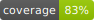

# Server Nexe

[](https://github.com/jgoy-labs/server-nexe/actions/workflows/ci.yml)

[](LICENSE)

**Version:** 0.8 — **Author:** Jordi Goy · [www.jgoy.net](https://www.jgoy.net)

Local AI server with persistent memory, RAG, and multi-backend inference (MLX / llama.cpp / Ollama).
Runs entirely on your machine — zero data sent to external services.

## Quick start

```bash
python3 install_nexe.py   # guided installation
./nexe go                 # start server (port 9119)
./nexe chat               # interactive chat
./nexe chat --rag         # chat with RAG memory
```

## Documentation

Full documentation is in the `knowledge/` directory:

- [English](knowledge/en/README.md)
- [Català](knowledge/ca/README.md)
- [Español](knowledge/es/README.md)

## License

MIT — see [LICENSE](LICENSE).

## Contributing

See [CONTRIBUTING.md](CONTRIBUTING.md).

## Security

See [SECURITY.md](SECURITY.md).
