<p align="center">
  
</p>

<p align="center">
  <strong>Local AI server with persistent memory. Zero cloud. Full control.</strong>
</p>

<p align="center">
  <em>I've reached the minimum viable product for the real world — but feedback is still missing. 🚀</em>
</p>

<p align="center">
  <a href="https://github.com/jgoy-labs/server-nexe/actions/workflows/ci.yml"></a>
  
  <a href="LICENSE"></a>
  <a href="https://www.python.org"></a>
  <a href="https://fastapi.tiangolo.com"></a>
</p>

<p align="center">
  <a href="https://qdrant.tech"></a>
  <a href="https://github.com/ml-explore/mlx"></a>
  <a href="https://ollama.com"></a>
  <a href="https://github.com/ggerganov/llama.cpp"></a>
  <a href="https://github.com/jgoy-labs/server-nexe"></a>
  <a href="https://github.com/sponsors/jgoy-labs"></a>
</p>

<p align="center">
  <a href="https://server-nexe.org"><strong>Documentation</strong></a> ·
  <a href="#-quick-start"><strong>Install</strong></a> ·
  <a href="#-architecture"><strong>Architecture</strong></a> ·
  <a href="https://github.com/jgoy-labs/server-nexe/releases"><strong>Releases</strong></a>
</p>

<p align="center">
  <a href="README-ca.md"><strong>Català</strong></a> ·
  <a href="README-es.md"><strong>Español</strong></a>
</p>

---

## Table of contents

- [The Story](#the-story)
- [Screenshots](#screenshots)
- [Why Server Nexe?](#why-server-nexe)
- [Quick Start](#quick-start)
  - [Option A: DMG Installer (macOS)](#option-a-dmg-installer-macos)
  - [Option B: Command Line](#option-b-command-line)
  - [Option C: Headless (servers, scripts, CI)](#option-c-headless-servers-scripts-ci)
- [Backends](#backends)
- [Available Models by RAM Tier](#available-models-by-ram-tier)
- [Architecture](#architecture)
  - [Request processing pipeline](#request-processing-pipeline)
- [Plugin System](#plugin-system)
- [AI-Ready Documentation](#ai-ready-documentation)
- [Security](#security)
- [Platform Support](#platform-support)
- [Requirements](#requirements)
- [Testing](#testing)
- [Roadmap](#roadmap)
- [Limitations](#limitations)
- [Contributing](#contributing)
- [Acknowledgments](#acknowledgments)
- [Disclaimer](#disclaimer)

## The Story

Server Nexe started as a learning-by-doing experiment: *"What would it take to have your own local AI with persistent memory?"* Since I wasn't going to build an LLM, I started picking up pieces to assemble a useful lego for myself and my day-to-day work. One thing led to another — inference backends, RAG pipelines, vector search, plugin systems, security layers, a web UI, an installer with hardware detection.

**This entire project — code, tests, audits, documentation — has been built by one person orchestrating different AI models**, both local (MLX, Ollama) and cloud (Claude, GPT, Gemini, DeepSeek, Qwen, Grok...), as collaborators. The human decides what to build, designs the architecture, reviews lines and runs tests. The AIs write, audit, and stress-test under human direction.

What began as a prototype has turned into a genuinely useful product: 4842 tests, security audits, encryption at rest, a macOS installer with hardware detection, and a plugin system. It's not done — there's a roadmap full of ideas — but it already does what it set out to do: **run an AI server on your machine, with memory that persists, and zero data leaving your device.**

This is not trying to compete with ChatGPT or Claude. But it can be complementary for less demanding tasks. It's an open-source tool for people who want to own their AI infrastructure. Built by one person in Barcelona, with AI as co-pilot, music, and stubbornness.

More technically: what was a **giant spaghetti monster** ended up distilling, refactor after refactor, into a **minimal, agnostic, modular core** — where security and memory are solved at the base so building on top is fast and comfortable, in human–AI collaboration. Whether that worked is for the community to say (the AI says yes, but what did you expect 🤪).

## Screenshots

<table>
<tr>
<td width="50%" align="center">
  
  <br/><em>Web UI — light mode</em>
</td>
<td width="50%" align="center">
  
  <br/><em>Web UI — dark mode</em>
</td>
</tr>
<tr>
<td width="50%" align="center">
  
  <br/><em>System tray menu (NexeTray.app)</em>
</td>
<td width="50%" align="center">
  
  <br/><em>SwiftUI installer wizard (DMG)</em>
</td>
</tr>
</table>

## Why Server Nexe?

Your conversations, documents, embeddings, and model weights stay on your machine. Always. Server Nexe combines LLM inference with a **persistent RAG memory system** — your AI remembers context across sessions, indexes your documents, and never phones home.

<table>
<tr>
<td width="50%">

### Local & Private
Every conversation, document, and embedding stays on your device. No telemetry, no external calls, no cloud dependency. Not even a server to spy on you.

</td>
<td width="50%">

### Persistent RAG Memory
Remembers context across sessions using Qdrant vector search with 768-dimensional embeddings across 3 specialized collections. Ingest documents, recall knowledge.

</td>
</tr>
<tr>
<td width="50%">

### Automatic Memory (MEM_SAVE)
The model extracts facts from conversations automatically — names, jobs, preferences, projects — and stores them to memory inside the same LLM call, with zero extra latency. Trilingual intent detection (ca/es/en), semantic deduplication, and deletion by voice ("forget that...").

</td>
<td width="50%">

### Multi-Backend Inference
Switch between MLX (Apple Silicon native), llama.cpp (GGUF, universal), or Ollama — one config change, same OpenAI-compatible API.

</td>
</tr>
<tr>
<td width="50%">

### Modular Plugin System
Auto-discovered plugins with independent manifests. Security, web UI, RAG, backends — everything is a plugin. Add capabilities without touching the core. NexeModule protocol with duck typing, no inheritance.

</td>
<td width="50%">

### macOS Installer
DMG with guided wizard that detects your hardware, picks the right backend, recommends models for your RAM, and gets you running in minutes.

</td>
</tr>
<tr>
<td width="50%">

### Document Upload with Session Isolation
Upload `.txt`, `.md` or `.pdf` and they're automatically indexed for RAG. Each document is only visible within the session it was uploaded in — no cross-contamination between sessions.

</td>
<td width="50%">

### Built to Grow
4842 tests (~85% coverage), security audits, i18n in 3 languages, comprehensive API. What started as an experiment is being built with production practices.

</td>
</tr>
</table>

## Quick Start

### Option A: DMG Installer (macOS)

Download the latest **[Install Nexe.dmg](https://github.com/jgoy-labs/server-nexe/releases/latest)** from Releases. The wizard handles everything: hardware detection, backend selection, model download, and configuration.

### Option B: Command Line

```bash
git clone https://github.com/jgoy-labs/server-nexe.git
cd server-nexe
./setup.sh      # guided installation (detects hardware, picks backend & model)
nexe go         # start server on port 9119
```

Once running:

```bash
nexe chat               # interactive chat
nexe chat --rag         # chat with RAG memory
nexe memory store "Barcelona is the capital of Catalonia"
nexe memory recall "capital Catalonia"
nexe status             # system status
```

### Option C: Headless (servers, scripts, CI)

```bash
python -m installer.install_headless --backend ollama --model qwen3.5:latest
nexe go
```

**Endpoints at `http://localhost:9119`:**

| Endpoint | Description |
|----------|-------------|
| `/v1/chat/completions` | OpenAI-compatible chat API |
| `/ui` | Web UI (chat, file upload, sessions) |
| `/health` | Health check |
| `/docs` | Interactive API documentation (Swagger) |

> Authentication via `X-API-Key` header. Key is generated during installation and stored in `.env`.

## Backends

| Backend | Platform | Best for |
|---------|----------|----------|
| **MLX** | macOS (Apple Silicon) | Recommended for Mac — native Metal GPU acceleration, fastest on M-series |
| **llama.cpp** | macOS / Linux | Universal — GGUF format, Metal on Mac, CPU/CUDA on Linux |
| **Ollama** | macOS / Linux | Bridge to existing Ollama installations, easiest model management |

The installer auto-detects your hardware and recommends the best backend. You can switch anytime in `personality/server.toml`.

## Available Models by RAM Tier

The installer organizes the 16 catalog models by the RAM available on your machine (4 tiers):

| Tier | Models | Origin |
|------|--------|--------|
| **8 GB** | Gemma 3 4B, Qwen3.5 4B, Qwen3 4B | Google, Alibaba |
| **16 GB** | Gemma 4 E4B, Salamandra 7B, Qwen3.5 9B, Gemma 3 12B | Google, BSC/AINA, Alibaba |
| **24 GB** | Gemma 4 31B, Qwen3 14B, GPT-OSS 20B | Google, Alibaba, OpenAI |
| **32 GB** | Qwen3.5 27B, Gemma 3 27B, DeepSeek R1 32B, Qwen3.5 35B-A3B, ALIA-40B | Alibaba, Google, DeepSeek, Spanish Government |

In addition, you can use any Ollama model by name or any GGUF model from Hugging Face.

## Architecture

```
server-nexe/
├── core/                 # FastAPI server, endpoints, CLI, config, metrics, resilience
│   ├── endpoints/        # REST API (v1 chat, health, status, system)
│   ├── cli/              # CLI commands & i18n (ca/es/en)
│   └── resilience/       # Circuit breaker, rate limiting
├── personality/          # Module manager, plugin discovery, server.toml
│   ├── loading/          # Plugin loading pipeline (find, validate, import, lifecycle)
│   └── module_manager/   # Discovery, registry, config, sync
├── memory/               # Embeddings, RAG engine, vector memory, document ingestion
│   ├── embeddings/       # Chunking, embedding generation
│   ├── rag/              # Retrieval-augmented generation pipeline
│   └── memory/           # Persistent vector store (Qdrant)
├── plugins/              # Auto-discovered plugin modules
│   ├── mlx_module/       # MLX backend (Apple Silicon)
│   ├── llama_cpp_module/ # llama.cpp backend (GGUF)
│   ├── ollama_module/    # Ollama bridge
│   ├── security/         # Auth, injection detection, CSRF, rate limiting, input sanitization
│   └── web_ui_module/    # Browser-based chat UI with file upload
├── installer/            # Guided installer, headless mode, hardware detection, model catalog
├── knowledge/            # Indexed documentation for RAG (ca/es/en)
└── tests/                # Integration & e2e test suites
```

### Request processing pipeline

```mermaid
flowchart LR
    A[Request] --> B[Auth<br/>X-API-Key]
    B --> C[Rate Limit<br/>slowapi]
    C --> D[validate_string_input<br/>context parameter]
    D --> E[RAG Recall<br/>3 collections]
    E --> F[_sanitize_rag_context<br/>injection filter]
    F --> G[LLM Inference<br/>MLX/Ollama/llama.cpp]
    G --> H[Stream Response<br/>SSE markers]
    H --> I[MEM_SAVE Parsing<br/>fact extraction]
    I --> J[Response<br/>to client]
```



## Plugin System

Server Nexe uses a duck typing protocol (NexeModule Protocol) — no class inheritance, no BasePlugin. Each plugin is a directory under `plugins/` with a `manifest.toml` and a `module.py`.

**5 active plugins:**

| Plugin | Type | Key features |
|--------|------|--------------|
| **mlx_module** | LLM Backend | Apple Silicon native, prefix caching (trie), Metal GPU |
| **llama_cpp_module** | LLM Backend | Universal GGUF, LRU ModelPool, CPU/GPU |
| **ollama_module** | LLM Backend | HTTP bridge to Ollama, auto-start, VRAM cleanup |
| **security** | Core | Dual-key auth, 6 injection detectors + NFKC, 47 jailbreak patterns, rate limiting, RFC5424 audit logging |
| **web_ui_module** | Interface | Web chat, sessions, document upload, MEM_SAVE, RAG sanitization, i18n |

## AI-Ready Documentation

The `knowledge/` folder contains 13 thematic documents × 3 languages = 39 files, structured with YAML frontmatter for RAG ingestion:

API, Architecture, Use Cases, Errors, Identity, Installation, Limitations, Plugins, RAG, README, Security, Testing, Usage.

Point any AI assistant at this repo and it can understand the complete architecture.

| Language | Link |
|----------|------|
| English | [knowledge/en/README.md](knowledge/en/README.md) |
| Catalan | [knowledge/ca/README.md](knowledge/ca/README.md) |
| Spanish | [knowledge/es/README.md](knowledge/es/README.md) |

## Security

Server Nexe includes a security module enabled by default:

- **API key authentication** on all endpoints
- **CSP headers** (script-src 'self', no unsafe-inline)
- **CSRF protection** with token validation
- **Rate limiting** per IP
- **Input sanitization** — 6 injection detectors + Unicode normalization
- **Jailbreak detection** — 47 pattern speed-bump detector
- **Upload denylist** — blocks accidental upload of API keys, PEM keys
- **Memory injection protection** — tag stripping on all input paths
- **RAG injection sanitization** — `[MEM_SAVE:]`, `[MEM_DELETE:]`, `[OLVIDA|OBLIT|FORGET:]`, `[MEMORIA:]` neutralized at ingest and retrieval (v0.9.9)
- **Pipeline enforcement** — all chat through canonical endpoints only
- **Encryption at rest** — AES-256-GCM, SQLCipher, `auto` default, fail-closed (v0.9.2+)
- **Trusted host middleware**

> **Note:** This project has not been tested in production with real users. Security testing has been performed by AI, not by professional auditors. See [SECURITY.md](SECURITY.md) for full disclosure and vulnerability reporting.

## Platform Support

| Platform | Status | Backends |
|----------|--------|----------|
| macOS Apple Silicon (M1+) | **Supported** — all 3 backends | MLX, llama.cpp, Ollama |
| macOS Intel | **Not supported** since v0.9.9 | — |
| macOS 13 Ventura or earlier | **Not supported** since v0.9.9 (requires macOS 14 Sonoma+) | — |
| Linux x86_64 | **Partial** — unit tests pass, CI green, **NOT tested in production** | llama.cpp, Ollama |
| Linux ARM64 | Not directly tested | llama.cpp, Ollama (theoretical) |
| Windows | Not supported | — |

> Since v0.9.9, server-nexe requires **macOS 14 Sonoma+ with Apple Silicon (M1 or later)**. The pre-built wheels in the DMG are `arm64` exclusive. Linux with the llama.cpp and Ollama backends should work, but the full compatibility audit is on the roadmap.

## Requirements

| | Minimum | Recommended |
|---|---------|-------------|
| **OS** | macOS 14 Sonoma (Apple Silicon only) | macOS 14+ (Apple Silicon) |
| **CPU** | Apple Silicon M1 | Apple Silicon M2 / M3 / M4 |
| **Python** | 3.11+ | 3.12+ |
| **RAM** | 8 GB | 16 GB+ (for larger models) |
| **Disk** | 10 GB free | 20 GB+ free |

> **Intel Macs and macOS 13 Ventura are no longer supported.** Apple Silicon only (arm64).
> **Linux**: Works with llama.cpp and Ollama backends. Full Linux compatibility audit is on the roadmap.

## Testing

4842 tests collected (of 4990 total, 148 deselected by default markers) with ~85% code coverage. CI runs the full suite on every push.

```bash
# Unit tests
pytest core memory personality plugins -m "not integration and not e2e and not slow" \
  --cov=core --cov=memory --cov=personality --cov=plugins \
  --cov-report=term --tb=short -q

# Integration tests (requires Ollama running)
NEXE_AUTOSTART_OLLAMA=true pytest -m "integration" -q
```

## Roadmap

Server Nexe is actively developed. Here's what's coming:

- [x] Persistent memory with RAG (v0.9.0)
- [x] Encryption at rest — AES-256-GCM (v0.9.0)
- [x] macOS code signing & notarization (v0.9.0)
- [x] Security hardening — jailbreak detection, upload denylist, pipeline enforcement (v0.9.1)
- [x] Encryption default `auto`, fail-closed (v0.9.2)
- [x] Embeddings on ONNX (`fastembed`), PyTorch removed (v0.9.3)
- [x] Multimodal VLM — 4 backends (Ollama, MLX, llama.cpp, Web UI) (v0.9.7)
- [x] Precomputed KB embeddings (~10.7x faster startup) (v0.9.8)
- [x] RAG injection sanitization (MEM tags neutralized at ingest and retrieval) (v0.9.9)
- [x] Offline install bundle — all wheels + embedding model in DMG (~1.2 GB, post-v0.9.9)
- [x] Thinking toggle endpoint — `PATCH /session/{id}/thinking` (post-v0.9.9)
- [ ] Native macOS app (SwiftUI, replaces Python tray)
- [ ] Configurable inference parameters via UI
- [ ] Community forum

See [CHANGELOG.md](CHANGELOG.md) for version history.

## Limitations

Honest disclosure of what server Nexe **does not** do or does not do well:

- **Local models < cloud** — Local models are less capable than GPT-4 or Claude. That's the trade-off for privacy.
- **RAG is not perfect** — Homonymy, negations, cold start (empty memory), and contradictory information across time periods.
- **Partially OpenAI-compatible API** — `/v1/chat/completions` works. Missing: `/v1/embeddings`, `/v1/models`, function calling, and multimodal.
- **Single user** — Mono-user by design. No multi-device sync, no accounts.
- **No fine-tuning** — You cannot train or fine-tune models.
- **New encryption** — Added in v0.9.0 (default `auto` since v0.9.2, fail-closed). Not battle-tested. If you lose the master key, data cannot be recovered (see MEK fallback: file → keyring → env → generate).
- **Single developer, single real user** — Personal open-source project, not an enterprise product.

See [knowledge/en/LIMITATIONS.md](knowledge/en/LIMITATIONS.md) for full detail.

## Contributing

See [CONTRIBUTING.md](CONTRIBUTING.md) for setup instructions and guidelines.

## Acknowledgments

server-nexe is built on the shoulders of these amazing open-source projects:

**AI & Inference**
- [MLX](https://github.com/ml-explore/mlx) — Apple Silicon native ML framework
- [llama.cpp](https://github.com/ggerganov/llama.cpp) — Efficient GGUF model inference
- [Ollama](https://ollama.ai) — Local model management and serving
- [fastembed](https://github.com/qdrant/fastembed) — ONNX-based text embeddings (replaced `sentence-transformers` since v0.9.3, saves ~600 MB)
- [sentence-transformers](https://www.sbert.net) — Historical: original embedding backend, replaced by `fastembed` in v0.9.3
- [Hugging Face](https://huggingface.co) — Model hub and transformers library

**Infrastructure**
- [Qdrant](https://qdrant.tech) — Vector search engine powering RAG memory
- [FastAPI](https://fastapi.tiangolo.com) — High-performance async web framework
- [Uvicorn](https://www.uvicorn.org) — Lightning-fast ASGI server
- [Pydantic](https://docs.pydantic.dev) — Data validation

**Tools & Libraries**
- [Rich](https://github.com/Textualize/rich) — Beautiful terminal formatting
- [marked.js](https://marked.js.org) — Markdown rendering in web UI
- [PyPDF](https://github.com/py-pdf/pypdf) — PDF text extraction for RAG
- [rumps](https://github.com/jaredks/rumps) — macOS menu bar integration

**Security & Monitoring**
- [Prometheus](https://prometheus.io) — Metrics and monitoring
- [SlowAPI](https://github.com/laurentS/slowapi) — Rate limiting

Also built with: Python, NumPy, httpx, tenacity, Click, Typer, Colorama, python-dotenv, PyYAML, toml, structlog, starlette-csrf, python-multipart, psutil, PyObjC, and Linux.

20% of Enterprise sponsorships go directly to supporting these projects.

Built with AI collaboration · Barcelona

## Disclaimer

This software is provided **"as is"**, without warranty of any kind. Use it at your own risk. The author is not responsible for any damage, data loss, security incidents, or misuse arising from the use of this software.

See [LICENSE](LICENSE) for details.

---

<p align="center">
  <strong>Version 1.0.0-beta</strong> · Apache 2.0 · Made by <a href="https://www.jgoy.net">Jordi Goy</a> in Barcelona
</p>
