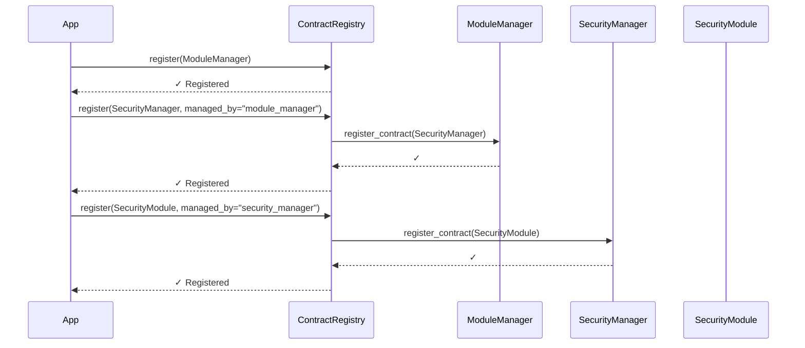
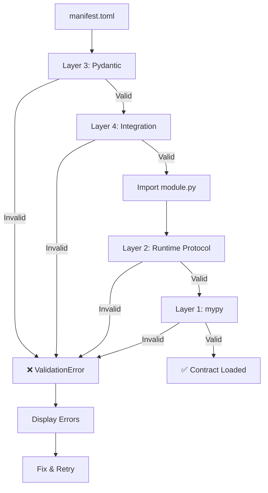

# Sistema Unificat de Contractes - NEXE 0.9

**Versió:** 0.9.0
**Autor:** Jordi Goy
**Data:** 2026-02-05
**Estat:** Planificat

---

## Índex

1. [Resum Executiu](#resum-executiu)
2. [Problema Actual](#problema-actual)
3. [Solució Proposada](#solució-proposada)
4. [Arquitectura Detallada](#arquitectura-detallada)
5. [Pla d'Implementació](#pla-dimplementació)
6. [Exemples Concrets](#exemples-concrets)
7. [Migration Path](#migration-path)
8. [Validació Multi-Capa](#validació-multi-capa)
9. [Timeline i Riscos](#timeline-i-riscos)

---

## Resum Executiu

El **Sistema Unificat de Contractes** és una refactorització arquitectònica de NEXE per unificar plugins i managers sota un criteri comú, amb suport per **jerarquia recursiva** (managers que gestionen altres managers) i **validació multi-capa completa**.

### Objectius

✅ **Unificació:** Un sol format de contracte per plugins, managers, specialists
✅ **Jerarquia recursiva:** Managers poden gestionar altres managers
✅ **Validació robusta:** Static (mypy) + Runtime (Protocol) + Schema (Pydantic) + Tests
✅ **Escalabilitat:** Base per futurs managers (SecurityManager, I18nManager, UIManager, etc.)
✅ **Type safety:** Protocol-based amb mypy --strict
✅ **Backward compatibility:** Auto-migració de manifests antics

### Beneficis

| Benefici | Descripció |
|----------|------------|
| **Criteri comú** | Tots els components segueixen el mateix contracte base |
| **Recursivitat** | Suport natiu per jerarquies complexes de managers |
| **Robustesa** | Validació en 4 capes elimina errors en temps de desenvolupament |
| **Mantenibilitat** | Un sol registry, un sol format de manifest |
| **Extensibilitat** | Afegir nous managers és trivial |

---

## Problema Actual

### 1. Manifests Incompatibles

Cada plugin té el seu propi format de `manifest.toml`, creant **"anarquia de contractes"**:

**Exemple: Ollama Module**
```toml
[module.cli]
command_name = "ollama"
entry_point = "nexe.tools.ollama_module.cli"

[module.endpoints]
router_prefix = "/ollama"
```

**Exemple: Security Module**
```toml
[authentication]
enabled = true
method = "api_key"

[rate_limiting]
scan_limit = "2/minute"
```

**Exemple: MLX Module**
```toml
[module.entry]
module = "plugins.mlx_module.module"
class = "MLXModule"

[module.router]
prefix = "/mlx"
```

❌ **Problemes:**
- Camps duplicats amb noms diferents
- Seccions específiques no documentades
- Impossible validar automàticament
- Confusió per desenvolupadors

### 2. Registres Duplicats

Existeixen **3 registres diferents** amb funcionalitats solapades:

1. **`core/loader/registry.py`**: `ModuleRegistry` per `RegisteredModule`
2. **`personality/module_manager/registry.py`**: `ModuleRegistry` per `ModuleRegistration`
3. **`core/module_registry.py`**: Registry simple per capabilities

❌ **Problemes:**
- Lògica duplicada
- Indexació incompatible
- Difícil mantenir consistència
- No hi ha "single source of truth"

### 3. Validació Fragmentada

La validació està dispersa en múltiples llocs:

- **Protocol validation** a `core/loader/protocol.py`
- **Config validation** a `personality/module_manager/config_validator.py`
- **Pydantic validation** a alguns models però no tots
- **No hi ha validació d'schema** per manifests de plugins

❌ **Problemes:**
- Errors detectats tard (runtime)
- No hi ha type checking estàtic
- Fàcil saltar validacions
- Difícil garantir compliment

### 4. No Hi Ha Suport per Managers Recursivos

Actualment només existeix **ModuleManager**. Els futurs managers necessiten:

- SecurityManager (gestiona security modules + specialists)
- I18nManager (gestiona translation modules)
- UIManager (gestiona UI components)
- TrasherManager (gestió de neteja)
- DoctorManager (diagnòstic del sistema)

❌ **Problemes:**
- Cap infraestructura per managers que gestionen managers
- Cap protocol estàndard per managers
- ModuleManager hardcoded com a únic manager
- Impossible escalar l'arquitectura

---

## Solució Proposada

### Arquitectura en 4 Capes

Crear un sistema de contractes unificat amb **validació completa** i **suport recursiu**:

```
core/contracts/
├── __init__.py                      # Exports públics
├── base.py                          # ⭐ Protocols base
├── models.py                        # ⭐ Pydantic models
├── registry.py                      # ⭐ Registry unificat
├── validators.py                    # Validadors multi-capa
├── tests/
│   ├── test_protocols.py
│   ├── test_models.py
│   ├── test_registry.py
│   └── test_validators.py
└── migrations/
    └── manifest_migrator.py         # Auto-migració
```

### Components Principals

#### 1. Base Contract Protocol

**Jerarquia de protocols:**

```
BaseContract (mínim per tots)
├── ModuleContract (plugins estàndard)
├── ManagerContract (gestiona altres contractes) ← RECURSIU
├── SpecialistContract (components especialitzats)
└── CoreContract (components core del sistema)
```

**Protocol base:**

```python
@runtime_checkable
class BaseContract(Protocol):
    """Protocol mínim per TOTS els contractes"""

    @property
    def metadata(self) -> ContractMetadata:
        """Metadata del contracte"""
        ...

    async def initialize(self, context: Dict[str, Any]) -> bool:
        """Inicialitza el component"""
        ...

    async def shutdown(self) -> None:
        """Atura i allibera recursos"""
        ...

    async def health_check(self) -> HealthResult:
        """Retorna estat de salut"""
        ...
```

**Manager Contract (recursiu):**

```python
@runtime_checkable
class ManagerContract(BaseContract, Protocol):
    """Contract per managers que poden gestionar altres contractes"""

    async def register_contract(self, contract: BaseContract) -> bool:
        """Registra qualsevol BaseContract (inclòs altres managers!)"""
        ...

    async def unregister_contract(self, contract_id: str) -> bool:
        ...

    def list_managed_contracts(self) -> List[ContractMetadata]:
        ...

    def get_managed_contract(self, contract_id: str) -> Optional[BaseContract]:
        ...
```

#### 2. Contract Metadata

```python
@dataclass
class ContractMetadata:
    """Metadata unificada per tots els contractes"""

    contract_id: str                    # Identificador únic
    contract_type: ContractType         # MODULE, MANAGER, SPECIALIST, CORE
    contract_version: str = "1.0.0"     # Versió del contracte

    name: str
    version: str
    description: str
    author: str

    # Capabilities
    capabilities: Dict[str, bool]       # has_api, has_ui, has_cli, etc.

    # Dependencies
    dependencies: List[str]
    optional_dependencies: List[str]

    # Manager support (recursiu!)
    can_manage_types: List[ContractType]  # Què pot gestionar
    parent_manager: Optional[str]         # Qui el gestiona
```

#### 3. Unified Manifest Schema

**Format TOML estàndard per TOTS:**

```toml
manifest_version = "1.0"

[module]
name = "nom_component"
version = "1.0.0"
type = "module"  # o "manager", "specialist", "core"
description = "Descripció del component"
author = "Autor"
enabled = true
auto_start = false
priority = 10

# Només per managers:
can_manage_types = ["module", "specialist"]
parent_manager = "module_manager"

[capabilities]
has_api = true
has_ui = false
has_cli = true
has_specialist = false
has_tests = true

[dependencies]
modules = ["dependency1", "dependency2"]
optional_modules = ["optional1"]
specialists = []
external_services = []

# Condicional: Obligatori si has_api = true
[api]
enabled = true
prefix = "/nom_component"
tags = ["tag1", "tag2"]
public_routes = ["/health", "/info"]
protected_routes = ["/admin"]
rate_limit = "10/minute"

# Condicional: Obligatori si has_ui = true
[ui]
enabled = true
path = "ui"
main_file = "index.html"
route = "/nom_component/ui"
framework = "vanilla-js"

# Condicional: Obligatori si has_cli = true
[cli]
enabled = true
command_name = "nom_command"
entry_point = "plugins.nom_component.cli"
description = "Descripció CLI"
commands = ["status", "start", "stop"]
framework = "click"

# Opcional
[i18n]
enabled = true
default_locale = "ca-ES"
supported_locales = ["ca-ES", "en-US", "es-ES"]

[storage]
paths = [
    {path = "storage/logs", type = "logs", retention_days = 30}
]
```

#### 4. Contract Registry (Unificat)

**Registry central amb suport recursiu:**

```python
class ContractRegistry:
    """Registry unificat per TOTS els contractes"""

    # Registre
    async def register(
        self,
        contract: BaseContract,
        managed_by: Optional[str] = None  # Manager que el gestiona
    ) -> bool

    async def unregister(self, contract_id: str) -> bool

    # Query
    def get(self, contract_id: str) -> Optional[RegisteredContract]
    def list_all(self) -> List[RegisteredContract]
    def list_by_type(self, contract_type: ContractType) -> List[RegisteredContract]
    def list_managers(self) -> List[RegisteredContract]
    def list_managed_by(self, manager_id: str) -> List[RegisteredContract]

    # Jerarquia recursiva
    def get_hierarchy(self, contract_id: str) -> Dict[str, Any]
    def get_dependency_tree(self) -> Dict[str, Dict[str, Any]]

    # Lifecycle
    async def initialize_contract(self, contract_id: str, context: Dict) -> bool
    async def health_check_all(self) -> Dict[str, HealthResult]
```

**Registered Contract:**

```python
@dataclass
class RegisteredContract:
    """Un contracte registrat al sistema"""

    metadata: ContractMetadata
    instance: BaseContract
    status: ContractStatus  # DISCOVERED, REGISTERED, INITIALIZED, ACTIVE

    # Timestamps
    registered_at: datetime
    initialized_at: Optional[datetime]

    # Jerarquia (suport recursiu)
    managed_by: Optional[str]  # Manager que el gestiona
    manages: Set[str]          # Contractes que gestiona (si és manager)

    # Dependencies
    depends_on: Set[str]
    dependents: Set[str]
```

#### 5. Multi-Layer Validation

**Validació en 4 capes:**

```python
class ContractValidator:
    """Validador multi-capa"""

    # Layer 1: Schema validation (Pydantic)
    def validate_manifest_schema(self, manifest_path: Path) -> ValidationResult

    # Layer 2: Runtime validation (Protocol)
    def validate_contract_runtime(self, contract: Any) -> ValidationResult

    # Layer 3: Static validation (mypy compatible)
    # (No és un mètode, és type checking extern)

    # Layer 4: Integration validation
    def validate_file_structure(
        self,
        contract_path: Path,
        manifest: UnifiedManifest
    ) -> ValidationResult

    # All-in-one
    def validate_all(
        self,
        contract_path: Path,
        contract_instance: Optional[BaseContract] = None
    ) -> List[ValidationResult]
```

---

## Arquitectura Detallada

### Jerarquia de Contractes

```
BaseContract (interface mínima)
│
├─ ModuleContract
│  │  + get_router() -> Optional[APIRouter]
│  │  + get_router_prefix() -> str
│  │
│  └─ Exemples: ollama_module, mlx_module, llama_cpp_module
│
├─ ManagerContract ← RECURSIU!
│  │  + register_contract(contract: BaseContract)
│  │  + unregister_contract(contract_id: str)
│  │  + list_managed_contracts()
│  │  + get_managed_contract(contract_id: str)
│  │
│  ├─ ModuleManager (top-level)
│  ├─ SecurityManager (gestiona security modules)
│  ├─ I18nManager (gestiona translations)
│  └─ UIManager (gestiona UI components)
│
├─ SpecialistContract
│  │  + get_specialist_type() -> str
│  │  + execute(context: Dict) -> Dict
│  │
│  └─ Exemples: sanitizer, security_scanner
│
└─ CoreContract
   │  (Components core del sistema)
   │
   └─ Exemples: memory, embeddings, rag
```

### Jerarquia Recursiva d'Exemple

```
ModuleManager (ManagerContract)
├── ollama_module (ModuleContract)
├── mlx_module (ModuleContract)
├── SecurityManager (ManagerContract) ← Manager dins de Manager!
│   ├── security (ModuleContract)
│   ├── sanitizer (SpecialistContract)
│   └── security_logger (ModuleContract)
├── I18nManager (ManagerContract)
│   ├── ca_translator (ModuleContract)
│   └── en_translator (ModuleContract)
└── UIManager (ManagerContract)
    ├── web_ui_module (ModuleContract)
    └── admin_ui (ModuleContract)
```

### Flow de Registre Recursiu



### Pydantic Validation Flow

```mermaid
flowchart TD
    A[manifest.toml] --> B{Load TOML}
    B --> C[Parse to dict]
    C --> D[Pydantic UnifiedManifest]

    D --> E{Field Validation}
    E -->|Invalid| F[ValidationError]
    E -->|Valid| G{Model Validators}

    G -->|has_api=true| H{Check [api] exists}
    H -->|Missing| F
    H -->|OK| I[Validated Manifest]

    G -->|has_ui=true| J{Check [ui] exists}
    J -->|Missing| F
    J -->|OK| I

    I --> K[to_contract_metadata]
    K --> L[ContractMetadata instance]
```

---

## Pla d'Implementació

### Fase 1: Infraestructura Base (3-5 dies)

**Objectiu:** Crear els components core del sistema de contractes.

#### Tasques:

1. **Crear `core/contracts/base.py`** (~400 línies)
   - `ContractType` enum (MODULE, MANAGER, SPECIALIST, CORE)
   - `HealthStatus` enum (HEALTHY, DEGRADED, UNHEALTHY, UNKNOWN)
   - `ContractMetadata` dataclass amb tots els camps
   - `HealthResult` dataclass
   - `BaseContract` Protocol amb `@runtime_checkable`
   - `ModuleContract` Protocol (extends BaseContract)
   - `ManagerContract` Protocol (extends BaseContract, recursiu)
   - `SpecialistContract` Protocol (extends BaseContract)
   - Helper functions: `validate_contract()`, `contract_is_manager()`, etc.

2. **Crear `core/contracts/models.py`** (~600 línies)
   - `ManifestVersion` enum
   - `ContractTypeModel` enum (per Pydantic)
   - `ModuleSection` BaseModel
   - `CapabilitiesSection` BaseModel
   - `DependenciesSection` BaseModel
   - `APISection` BaseModel amb validators
   - `UISection` BaseModel
   - `CLISection` BaseModel amb framework validation
   - `SpecialistSection` BaseModel
   - `I18nSection` BaseModel
   - `StorageSection` BaseModel
   - `UnifiedManifest` BaseModel amb `@model_validator`
   - Helper: `load_manifest_from_toml()`, `validate_manifest_dict()`

3. **Crear `core/contracts/registry.py`** (~500 línies)
   - `ContractStatus` enum
   - `RegisteredContract` dataclass
   - `ContractRegistry` class (singleton pattern)
   - Methods: `register`, `unregister`, `get`, `list_*`
   - Hierarchy support: `get_hierarchy()`, `list_managed_by()`
   - Lifecycle: `initialize_contract()`, `health_check_all()`
   - Stats: `get_stats()`, `to_dict()`
   - Thread-safety amb `asyncio.Lock()`

4. **Crear `core/contracts/validators.py`** (~400 línies)
   - `ValidationResult` dataclass
   - `ContractValidator` class
   - `validate_manifest_schema()` - Pydantic validation
   - `validate_contract_runtime()` - Protocol compliance
   - `validate_file_structure()` - Integration checks
   - `validate_all()` - Orchestrator

5. **Crear tests unitaris:**
   - `core/contracts/tests/test_protocols.py`
     - Test `BaseContract` compliance
     - Test `ModuleContract` methods
     - Test `ManagerContract` recursiu
     - Test `isinstance()` amb `@runtime_checkable`
   - `core/contracts/tests/test_models.py`
     - Test Pydantic field validation
     - Test model validators
     - Test conditional sections
     - Test `to_contract_metadata()`
   - `core/contracts/tests/test_registry.py`
     - Test register/unregister
     - Test hierarchy recursiva
     - Test dependency tracking
     - Test health check propagation
   - `core/contracts/tests/test_validators.py`
     - Test cada layer de validació
     - Test error reporting

**Patrons a reutilitzar:**

- Protocol pattern de `core/loader/protocol.py` (línies 89-169)
- Pydantic models de `memory/embeddings/core/interfaces.py` (línies 17-308)
- Registry singleton de `memory/embeddings/chunkers/registry.py` (línies 33-316)
- Config validation de `personality/module_manager/config_validator.py`

**Deliverables:**

✅ 4 fitxers nous a `core/contracts/`
✅ 4 fitxers de tests amb >80% coverage
✅ Tots els tests passen
✅ Mypy --strict passa sense errors

---

### Fase 2: Migració de Manifests (2-3 dies)

**Objectiu:** Migrar tots els manifests existents al nou format unificat.

#### Tasques:

1. **Crear `core/contracts/migrations/manifest_migrator.py`** (~300 línies)
   - `MigrationResult` dataclass
   - `ManifestMigrator` class
   - `migrate_manifest()` - Migra un manifest individual
   - `migrate_all_plugins()` - Migra tots els plugins d'un directori
   - Suport per formats:
     - Ollama format (`module.cli`, `module.endpoints`)
     - Security format (`authentication`, `rate_limiting`)
     - MLX format (`module.entry`, `module.router`)
     - Generic format (best-effort)

2. **Migrar manifests de plugins existents:**

   **Plugin 1: ollama_module**
   - Path: `plugins/ollama_module/manifest.toml`
   - Canvis:
     - `[module.cli]` → `[cli]`
     - `[module.endpoints]` → `[api]`
     - Afegir `manifest_version = "1.0"`
     - Afegir seccions obligatòries segons capabilities
   - Validar amb `ContractValidator.validate_manifest_schema()`
   - Guardar `.migrated` temporalment
   - Tests d'integració

   **Plugin 2: security**
   - Path: `plugins/security/manifest.toml`
   - Canvis:
     - `[authentication]` → merge a `[api]` o deprecar
     - `[rate_limiting]` → merge a `[api]`
     - Normalitzar `[module.dependencies]` → `[dependencies]`
     - Convertir a `type = "module"` o `type = "manager"`?
   - Validar i testar

   **Plugin 3: mlx_module**
   - Path: `plugins/mlx_module/manifest.toml`
   - Canvis:
     - `[module.entry]` → afegir a `[metadata]` o deprecar
     - `[module.router]` → `[api]`
     - Normalitzar estructura
   - Validar i testar

   **Plugin 4: web_ui_module**
   - Path: `plugins/web_ui_module/manifest.toml`
   - Canvis similars
   - Assegurar `[ui]` section correcta

   **Plugin 5: llama_cpp_module**
   - Path: `plugins/llama_cpp_module/manifest.toml`
   - Canvis similars a mlx_module

   **Plugin 6: sanitizer**
   - Path: `plugins/security/sanitizer/manifest.toml`
   - Canvis:
     - `[module.position]` → deprecar o moure a `[metadata]`
     - `[module.performance]` → deprecar o moure a `[metadata]`
     - Normalitzar dependencies

3. **Procés per cada manifest:**
   ```bash
   # 1. Executar migrador
   python -m core.contracts.migrations.manifest_migrator \
       --manifest plugins/ollama_module/manifest.toml \
       --output plugins/ollama_module/manifest.toml.migrated

   # 2. Validar
   python -m core.contracts.validators \
       --validate plugins/ollama_module/manifest.toml.migrated

   # 3. Revisar manualment
   diff plugins/ollama_module/manifest.toml \
        plugins/ollama_module/manifest.toml.migrated

   # 4. Confirmar i reemplaçar
   mv plugins/ollama_module/manifest.toml \
      plugins/ollama_module/manifest.toml.old
   mv plugins/ollama_module/manifest.toml.migrated \
      plugins/ollama_module/manifest.toml

   # 5. Tests d'integració
   pytest plugins/ollama_module/tests/test_contract.py
   ```

**Deliverables:**

✅ 6 manifests migrats i validats
✅ Fitxers `.old` com a backup
✅ Tests d'integració passen per cada plugin
✅ Documentació de canvis per cada manifest

---

### Fase 3: Actualització ModuleManager (3-4 dies)

**Objectiu:** Integrar el nou sistema de contractes amb el ModuleManager actual, mantenint backward compatibility.

#### Tasques:

1. **Modificar `personality/module_manager/module_manager.py`**

   Canvis:
   - Importar `ContractRegistry` de `core.contracts.registry`
   - Afegir `_contract_registry: ContractRegistry` com a atribut
   - Delegat operacions de registre al `ContractRegistry`
   - Mantenir façade per compatibilitat amb codi existent

   ```python
   # Abans
   class ModuleManager:
       def __init__(self):
           self._registry = ModuleRegistry()  # Registry propi

   # Després
   from core.contracts.registry import get_contract_registry

   class ModuleManager:
       def __init__(self):
           self._registry = ModuleRegistry()  # Deprecated, mantenir temporalment
           self._contract_registry = get_contract_registry()  # NOU
   ```

2. **Modificar `personality/module_manager/loader.py`**

   Afegir detecció de format de manifest:

   ```python
   async def load_module(self, module_path: Path):
       """Carrega amb backward compatibility"""
       manifest_path = module_path / "manifest.toml"

       # Try new format first
       try:
           from core.contracts.models import load_manifest_from_toml
           from core.contracts.validators import get_validator

           manifest = load_manifest_from_toml(str(manifest_path))
           validator = get_validator()

           # Validate
           result = validator.validate_manifest_schema(manifest_path)
           if not result.valid:
               logger.error(f"Invalid manifest: {result.errors}")
               raise ValueError("Invalid manifest")

           # Load with new contract system
           return await self._load_with_contract(module_path, manifest)

       except Exception as e:
           logger.warning(f"Failed new format, trying migration: {e}")

           # Auto-migrate
           from core.contracts.migrations.manifest_migrator import ManifestMigrator
           migrator = ManifestMigrator()

           result = migrator.migrate_manifest(manifest_path)
           if not result.success:
               logger.error(f"Migration failed: {result.errors}")
               raise ValueError("Migration failed")

           # Load migrated
           manifest = load_manifest_from_toml(str(result.migrated_path))
           return await self._load_with_contract(module_path, manifest)

   async def _load_with_contract(
       self,
       module_path: Path,
       manifest: UnifiedManifest
   ):
       """Load using new contract system"""
       # Import module
       instance = await self._import_module(module_path, manifest)

       # Validate implements BaseContract
       from core.contracts.base import validate_contract
       if not validate_contract(instance):
           raise ValueError(f"{manifest.module.name} doesn't implement BaseContract")

       # Register to ContractRegistry
       success = await self._contract_registry.register(
           contract=instance,
           managed_by="module_manager"
       )

       if not success:
           raise ValueError(f"Failed to register {manifest.module.name}")

       return instance
   ```

3. **Deprecar progressivament `personality/module_manager/registry.py`**

   - Afegir warnings de deprecació
   - Mantenir només per backward compatibility temporal
   - Planificar eliminació en v1.0

   ```python
   import warnings

   class ModuleRegistry:
       def __init__(self):
           warnings.warn(
               "ModuleRegistry is deprecated, use ContractRegistry instead",
               DeprecationWarning,
               stacklevel=2
           )
           # ... rest of implementation
   ```

4. **Tests d'integració complets:**

   ```python
   # tests/integration/test_contract_loading.py

   @pytest.mark.asyncio
   async def test_load_plugin_with_new_manifest():
       """Test loading plugin with new UnifiedManifest format"""
       manager = ModuleManager()
       plugin_path = Path("plugins/ollama_module")

       # Should load successfully
       instance = await manager.load_module(plugin_path)

       assert instance is not None
       assert hasattr(instance, 'metadata')
       assert instance.metadata.contract_id == "ollama_module"

   @pytest.mark.asyncio
   async def test_load_plugin_with_old_manifest_auto_migrate():
       """Test backward compatibility with auto-migration"""
       # Create old-format manifest temporarily
       # ... test auto-migration ...

   @pytest.mark.asyncio
   async def test_contract_registry_integration():
       """Test that plugins are registered to ContractRegistry"""
       from core.contracts.registry import get_contract_registry

       manager = ModuleManager()
       await manager.start_system()

       registry = get_contract_registry()

       # Check all plugins are registered
       all_contracts = registry.list_all()
       assert len(all_contracts) > 0

       # Check can query by type
       modules = registry.list_by_type(ContractType.MODULE)
       assert len(modules) > 0
   ```

**Deliverables:**

✅ ModuleManager integrat amb ContractRegistry
✅ Auto-migració funcional
✅ Backward compatibility verificada
✅ Tests d'integració passen (>90% success rate)
✅ Warnings de deprecació afegits

---

### Fase 4: Implementació Managers Nous (4-5 dias)

**Objectiu:** Crear managers nous com a prova de concepte del sistema recursiu.

#### Manager 1: SecurityManager

**Path:** `plugins/security_manager/`

**Manifest (`manifest.toml`):**

```toml
manifest_version = "1.0"

[module]
name = "security_manager"
version = "1.0.0"
type = "manager"  # ← Manager, no module!
description = "Gestió centralitzada de seguretat"
author = "Nexe Team (Jordi Goy)"
enabled = true
auto_start = true
priority = 5

# Manager specifics
can_manage_types = ["module", "specialist"]
parent_manager = "module_manager"

[capabilities]
has_api = true
has_ui = true
has_tests = true

[dependencies]
modules = []

[api]
enabled = true
prefix = "/security"
tags = ["security", "manager"]
public_routes = ["/health", "/ui"]
protected_routes = ["/scan", "/report", "/managed"]
rate_limit = "2/minute"

[ui]
enabled = true
path = "ui"
main_file = "index.html"
route = "/security/ui"
```

**Implementació (`module.py`):**

```python
from typing import Dict, Any, List
from core.contracts.base import (
    ManagerContract, BaseContract, ContractMetadata,
    ContractType, HealthResult, HealthStatus
)
from fastapi import APIRouter

class SecurityManager:
    """Manager de seguretat (gestiona security modules + specialists)"""

    def __init__(self):
        self._managed: Dict[str, BaseContract] = {}
        self._metadata = ContractMetadata(
            contract_id="security_manager",
            contract_type=ContractType.MANAGER,
            name="Security Manager",
            version="1.0.0",
            can_manage_types=[ContractType.MODULE, ContractType.SPECIALIST],
            parent_manager="module_manager",
            capabilities={
                "has_api": True,
                "has_ui": True,
                "has_tests": True
            }
        )
        self._router = self._init_router()

    @property
    def metadata(self) -> ContractMetadata:
        return self._metadata

    async def initialize(self, context: Dict[str, Any]) -> bool:
        self._context = context
        return True

    async def shutdown(self) -> None:
        for contract in self._managed.values():
            await contract.shutdown()

    async def health_check(self) -> HealthResult:
        checks = []
        for cid, contract in self._managed.items():
            result = await contract.health_check()
            checks.append({
                "contract_id": cid,
                "status": result.status.value,
                "message": result.message
            })

        all_healthy = all(
            c['status'] == HealthStatus.HEALTHY.value
            for c in checks
        )

        return HealthResult(
            status=HealthStatus.HEALTHY if all_healthy else HealthStatus.DEGRADED,
            message=f"Managing {len(self._managed)} security contracts",
            checks=checks
        )

    # ManagerContract methods

    async def register_contract(self, contract: BaseContract) -> bool:
        meta = contract.metadata

        # Check if we can manage this type
        if not self._metadata.can_manage(meta.contract_type):
            return False

        self._managed[meta.contract_id] = contract
        return True

    async def unregister_contract(self, contract_id: str) -> bool:
        if contract_id in self._managed:
            del self._managed[contract_id]
            return True
        return False

    def list_managed_contracts(self) -> List[ContractMetadata]:
        return [c.metadata for c in self._managed.values()]

    def get_managed_contract(self, contract_id: str) -> BaseContract | None:
        return self._managed.get(contract_id)

    # ModuleContract methods (per API)

    def get_router(self):
        return self._router

    def get_router_prefix(self) -> str:
        return "/security"

    def _init_router(self) -> APIRouter:
        router = APIRouter(prefix="/security", tags=["security", "manager"])

        @router.get("/health")
        async def health():
            result = await self.health_check()
            return result.to_dict()

        @router.get("/managed")
        async def list_managed():
            contracts = self.list_managed_contracts()
            return {
                "count": len(contracts),
                "contracts": [
                    {
                        "contract_id": c.contract_id,
                        "contract_type": c.contract_type.value,
                        "name": c.name,
                        "version": c.version
                    }
                    for c in contracts
                ]
            }

        return router
```

**Tests (`tests/test_security_manager.py`):**

```python
import pytest
from plugins.security_manager.module import SecurityManager
from core.contracts.base import BaseContract, ContractMetadata, ContractType

@pytest.mark.asyncio
async def test_security_manager_implements_manager_contract():
    """Test que SecurityManager implementa ManagerContract"""
    from core.contracts.base import ManagerContract

    manager = SecurityManager()

    assert isinstance(manager, ManagerContract)
    assert manager.metadata.contract_type == ContractType.MANAGER

@pytest.mark.asyncio
async def test_security_manager_can_manage_modules():
    """Test que pot gestionar security modules"""
    manager = SecurityManager()
    await manager.initialize({})

    # Mock security module
    class MockSecurityModule:
        @property
        def metadata(self):
            return ContractMetadata(
                contract_id="mock_security",
                contract_type=ContractType.MODULE
            )

        async def initialize(self, context):
            return True

        async def shutdown(self):
            pass

        async def health_check(self):
            from core.contracts.base import HealthResult, HealthStatus
            return HealthResult(status=HealthStatus.HEALTHY)

    module = MockSecurityModule()

    # Register
    success = await manager.register_contract(module)
    assert success

    # List
    managed = manager.list_managed_contracts()
    assert len(managed) == 1
    assert managed[0].contract_id == "mock_security"

@pytest.mark.asyncio
async def test_security_manager_health_check_propagation():
    """Test que health check es propaga a contracts gestionats"""
    manager = SecurityManager()
    await manager.initialize({})

    # Add mock module (HEALTHY)
    # ... (similar to above)

    # Health check manager
    result = await manager.health_check()

    assert result.status == HealthStatus.HEALTHY
    assert len(result.checks) == 1
```

#### Manager 2: I18nManager

**Path:** `personality/i18n_manager/`

**Manifest:**

```toml
manifest_version = "1.0"

[module]
name = "i18n_manager"
version = "1.0.0"
type = "manager"
description = "Gestió de traduccions i localització"
author = "Nexe Team"
enabled = true
auto_start = true

can_manage_types = ["module"]
parent_manager = "module_manager"

[capabilities]
has_api = true
has_ui = false
has_tests = true

[api]
enabled = true
prefix = "/i18n"
tags = ["i18n", "translations"]
public_routes = ["/locales", "/translate"]
protected_routes = ["/managed"]
```

**Implementació (simplificada):**

```python
class I18nManager:
    """Manager de traduccions"""

    def __init__(self):
        self._translators: Dict[str, BaseContract] = {}
        self._metadata = ContractMetadata(
            contract_id="i18n_manager",
            contract_type=ContractType.MANAGER,
            can_manage_types=[ContractType.MODULE],
            parent_manager="module_manager"
        )

    # ... implementació similar a SecurityManager ...

    async def register_contract(self, contract: BaseContract) -> bool:
        # Only accept translation modules
        meta = contract.metadata
        if "translation" not in meta.tags:
            return False

        self._translators[meta.contract_id] = contract
        return True

    async def translate(self, text: str, locale: str) -> str:
        """Translate using managed translators"""
        translator = self._find_translator_for_locale(locale)
        if translator:
            # Call translator's translate method
            return await translator.translate(text, locale)
        return text
```

#### Manager 3: UIManager

**Path:** `plugins/ui_manager/`

**Manifest:**

```toml
manifest_version = "1.0"

[module]
name = "ui_manager"
version = "1.0.0"
type = "manager"
description = "Gestió de components UI"
enabled = true

can_manage_types = ["module"]
parent_manager = "module_manager"

[capabilities]
has_api = true
has_ui = true

[api]
enabled = true
prefix = "/ui"
tags = ["ui", "manager"]
public_routes = ["/components"]

[ui]
enabled = true
path = "ui"
main_file = "index.html"
route = "/ui/manager"
```

#### Tests de Jerarquia Recursiva

```python
# tests/integration/test_recursive_hierarchy.py

@pytest.mark.asyncio
async def test_three_level_hierarchy():
    """
    Test jerarquia de 3 nivells:
    ModuleManager -> SecurityManager -> security_module
    """
    from core.contracts.registry import get_contract_registry

    registry = get_contract_registry()

    # Level 1: ModuleManager
    module_manager = ModuleManager()
    await registry.register(module_manager)

    # Level 2: SecurityManager (managed by ModuleManager)
    security_manager = SecurityManager()
    await registry.register(security_manager, managed_by="module_manager")
    await module_manager.register_contract(security_manager)

    # Level 3: security module (managed by SecurityManager)
    security_module = SecurityModule()
    await registry.register(security_module, managed_by="security_manager")
    await security_manager.register_contract(security_module)

    # Verify hierarchy
    hierarchy = registry.get_hierarchy("module_manager")

    assert hierarchy["contract_id"] == "module_manager"
    assert len(hierarchy["manages"]) >= 1

    # Find SecurityManager in manages
    sec_mgr = next(
        m for m in hierarchy["manages"]
        if m["contract_id"] == "security_manager"
    )
    assert sec_mgr is not None

    # SecurityManager manages security_module
    assert len(sec_mgr["manages"]) >= 1
    assert sec_mgr["manages"][0]["contract_id"] == "security_module"

@pytest.mark.asyncio
async def test_health_check_propagates_up_hierarchy():
    """Test que health checks es propaguen correctament"""
    # ... setup hierarchy ...

    # Mark security_module as unhealthy
    security_module._force_unhealthy = True

    # Health check SecurityManager
    sec_result = await security_manager.health_check()
    assert sec_result.status == HealthStatus.DEGRADED  # Has unhealthy child

    # Health check ModuleManager
    mgr_result = await module_manager.health_check()
    assert mgr_result.status == HealthStatus.DEGRADED  # Has degraded child
```

**Deliverables:**

✅ 3 managers nous implementats
✅ Jerarquia recursiva funcional (3 nivells)
✅ Tests de jerarquia passen
✅ Health check propagation funciona
✅ API endpoints funcionals per cada manager

---

### Fase 5: Tests i Documentació (2-3 dies)

**Objectiu:** Completar tests, documentació i preparar per release.

#### Tasques de Testing:

1. **Tests unitaris (80%+ coverage)**
   - `core/contracts/` → 85%+ coverage
   - Cada manager → 75%+ coverage
   - Plugins migrats → 70%+ coverage (mantenir o millorar)

2. **Tests d'integració:**

   ```python
   # tests/integration/test_full_system.py

   @pytest.mark.asyncio
   async def test_full_system_startup_with_contracts():
       """Test startup complet amb nou sistema"""
       from core.server.factory import create_app
       from core.contracts.registry import get_contract_registry

       app = create_app()

       # Should initialize without errors
       assert app is not None

       registry = get_contract_registry()
       contracts = registry.list_all()

       # Should have loaded all plugins
       assert len(contracts) >= 6  # ollama, mlx, llama_cpp, security, web_ui, etc.

       # Should have managers
       managers = registry.list_managers()
       assert len(managers) >= 1  # module_manager at minimum

   @pytest.mark.asyncio
   async def test_api_endpoints_still_work():
       """Test que endpoints de plugins continuen funcionant"""
       from fastapi.testclient import TestClient

       client = TestClient(app)

       # Ollama health
       response = client.get("/ollama/health")
       assert response.status_code == 200

       # Security health
       response = client.get("/security/health")
       assert response.status_code == 200

       # Manager endpoints
       response = client.get("/security/managed")
       assert response.status_code == 200
   ```

3. **Tests E2E:**

   ```bash
   # Test CLI
   ./nexe go &
   sleep 10
   ./nexe status
   ./nexe modules list
   ./nexe modules info ollama_module
   ./nexe stop

   # Test API
   curl http://localhost:9119/health
   curl http://localhost:9119/modules
   curl http://localhost:9119/contracts  # Nou endpoint
   ```

4. **Performance tests:**

   ```python
   def test_contract_registration_performance():
       """Registrar 100 contractes ha de ser < 1s"""
       import time

       registry = ContractRegistry()
       contracts = [create_mock_contract(i) for i in range(100)]

       start = time.time()
       for contract in contracts:
           await registry.register(contract)
       duration = time.time() - start

       assert duration < 1.0  # < 1 second for 100 registrations
   ```

#### Tasques de Documentació:

1. **Actualitzar `knowledge/PLUGIN_CONTRACT.md`**

   Afegir seccions:
   - Nou schema de manifest (UnifiedManifest)
   - Protocols a implementar (BaseContract, ModuleContract, ManagerContract)
   - Exemples complets de plugins
   - Exemples complets de managers
   - Migration guide breu

2. **Crear `knowledge/MIGRATION_GUIDE.md`**

   ```markdown
   # Guia de Migració a Sistema Unificat de Contractes

   ## Per Plugins Existents

   ### 1. Auto-migració (recomanat)
   ```bash
   python -m core.contracts.migrations.manifest_migrator \
       --manifest plugins/your_plugin/manifest.toml
   ```

   ### 2. Migració manual
   - Canvis necessaris en manifest.toml
   - Actualitzar module.py per implementar BaseContract
   - Afegir tests de contracte

   ## Per Crear Nous Managers

   - Implementar ManagerContract
   - Definir can_manage_types
   - Crear manifest amb type="manager"
   - Exemples...
   ```

3. **Crear `knowledge/CONTRACTS_API.md`**

   Documentació completa de:
   - `core.contracts.base` - Protocols i metadata
   - `core.contracts.models` - Pydantic models
   - `core.contracts.registry` - Registry API
   - `core.contracts.validators` - Validació
   - Exemples d'ús per desenvolupadors

4. **Actualitzar `knowledge/ARCHITECTURE.md`**

   Afegir secció:
   - Sistema de Contractes
   - Diagrama de jerarquia
   - Flow de registre
   - Validació multi-capa

5. **Crear CHANGELOG entry:**

   ```markdown
   ## [0.9.0] - 2026-02-XX

   ### Added
   - **Sistema Unificat de Contractes** (`core/contracts/`)
     - BaseContract, ModuleContract, ManagerContract protocols
     - UnifiedManifest schema (Pydantic)
     - ContractRegistry amb suport recursiu
     - Validació multi-capa (Static, Runtime, Schema, Integration)
   - **Managers Nous:**
     - SecurityManager (gestiona security modules)
     - I18nManager (gestiona translations)
     - UIManager (gestiona UI components)
   - **Auto-migració** de manifests antics

   ### Changed
   - Manifests migrats a nou format unificat
   - ModuleManager ara usa ContractRegistry
   - Jerarquia recursiva habilitada

   ### Deprecated
   - `personality/module_manager/registry.py` (usar ContractRegistry)
   - Format antic de manifests (auto-migració disponible)

   ### Breaking Changes
   - Plugins han d'implementar BaseContract protocol
   - Manifest.toml ha de seguir UnifiedManifest schema
   ```

6. **README actualització:**

   Afegir menció al nou sistema de contractes a `knowledge/README.md`

**Deliverables:**

✅ Tests coverage >80% per core/contracts/
✅ Tests d'integració passen
✅ Tests E2E passen
✅ 4 documents nous/actualitzats
✅ CHANGELOG entry
✅ README actualitzat

---

## Exemples Concrets

### Exemple 1: Plugin Migrat (Ollama)

**Abans (`manifest.toml` antic):**

```toml
[module]
name = "ollama_module"
version = "0.5.0"
type = "local_llm_option"

[module.cli]
command_name = "ollama"
entry_point = "nexe.tools.ollama_module.cli"

[module.endpoints]
router_prefix = "/ollama"
public_routes = ["/health"]

[module.capabilities]
has_api = true
has_ui = true
```

**Després (`manifest.toml` nou):**

```toml
manifest_version = "1.0"

[module]
name = "ollama_module"
version = "0.5.0"
type = "module"
description = "Integració amb Ollama per executar models LLM locals"
enabled = true
auto_start = false

[capabilities]
has_api = true
has_ui = true
has_cli = true
has_tests = true
streaming = true

[dependencies]
modules = []
specialists = ["ollama_specialist"]
external_services = ["Ollama"]

[api]
enabled = true
prefix = "/ollama"
tags = ["ollama", "llm"]
public_routes = ["/", "/health", "/assets/{path:path}"]
protected_routes = ["/api/pull", "/api/chat"]

[ui]
enabled = true
path = "ui"
main_file = "index.html"
route = "/ollama/ui"

[cli]
enabled = true
command_name = "ollama"
entry_point = "plugins.ollama_module.cli"
description = "Gestió de models LLM locals"
commands = ["status", "models", "pull", "chat"]
framework = "typer"
```

**Implementació actualitzada (`module.py`):**

```python
# Abans
class OllamaModule:
    def __init__(self):
        self.name = "ollama_module"
        self.version = "0.5.0"

# Després
from core.contracts.base import ModuleContract, ContractMetadata, ContractType

class OllamaModule:
    def __init__(self):
        self._metadata = ContractMetadata(
            contract_id="ollama_module",
            contract_type=ContractType.MODULE,
            name="Ollama Module",
            version="0.5.0",
            description="Integració amb Ollama",
            capabilities={
                "has_api": True,
                "has_ui": True,
                "has_cli": True,
                "streaming": True
            },
            dependencies=[],
            tags=["ollama", "llm"]
        )

    @property
    def metadata(self) -> ContractMetadata:
        return self._metadata

    async def initialize(self, context: Dict[str, Any]) -> bool:
        self._context = context
        # ... initialization ...
        return True

    async def shutdown(self) -> None:
        # ... cleanup ...
        pass

    async def health_check(self) -> HealthResult:
        connected = await self.check_connection()
        if connected:
            return HealthResult(
                status=HealthStatus.HEALTHY,
                message="Ollama reachable"
            )
        return HealthResult(
            status=HealthStatus.UNHEALTHY,
            message="Ollama not reachable"
        )

    def get_router(self):
        return self._router

    def get_router_prefix(self) -> str:
        return "/ollama"
```

### Exemple 2: Nou Manager (SecurityManager)

**Manifest (`plugins/security_manager/manifest.toml`):**

```toml
manifest_version = "1.0"

[module]
name = "security_manager"
version = "1.0.0"
type = "manager"  # ← Important!
description = "Gestió centralitzada de seguretat"
author = "Nexe Team"
enabled = true
auto_start = true
priority = 5

# Manager capabilities
can_manage_types = ["module", "specialist"]
parent_manager = "module_manager"

[capabilities]
has_api = true
has_ui = true
has_tests = true

[api]
enabled = true
prefix = "/security"
tags = ["security", "manager"]
public_routes = ["/health"]
protected_routes = ["/scan", "/managed"]
rate_limit = "2/minute"

[ui]
enabled = true
path = "ui"
route = "/security/ui"
```

**Implementació (`plugins/security_manager/module.py`):**

```python
from typing import Dict, Any, List, Optional
from core.contracts.base import (
    ManagerContract, BaseContract, ContractMetadata,
    ContractType, HealthResult, HealthStatus
)
from fastapi import APIRouter

class SecurityManager:
    """
    Manager de seguretat que gestiona:
    - Security modules (security, security_logger)
    - Security specialists (sanitizer, scanner)
    """

    def __init__(self):
        self._managed: Dict[str, BaseContract] = {}
        self._metadata = ContractMetadata(
            contract_id="security_manager",
            contract_type=ContractType.MANAGER,
            name="Security Manager",
            version="1.0.0",
            description="Gestió centralitzada de seguretat",
            can_manage_types=[ContractType.MODULE, ContractType.SPECIALIST],
            parent_manager="module_manager",
            capabilities={
                "has_api": True,
                "has_ui": True,
                "has_tests": True
            }
        )
        self._router = self._init_router()

    # BaseContract implementation

    @property
    def metadata(self) -> ContractMetadata:
        return self._metadata

    async def initialize(self, context: Dict[str, Any]) -> bool:
        """Initialize security manager"""
        self._context = context
        self._registry = context.get('registry')
        return True

    async def shutdown(self) -> None:
        """Shutdown all managed security contracts"""
        for contract in self._managed.values():
            await contract.shutdown()
        self._managed.clear()

    async def health_check(self) -> HealthResult:
        """
        Health check que agrega l'estat de tots els
        contractes de seguretat gestionats
        """
        checks = []

        for cid, contract in self._managed.items():
            try:
                result = await contract.health_check()
                checks.append({
                    "contract_id": cid,
                    "status": result.status.value,
                    "message": result.message
                })
            except Exception as e:
                checks.append({
                    "contract_id": cid,
                    "status": "error",
                    "message": str(e)
                })

        # Aggregate status
        all_healthy = all(
            c['status'] == HealthStatus.HEALTHY.value
            for c in checks
        )

        if all_healthy:
            status = HealthStatus.HEALTHY
            message = f"All {len(self._managed)} security contracts healthy"
        else:
            status = HealthStatus.DEGRADED
            unhealthy = [c for c in checks if c['status'] != 'healthy']
            message = f"{len(unhealthy)}/{len(checks)} contracts unhealthy"

        return HealthResult(
            status=status,
            message=message,
            checks=checks
        )

    # ManagerContract implementation

    async def register_contract(self, contract: BaseContract) -> bool:
        """
        Registra un security module o specialist.

        Només accepta:
        - Modules amb tag "security"
        - Specialists de tipus "security"
        """
        meta = contract.metadata

        # Check if we can manage this type
        if meta.contract_type not in self._metadata.can_manage_types:
            return False

        # Additional check: only security-related contracts
        if meta.contract_type == ContractType.MODULE:
            if "security" not in meta.tags:
                return False

        self._managed[meta.contract_id] = contract
        return True

    async def unregister_contract(self, contract_id: str) -> bool:
        """Unregister a security contract"""
        if contract_id in self._managed:
            del self._managed[contract_id]
            return True
        return False

    def list_managed_contracts(self) -> List[ContractMetadata]:
        """List all managed security contracts"""
        return [c.metadata for c in self._managed.values()]

    def get_managed_contract(self, contract_id: str) -> Optional[BaseContract]:
        """Get a specific managed contract"""
        return self._managed.get(contract_id)

    # ModuleContract implementation (per exposar API)

    def get_router(self):
        return self._router

    def get_router_prefix(self) -> str:
        return "/security"

    def _init_router(self) -> APIRouter:
        """Initialize FastAPI router amb endpoints del manager"""
        router = APIRouter(prefix="/security", tags=["security", "manager"])

        @router.get("/health")
        async def health():
            """Health check del manager"""
            result = await self.health_check()
            return result.to_dict()

        @router.get("/managed")
        async def list_managed():
            """List all managed security contracts"""
            contracts = self.list_managed_contracts()
            return {
                "manager": "security_manager",
                "count": len(contracts),
                "contracts": [
                    {
                        "contract_id": c.contract_id,
                        "contract_type": c.contract_type.value,
                        "name": c.name,
                        "version": c.version,
                        "tags": c.tags
                    }
                    for c in contracts
                ]
            }

        @router.get("/managed/{contract_id}")
        async def get_managed_contract_info(contract_id: str):
            """Get info about a specific managed contract"""
            contract = self.get_managed_contract(contract_id)
            if not contract:
                return {"error": "Contract not found"}, 404

            meta = contract.metadata
            health = await contract.health_check()

            return {
                "contract_id": meta.contract_id,
                "name": meta.name,
                "version": meta.version,
                "type": meta.contract_type.value,
                "health": health.to_dict()
            }

        return router

    # Custom security methods

    async def run_security_scan(self) -> Dict[str, Any]:
        """Run security scan using all managed specialists"""
        results = {}

        for cid, contract in self._managed.items():
            if contract.metadata.contract_type == ContractType.SPECIALIST:
                # Execute specialist
                result = await contract.execute({"action": "scan"})
                results[cid] = result

        return {
            "scanned_by": list(results.keys()),
            "results": results
        }
```

**Ús:**

```python
# Registre i ús del SecurityManager

from core.contracts.registry import get_contract_registry

registry = get_contract_registry()

# Create and register SecurityManager
security_manager = SecurityManager()
await registry.register(security_manager, managed_by="module_manager")

# ModuleManager registra SecurityManager
module_manager = registry.get_instance("module_manager")
await module_manager.register_contract(security_manager)

# SecurityManager registra security modules
security_module = registry.get_instance("security")
await security_manager.register_contract(security_module)

sanitizer = registry.get_instance("sanitizer")
await security_manager.register_contract(sanitizer)

# Query hierarchy
hierarchy = registry.get_hierarchy("module_manager")
# {
#   "contract_id": "module_manager",
#   "manages": [
#     {
#       "contract_id": "security_manager",
#       "manages": [
#         {"contract_id": "security", "manages": []},
#         {"contract_id": "sanitizer", "manages": []}
#       ]
#     }
#   ]
# }

# Health check propagation
health = await security_manager.health_check()
# Checks health of security + sanitizer
```

### Exemple 3: Test de Jerarquia Recursiva

```python
# tests/integration/test_recursive_managers.py

import pytest
from core.contracts.registry import get_contract_registry, ContractRegistry
from core.contracts.base import ContractType
from plugins.security_manager.module import SecurityManager
from personality.module_manager.module_manager import ModuleManager

@pytest.mark.asyncio
async def test_three_level_recursive_hierarchy():
    """
    Test jerarquia completa:

    ModuleManager (level 1)
    └── SecurityManager (level 2)
        ├── security_module (level 3)
        └── sanitizer (level 3)
    """

    # Setup registry
    registry = ContractRegistry()

    # Level 1: ModuleManager (top-level)
    module_manager = ModuleManager()
    await registry.register(module_manager)
    await registry.initialize_contract("module_manager", {})

    # Level 2: SecurityManager (managed by ModuleManager)
    security_manager = SecurityManager()
    await registry.register(security_manager, managed_by="module_manager")
    await module_manager.register_contract(security_manager)
    await registry.initialize_contract("security_manager", {'registry': registry})

    # Level 3a: security_module (managed by SecurityManager)
    from plugins.security.module import SecurityModule
    security_module = SecurityModule()
    await registry.register(security_module, managed_by="security_manager")
    await security_manager.register_contract(security_module)

    # Level 3b: sanitizer (managed by SecurityManager)
    from plugins.security.sanitizer.module import SanitizerModule
    sanitizer = SanitizerModule()
    await registry.register(sanitizer, managed_by="security_manager")
    await security_manager.register_contract(sanitizer)

    # Verify hierarchy
    hierarchy = registry.get_hierarchy("module_manager")

    assert hierarchy["contract_id"] == "module_manager"
    assert len(hierarchy["manages"]) >= 1

    # Find SecurityManager in hierarchy
    sec_manager_node = next(
        (m for m in hierarchy["manages"] if m["contract_id"] == "security_manager"),
        None
    )
    assert sec_manager_node is not None

    # SecurityManager should manage 2 contracts
    assert len(sec_manager_node["manages"]) == 2

    managed_ids = {m["contract_id"] for m in sec_manager_node["manages"]}
    assert "security" in managed_ids
    assert "sanitizer" in managed_ids

@pytest.mark.asyncio
async def test_health_check_propagates_through_hierarchy():
    """
    Test que health checks es propaguen correctament
    per tota la jerarquia
    """
    # ... setup hierarchy as above ...

    # Make sanitizer unhealthy
    sanitizer._is_healthy = False

    # Health check SecurityManager (level 2)
    sec_health = await security_manager.health_check()

    # Should be DEGRADED because sanitizer is unhealthy
    assert sec_health.status == HealthStatus.DEGRADED
    assert len(sec_health.checks) == 2

    # Find sanitizer check
    sanitizer_check = next(
        c for c in sec_health.checks
        if c["contract_id"] == "sanitizer"
    )
    assert sanitizer_check["status"] != "healthy"

    # Health check ModuleManager (level 1)
    mgr_health = await module_manager.health_check()

    # Should propagate degraded status
    # (implementation dependent - might be DEGRADED or HEALTHY with warning)
    assert mgr_health.status in [HealthStatus.HEALTHY, HealthStatus.DEGRADED]

@pytest.mark.asyncio
async def test_registry_can_query_all_levels():
    """Test que el registry pot query contracts a tots els nivells"""
    # ... setup hierarchy ...

    # Query all contracts
    all_contracts = registry.list_all()
    assert len(all_contracts) >= 4  # module_manager, security_manager, security, sanitizer

    # Query by type
    managers = registry.list_by_type(ContractType.MANAGER)
    assert len(managers) >= 2  # module_manager, security_manager

    modules = registry.list_by_type(ContractType.MODULE)
    assert len(modules) >= 1  # security (sanitizer might be SPECIALIST)

    # Query managed by SecurityManager
    managed = registry.list_managed_by("security_manager")
    assert len(managed) == 2

@pytest.mark.asyncio
async def test_shutdown_propagates_correctly():
    """Test que shutdown es propaga per la jerarquia"""
    # ... setup hierarchy ...

    # Shutdown SecurityManager
    await security_manager.shutdown()

    # All managed contracts should have been shut down
    # (verify by checking their state or mocking shutdown calls)
```

---

## Migration Path

### Estratègia de Migració

La migració es farà de forma **gradual i compatible** per minimitzar riscos:

#### Fase de Transició (Dual Mode)

Durant la transició, el sistema suportarà **ambdós formats**:

1. **Manifests nous** (UnifiedManifest): Carreguem directament
2. **Manifests antics**: Auto-migració transparent

```python
# personality/module_manager/loader.py

async def load_module(self, module_path: Path):
    """Load with automatic migration"""

    manifest_path = module_path / "manifest.toml"

    # Try new format first
    try:
        manifest = load_manifest_from_toml(str(manifest_path))
        return await self._load_with_contract(manifest)

    except ValidationError:
        # Old format detected, auto-migrate
        logger.info(f"Auto-migrating {manifest_path}")

        migrator = ManifestMigrator()
        result = migrator.migrate_manifest(manifest_path)

        if not result.success:
            raise ValueError(f"Migration failed: {result.errors}")

        # Load migrated
        manifest = load_manifest_from_toml(str(result.migrated_path))
        return await self._load_with_contract(manifest)
```

#### Detecció de Format

```python
def detect_manifest_format(manifest_path: Path) -> str:
    """Detect manifest format version"""

    with open(manifest_path) as f:
        data = toml.load(f)

    # Check for new format marker
    if "manifest_version" in data:
        return "unified"

    # Check for old format patterns
    if "module" in data:
        module = data["module"]

        if "cli" in module or "endpoints" in module:
            return "ollama"

        if "entry" in module:
            return "mlx"

    if "authentication" in data or "rate_limiting" in data:
        return "security"

    return "unknown"
```

#### Migration Tool CLI

```bash
# Migrar un plugin
python -m core.contracts.migrations.manifest_migrator \
    --manifest plugins/ollama_module/manifest.toml \
    --output plugins/ollama_module/manifest.toml.new \
    --validate

# Migrar tots els plugins
python -m core.contracts.migrations.manifest_migrator \
    --directory plugins/ \
    --backup \
    --validate

# Dry-run (sense escriure)
python -m core.contracts.migrations.manifest_migrator \
    --directory plugins/ \
    --dry-run
```

#### Rollback Strategy

En cas de problemes:

1. **Backups automàtics**: Cada migració crea `.old` backup
2. **Rollback script**:

   ```bash
   # Restore all backups
   find plugins/ -name "manifest.toml.old" | while read old; do
       new="${old%.old}"
       mv "$old" "$new"
   done
   ```

3. **Feature flag**: Desactivar nou sistema temporalment

   ```python
   # .env
   NEXE_USE_UNIFIED_CONTRACTS=false

   # loader.py
   if os.getenv("NEXE_USE_UNIFIED_CONTRACTS", "true") == "false":
       return await self._load_legacy(module_path)
   ```

---

## Validació Multi-Capa

### Layer 1: Static Type Checking (mypy)

**Configuració `.mypy.ini`:**

```ini
[mypy]
python_version = 3.11
warn_return_any = True
warn_unused_configs = True
disallow_untyped_defs = True
plugins = pydantic.mypy

[mypy-core.contracts.*]
strict = True

[mypy-plugins.*]
disallow_untyped_defs = False  # More lenient for plugins
warn_return_any = True
```

**Execució:**

```bash
# Validar contracts
mypy core/contracts/ --strict

# Validar plugins
mypy plugins/ollama_module/ plugins/security_manager/
```

**Beneficis:**
- Errors de tipus detectats abans d'executar
- IDE autocomplete funcional
- Refactoring més segur

### Layer 2: Runtime Protocol Validation

**Automatic validation on register:**

```python
# core/contracts/registry.py

async def register(self, contract: BaseContract, ...) -> bool:
    # Validate protocol compliance
    if not validate_contract(contract):
        raise ValueError(
            f"Contract {contract} does not implement BaseContract protocol"
        )

    # Validate metadata
    meta = contract.metadata
    if not isinstance(meta, ContractMetadata):
        raise ValueError("Invalid metadata type")

    # Store
    self._contracts[meta.contract_id] = RegisteredContract(...)
```

**Manual validation:**

```python
from core.contracts.base import validate_contract

if not validate_contract(my_module):
    print("ERROR: Module doesn't implement BaseContract")
```

**Beneficis:**
- Errors detectats immediatament en load time
- No cal esperar a runtime errors
- Stack traces clars

### Layer 3: Schema Validation (Pydantic)

**Automatic validation on manifest load:**

```python
# core/contracts/models.py

manifest = load_manifest_from_toml("manifest.toml")
# ValidationError raised if:
# - Required fields missing
# - Type mismatch
# - Field validators fail
# - Model validators fail
```

**Custom validators:**

```python
class UnifiedManifest(BaseModel):
    ...

    @model_validator(mode='after')
    def validate_conditional_sections(self):
        """Validate that conditional sections exist"""

        if self.capabilities.has_api and self.api is None:
            raise ValueError(
                "[api] section required when capabilities.has_api = true"
            )

        if self.module.type == ContractTypeModel.MANAGER:
            if not self.module.can_manage_types:
                raise ValueError(
                    "Managers must specify can_manage_types"
                )

        return self
```

**Beneficis:**
- Validació exhaustiva de manifests
- Error messages clars amb path al camp
- Impossible carregar manifest invàlid

### Layer 4: Integration Validation

**File structure checks:**

```python
# core/contracts/validators.py

def validate_file_structure(
    contract_path: Path,
    manifest: UnifiedManifest
) -> ValidationResult:
    errors = []

    # Check manifest.py exists
    if not (contract_path / "manifest.py").exists():
        errors.append("manifest.py not found")

    # Check UI files if declared
    if manifest.ui and manifest.ui.enabled:
        ui_file = contract_path / manifest.ui.path / manifest.ui.main_file
        if not ui_file.exists():
            errors.append(f"UI file not found: {ui_file}")

    # Check CLI entry point
    if manifest.cli and manifest.cli.enabled:
        # Validate entry_point is importable
        try:
            importlib.import_module(manifest.cli.entry_point)
        except ImportError as e:
            errors.append(f"CLI entry point not importable: {e}")

    return ValidationResult(
        valid=len(errors) == 0,
        errors=errors,
        layer="integration"
    )
```

**Dependency validation:**

```python
def validate_dependencies(
    contract_id: str,
    registry: ContractRegistry
) -> ValidationResult:
    """Validate all dependencies are satisfied"""

    contract = registry.get(contract_id)
    errors = []

    for dep in contract.metadata.dependencies:
        if registry.get(dep) is None:
            errors.append(f"Dependency not found: {dep}")

    return ValidationResult(
        valid=len(errors) == 0,
        errors=errors,
        layer="integration"
    )
```

**Beneficis:**
- Detect missing files early
- Validate dependencies before runtime
- Prevent broken imports

### Validation Flow Complet



### CI/CD Integration

**GitHub Actions workflow:**

```yaml
name: Validate Contracts

on: [push, pull_request]

jobs:
  validate:
    runs-on: ubuntu-latest
    steps:
      - uses: actions/checkout@v2

      - name: Set up Python
        uses: actions/setup-python@v2
        with:
          python-version: '3.11'

      - name: Install dependencies
        run: |
          pip install -r requirements.txt
          pip install mypy pytest pytest-cov

      - name: Layer 1: Static Type Checking
        run: |
          mypy core/contracts/ --strict
          mypy plugins/ --config-file .mypy.ini

      - name: Layer 3: Schema Validation
        run: |
          python -m core.contracts.validators \
              --validate-all plugins/

      - name: Unit Tests (Layer 2 & 4)
        run: |
          pytest core/contracts/tests/ -v --cov=core.contracts

      - name: Integration Tests
        run: |
          pytest tests/integration/ -v

      - name: Coverage Report
        run: |
          coverage report --fail-under=80
```

---

## Timeline i Riscos

### Timeline Detallat

| Fase | Tasques | Dies | Dependències |
|------|---------|------|--------------|
| **Fase 1** | Infraestructura Base | 3-5 | - |
| - Base protocols | `base.py` | 1-2 | - |
| - Pydantic models | `models.py` | 1-2 | base.py |
| - Registry | `registry.py` | 1-2 | base.py |
| - Validators | `validators.py` | 0.5-1 | models.py |
| - Tests unitaris | tests/ | 1 | All above |
| **Fase 2** | Migració Manifests | 2-3 | Fase 1 |
| - Migrator | `manifest_migrator.py` | 1 | models.py |
| - Migrar 6 plugins | manifest.toml × 6 | 1-2 | Migrator |
| **Fase 3** | Actualitzar ModuleManager | 3-4 | Fase 2 |
| - Integrar ContractRegistry | module_manager.py | 1-2 | registry.py |
| - Backward compatibility | loader.py | 1 | Migrator |
| - Tests integració | tests/ | 1-2 | All above |
| **Fase 4** | Managers Nous | 4-5 | Fase 3 |
| - SecurityManager | Complete | 1-2 | - |
| - I18nManager | Complete | 1 | - |
| - UIManager | Complete | 1 | - |
| - Tests jerarquia | Recursive tests | 1-2 | All managers |
| **Fase 5** | Tests i Docs | 2-3 | Fase 4 |
| - Tests E2E | Full system | 1 | - |
| - Documentació | 4 docs | 1-2 | - |
| **TOTAL** | | **14-20 dies** | |

### Riscos i Mitigació

#### Risc 1: Breaking Changes en Plugins Existents

**Probabilitat:** Alta
**Impacte:** Alt

**Descripció:**
Migració de manifests i actualització de code poden trencar plugins existents.

**Mitigació:**
- ✅ **Backward compatibility**: Auto-migració transparent
- ✅ **Dual mode**: Suport per ambdós formats durant transició
- ✅ **Feature flag**: `NEXE_USE_UNIFIED_CONTRACTS=false` per rollback
- ✅ **Backups automàtics**: `.old` files created automatically
- ✅ **Tests exhaustius**: Integration tests per cada plugin
- ✅ **Migració gradual**: Plugin per plugin, no tot alhora

**Pla de contingència:**
1. Detectar plugin trencat
2. Activar feature flag: `NEXE_USE_UNIFIED_CONTRACTS=false`
3. Restore backup: `mv manifest.toml.old manifest.toml`
4. Investigar error
5. Fix i retry

#### Risc 2: Complexitat de Jerarquia Recursiva

**Probabilitat:** Mitjana
**Impacte:** Mitjà

**Descripció:**
Jerarquia recursiva (managers que gestionen managers) pot introduir bugs subtils: circular dependencies, infinite loops, memory leaks.

**Mitigació:**
- ✅ **Límit de profunditat**: Màx 3 nivells de nesting
- ✅ **Cycle detection**: Algoritme per detectar dependency cycles
- ✅ **Tests exhaustius**: Tests específics per cada nivell de jerarquia
- ✅ **Logging detallat**: Trace de tota la jerarquia
- ✅ **Visualització**: Endpoint `/contracts/hierarchy` per debugging

**Implementació cycle detection:**

```python
def detect_cycles(registry: ContractRegistry) -> List[List[str]]:
    """Detect circular dependencies in hierarchy"""
    cycles = []

    def dfs(contract_id, path):
        if contract_id in path:
            # Cycle found
            cycle_start = path.index(contract_id)
            cycles.append(path[cycle_start:] + [contract_id])
            return

        contract = registry.get(contract_id)
        if not contract:
            return

        for managed_id in contract.manages:
            dfs(managed_id, path + [contract_id])

    for contract in registry.list_managers():
        dfs(contract.contract_id, [])

    return cycles
```

#### Risc 3: Performance Overhead de Validació

**Probabilitat:** Baixa
**Impacte:** Baix

**Descripció:**
Validació en 4 capes pot afegir latència al startup.

**Mitigació:**
- ✅ **Validació només en load time**: No runtime overhead
- ✅ **Cache de manifests validats**: Skip validation si no ha canviat
- ✅ **Production mode**: Skip some validations amb `NEXE_ENV=production`
- ✅ **Lazy loading**: Carregar plugins on-demand
- ✅ **Performance tests**: Benchmark startup time

**Benchmark target:**
- Validar 10 plugins: < 500ms
- Startup complet: < 15s (actual: ~10-40s)

#### Risc 4: Confusió de Developers

**Probabilitat:** Mitjana
**Impacte:** Baix

**Descripció:**
Nou sistema pot confondre developers externs que vulguin crear plugins.

**Mitigació:**
- ✅ **Documentació exhaustiva**: 4 docs nous
- ✅ **Migration guide**: Pas a pas
- ✅ **Examples complets**: 3 managers + 6 plugins migrats
- ✅ **CLI tool**: Auto-migració automàtica
- ✅ **Error messages clars**: Validation errors amb hints
- ✅ **Templates**: Plugin template i Manager template

**Plugin template:**

```bash
# Create new plugin from template
python -m core.contracts.templates.create_plugin \
    --name my_plugin \
    --type module \
    --has-api \
    --has-ui
```

#### Risc 5: Incompatibilitat amb Futurs Canvis

**Probabilitat:** Baixa
**Impacte:** Mitjà

**Descripció:**
Sistema pot ser massa rígid i dificultar futurs canvis.

**Mitigació:**
- ✅ **Versioning**: `manifest_version = "1.0"` permet evolució
- ✅ **Extensibilitat**: Custom capabilities via dict
- ✅ **Protocol-based**: Fàcil afegir nous protocols
- ✅ **Pydantic**: Permet field deprecation i migration
- ✅ **Metadata flexible**: `metadata: Dict[str, Any]` per custom data

**Evolution strategy:**

```toml
# manifest.toml v1.0 (actual)
manifest_version = "1.0"

# manifest.toml v2.0 (futur)
manifest_version = "2.0"
# + new fields
# - deprecated fields (amb warnings)
```

### Criteris d'Èxit

| Criteri | Target | Mètode de Verificació |
|---------|--------|----------------------|
| **Migració completa** | 6/6 plugins | Tots els manifests migrats i validats |
| **Managers nous** | 2+ managers | SecurityManager + I18nManager implementats |
| **Tests coverage** | >80% | `pytest --cov=core.contracts` |
| **Jerarquia funcional** | 3 nivells | Tests recursivos passen |
| **Validació 4 capes** | 100% | Mypy, Pydantic, Runtime, Integration |
| **Backward compat** | 100% | Plugins antics carreguen amb auto-migració |
| **Documentació** | 4 docs | PLUGIN_CONTRACT, MIGRATION_GUIDE, CONTRACTS_API, ARCHITECTURE |
| **CI/CD** | Green | GitHub Actions passa amb mypy --strict |
| **Performance** | Startup < 15s | Benchmark amb 10 plugins |
| **Zero regressions** | 100% | Tots els tests existents continuen passant |

### Go/No-Go Decision Points

**Checkpoint 1 (Final Fase 1):**
- ✅ Tests unitaris >80% coverage
- ✅ Mypy --strict passa
- **Decision:** Continuar a Fase 2 o refactoritzar

**Checkpoint 2 (Final Fase 2):**
- ✅ 6 plugins migrats correctament
- ✅ Auto-migració funcional
- **Decision:** Continuar a Fase 3 o fix bugs

**Checkpoint 3 (Final Fase 3):**
- ✅ ModuleManager integrat
- ✅ Backward compatibility verificada
- **Decision:** Continuar a Fase 4 o rollback

**Checkpoint 4 (Final Fase 4):**
- ✅ 2+ managers implementats
- ✅ Jerarquia recursiva funcional
- **Decision:** Continuar a Fase 5 o extend Fase 4

**Final Go-Live (Final Fase 5):**
- ✅ Tots els criteris d'èxit complerts
- ✅ Zero regressions
- ✅ Documentació completa
- **Decision:** Release v0.9.0 o delay

---

## Conclusió

El **Sistema Unificat de Contractes** és una refactorització arquitectònica significativa que proporciona:

✅ **Criteri comú** per plugins i managers
✅ **Jerarquia recursiva** completa
✅ **Validació robusta** en 4 capes
✅ **Type safety** amb mypy
✅ **Escalabilitat** per futurs components
✅ **Backward compatibility** amb auto-migració

**Timeline:** 14-20 dies de desenvolupament en 5 fases.

**Riscos:** Mitigats amb backward compatibility, tests exhaustius, documentació completa i feature flags.

**Beneficis a llarg termini:**
- Codebase més mantenible
- Menys bugs en production
- Fàcil afegir nous managers
- Millor developer experience
- Base sòlida per NEXE 1.0

Aquest sistema és la **base arquitectònica** per l'evolució futura de NEXE cap a un sistema de plugins professional i escalable.

---

**Document:** UNIFIED_CONTRACTS.md
**Versió:** 1.0
**Data:** 2026-02-05
**Autor:** Jordi Goy
**Estat:** Planificat
