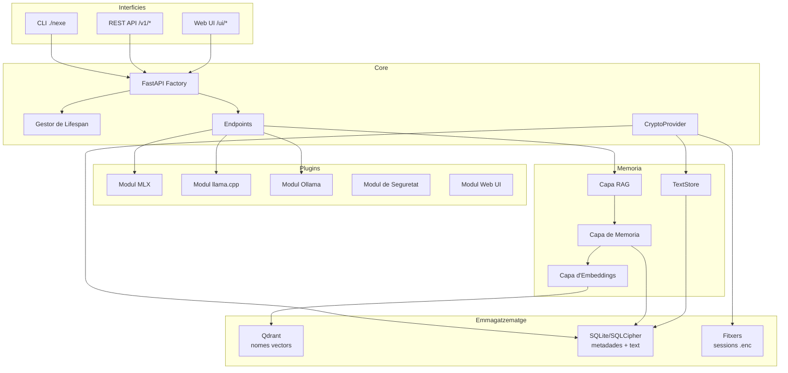
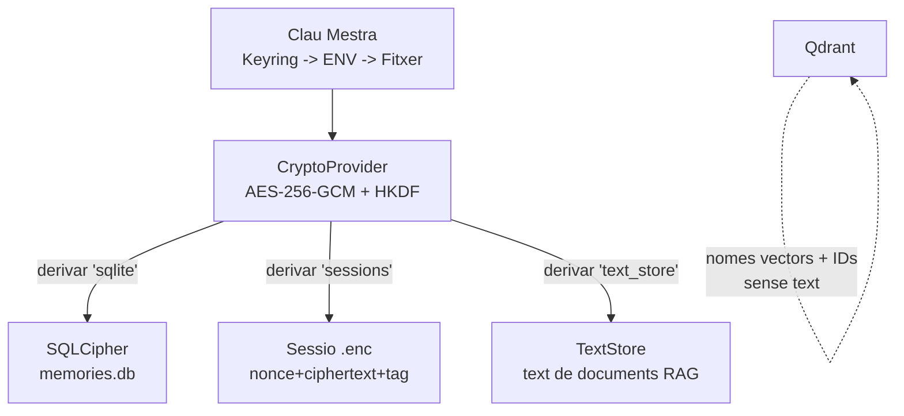

# === METADATA RAG ===
versio: "2.0"
data: 2026-04-02
id: nexe-architecture

# === CONTINGUT RAG (OBLIGATORI) ===
abstract: "Arquitectura interna de server-nexe 0.9.0 pre-release. Disseny de cinc capes: Interficies, Core (FastAPI factory, endpoints separats, lifespan, crypto), Plugins (5 moduls amb auto-descobriment), Serveis Base (RAG memoria de 3 capes amb TextStore), Emmagatzematge. Cobreix refactoritzacio modular, module manager, i18n, Docker, pipeline d'encriptacio, pipeline de sanititzacio de peticions i diagrames Mermaid."
tags: [architecture, fastapi, plugins, qdrant, memory, lifespan, cli, design, factory, modules, refactoring, docker, i18n, module-manager, crypto, encryption, sanitization, mermaid]
chunk_size: 800
priority: P2

# === OPCIONAL ===
lang: ca
type: docs
author: "Jordi Goy"
expires: null
---

# Arquitectura — server-nexe 0.9.0 pre-release

## Arquitectura de cinc capes

```
INTERFICIES       CLI (./nexe) | REST API | Web UI
      |
CORE              Servidor FastAPI, endpoints, middleware, lifespan, crypto
      |
PLUGINS           MLX | llama.cpp | Ollama | Security | Web UI
      |
SERVEIS BASE      Memoria (RAG) | Qdrant | Embeddings | SQLite/SQLCipher | TextStore
      |
EMMAGATZEMATGE    models/ | vectors/ | logs/ | cache/ | sessions/ | *.enc
```

Principis de disseny: modularitat, backends basats en plugins, API-first, RAG natiu com a primera classe, simplicitat, encriptacio opt-in.

## Pipeline de processament de peticions

```mermaid
flowchart LR
    A[Peticio] --> B[Auth<br/>X-API-Key]
    B --> C[Rate Limit<br/>slowapi]
    C --> D[validate_string_input<br/>parametre context]
    D --> E[RAG Recall<br/>3 col·leccions]
    E --> F[_sanitize_rag_context<br/>filtre d'injeccio]
    F --> G[Inferencia LLM<br/>MLX/Ollama/llama.cpp]
    G --> H[Resposta Stream<br/>marcadors SSE]
    H --> I[Parseig MEM_SAVE<br/>extraccio de fets]
    I --> J[Resposta<br/>al client]
```



## Arquitectura de components



## Pipeline d'encriptacio



## Estructura de directoris (post-refactoritzacio marc 2026)

Quatre fitxers monolitics es van separar en 20+ submoduls durant la refactoritzacio de deute tecnic del marc 2026:
- chat.py (1187 linies) separat en 8 submoduls
- routes.py (974 linies) separat en 6 submoduls
- lifespan.py (681 linies) separat en 4 submoduls
- tray.py (707 linies) separat en 2 submoduls

```
server-nexe/
├── core/
│   ├── app.py                    # Punt d'entrada (delega a la factory)
│   ├── config.py                 # Carrega de configuracio TOML + .env
│   ├── lifespan.py               # Orquestrador del cicle de vida
│   ├── lifespan_modules.py       # Carrega de moduls de memoria i plugins
│   ├── lifespan_services.py      # Auto-arrencada de serveis (Qdrant, Ollama)
│   ├── lifespan_tokens.py        # Generacio del bootstrap token
│   ├── lifespan_ollama.py        # Gestio del cicle de vida d'Ollama
│   ├── middleware.py              # CORS, CSRF, logging, capcaleres de seguretat
│   ├── security_headers.py       # Capcaleres OWASP (CSP, HSTS, X-Frame)
│   ├── messages.py               # Claus de missatges i18n per al core
│   ├── bootstrap_tokens.py       # Sistema de bootstrap token (persistent a BD)
│   ├── models.py                 # Models Pydantic
│   │
│   ├── crypto/                   # Encriptacio at-rest (nou a la v0.9.0)
│   │   ├── __init__.py           # Paquet + check_encryption_status()
│   │   ├── provider.py           # CryptoProvider (AES-256-GCM, HKDF-SHA256)
│   │   ├── keys.py               # Gestio de clau mestra (keyring/env/fitxer)
│   │   └── cli.py                # CLI: encrypt-all, export-key, status
│   │
│   ├── endpoints/                # API REST
│   │   ├── chat.py               # POST /v1/chat/completions (orquestrador)
│   │   ├── chat_schemas.py       # Models Pydantic (Message, ChatCompletionRequest)
│   │   ├── chat_sanitization.py  # Sanititzacio de tokens SSE, truncament de context
│   │   ├── chat_rag.py           # Constructor de context RAG (3 col·leccions)
│   │   ├── chat_memory.py        # Guardar conversa a memoria (MEM_SAVE)
│   │   ├── chat_engines/         # Generadors per backend
│   │   │   ├── routing.py        # Logica de seleccio de motor
│   │   │   ├── ollama.py         # Generador streaming d'Ollama
│   │   │   ├── ollama_helpers.py # auto_num_ctx() unificat per Ollama
│   │   │   ├── mlx.py            # Generador streaming de MLX
│   │   │   └── llama_cpp.py      # Generador streaming de llama.cpp
│   │   ├── root.py               # GET /, /health, /api/info
│   │   ├── bootstrap.py          # POST /bootstrap/init
│   │   ├── modules.py            # GET /modules
│   │   ├── system.py             # POST /admin/system/*
│   │   └── v1.py                 # Wrapper d'endpoints v1
│   │
│   ├── server/                   # Patro factory (singleton amb cache)
│   │   ├── factory.py            # Facana principal create_app() amb double-check locking
│   │   ├── factory_app.py        # Crear instancia FastAPI
│   │   ├── factory_state.py      # Configurar app.state
│   │   ├── factory_security.py   # SecurityLogger, validacio de produccio
│   │   ├── factory_i18n.py       # Configuracio d'I18n + config
│   │   ├── factory_modules.py    # Descobriment i carrega de moduls
│   │   ├── factory_routers.py    # Registre de routers del core
│   │   ├── runner.py             # Executor del servidor Uvicorn
│   │   └── exception_handlers.py # Patrons de gestio d'errors
│   │
│   ├── cli/                      # CLI amb Click i router dinamic
│   │   ├── cli.py                # DynamicGroup (intercepta CLIs de moduls)
│   │   ├── router.py             # CLIRouter (descobreix CLIs via manifest.toml)
│   │   ├── chat_cli.py           # Comanda de xat interactiu
│   │   └── client.py             # Client HTTP per a l'API local
│   │
│   ├── ingest/                   # Ingestio de documents
│   │   ├── ingest_docs.py        # docs/ -> nexe_documentation (500/50 chars, destructiu)
│   │   └── ingest_knowledge.py   # knowledge/ -> nexe_documentation (default, idempotent post-F7, chunk_size per document via frontmatter)
│   │
│   ├── metrics/                  # Prometheus /metrics
│   ├── resilience/               # Circuit breaker, retry
│   └── paths/                    # Resolucio de rutes
│
├── plugins/                      # 5 moduls de plugins (auto-descoberts)
│   ├── mlx_module/               # Backend Apple Silicon (MLX)
│   ├── llama_cpp_module/         # Backend universal GGUF
│   ├── ollama_module/            # Bridge Ollama + auto-arrencada + neteja VRAM
│   ├── security/                 # Auth, rate limiting, deteccio d'injeccions, normalitzacio Unicode
│   └── web_ui_module/            # Interficie web (6 fitxers de rutes, session manager, memory helper)
│
├── memory/                       # Sistema RAG de 3 subcapes
│   ├── embeddings/               # Generacio de vectors (Ollama + sentence-transformers)
│   ├── memory/                   # Gestio de memoria (persistencia, SQLCipher)
│   │   └── api/
│   │       └── text_store.py     # TextStore (text SQLite per a documents RAG)
│   └── rag/                      # Orquestracio RAG
│
├── personality/                  # Configuracio del sistema
│   ├── server.toml               # Configuracio principal (prompts, moduls, models)
│   ├── i18n/                     # Gestor i18n + traduccions (ca/es/en)
│   └── module_manager/           # FONT UNICA DE VERITAT per a tots els moduls
│
├── installer/                    # Instal·lador macOS
│   ├── swift-wizard/             # Wizard SwiftUI (12 fitxers Swift, 6 pantalles)
│   ├── build_dmg.sh              # Constructor de DMG amb signatura
│   ├── tray.py                   # Aplicacio de safata del sistema
│   ├── tray_monitor.py           # _RamMonitor (thread daemon per RAM polling)
│   ├── tray_uninstaller.py       # Desinstal·lador amb copia de seguretat
│   └── install_headless.py       # Instal·lador headless (compatible amb Linux)
│
├── knowledge/                    # Docs per a ingestio RAG (ca/es/en x 12 fitxers)
├── storage/                      # Dades en temps d'execucio (no a git)
├── tests/                        # 4143 funcions de test
├── Dockerfile                    # Python 3.12-slim + Qdrant embegut
├── docker-compose.yml            # Serveis Nexe + Ollama
└── nexe                          # Executable CLI
```

## Patro Factory

L'aplicacio es crea via una factory singleton amb double-check locking:

- `core/app.py` crida `create_app()` de `core/server/factory.py`
- Primera crida (~0.5s): carrega i18n, config, descobreix moduls, registra routers
- Crides amb cache (<10ms): retorna la instancia existent
- La factory esta separada en 7 submoduls (factory_app, factory_state, factory_security, factory_i18n, factory_modules, factory_routers, helpers)
- `reset_app_cache()` disponible per a tests

## Gestor de Lifespan

Gestiona l'arrencada i l'aturada del servidor. Separat en 4 submoduls.

**Sequencia d'arrencada:**
1. Carregar configuracio de server.toml
2. Inicialitzar APIIntegrator (sistema de personalitat)
3. Inicialitzar Qdrant embedded (pool singleton a `core/qdrant_pool.py`, path `storage/vectors/`)
4. Auto-arrencar Ollama (si disponible, en segon pla)
5. Carregar moduls de memoria (Memory -> RAG -> Embeddings, ordre correcte)
6. Inicialitzar moduls de plugins (MLX, llama.cpp, Ollama, Security, Web UI)
7. Inicialitzar CryptoProvider si `NEXE_ENCRYPTION_ENABLED=true` (opt-in)
8. Auto-ingestio de knowledge/ (nomes la primera execucio, fitxer marcador)
9. Generar bootstrap token (256 bits, persistent a SQLite, TTL de 30min)

**Sequencia d'aturada:**
1. Descarregar models d'Ollama (neteja VRAM via keep_alive:0)
2. Tancar connexions de Qdrant
3. Finalitzar processos fills
4. Sincronitzar estat a disc

## Module Manager

`personality/module_manager/` es la FONT UNICA DE VERITAT per a tots els moduls. NO existeix cap `plugins/base.py` ni `plugins/registry.py`.

**Components:**
- ConfigManager: config + manifests
- PathDiscovery: resolucio de rutes de moduls
- ModuleDiscovery: escaneja plugins/, memory/, personality/ per a manifest.toml
- ModuleLoader: import dinamic de Python
- ModuleRegistry: registre centralitzat
- ModuleLifecycleManager: cicle de vida individual amb asyncio.Lock() lazy (correccio per al deadlock de Python 3.12)
- SystemLifecycleManager: cicle de vida a nivell de sistema

**Format manifest.toml** (cada plugin en te un):
```toml
[module]
name = "module_name"
version = "0.9.0"
type = "local_llm_option"
description = "Module description"
location = "plugins/module_name/"

[module.entry]
module = "plugins.module_name.module"
class = "ModuleClass"

[module.router]
prefix = "/module"

[module.cli]
command_name = "module"
entry_point = "plugins.module_name.cli"
```

## Arquitectura del CLI

CLI basat en Click amb router dinamic:
- `DynamicGroup` intercepta comandes no definides
- `CLIRouter` descobreix CLIs de moduls via manifest.toml
- Els CLIs dels moduls s'executen en subproces (aillament)
- Comandes: go, chat, status, modules, memory, knowledge, rag, encryption

## Arquitectura de memoria (3 subcapes)

```
Capa RAG (memory/rag/)           — orquestra cerca multi-col·leccio
      |
Capa de Memoria (memory/memory/) — FlashMemory + RAMContext + Persistencia (SQLCipher)
      |
Capa d'Embeddings (memory/embeddings/) — generacio de vectors + interficie Qdrant
```

- FlashMemory: cache temporal amb TTL (1800s)
- RAMContext: context de la sessio actual
- PersistenceManager: metadades SQLite/SQLCipher + vectors Qdrant (sense text als payloads de Qdrant)
- TextStore: emmagatzematge SQLite per al text de documents RAG (desacoblat de Qdrant)
- Tots els vectors: 768 dimensions (DEFAULT_VECTOR_SIZE centralitzat)

## Arquitectura de l'endpoint de xat

`POST /v1/chat/completions` es l'endpoint principal, separat en 8 submoduls:

1. **chat_schemas.py** — Models Pydantic (Message, ChatCompletionRequest amb use_rag=True per defecte)
2. **chat_sanitization.py** — Sanititzacio de tokens SSE (bytes nuls, caracters de control), truncament de context (MAX_CONTEXT_CHARS=24000)
3. **chat_rag.py** — Constructor de context RAG: cerca a nexe_documentation (0.4), user_knowledge (0.35), personal_memory (0.3)
4. **chat_memory.py** — Parseig de MEM_SAVE, guardar conversa a memoria
5. **chat_engines/routing.py** — Seleccio de motor (auto, ollama, mlx, llama_cpp)
6. **chat_engines/ollama.py** — Streaming d'Ollama amb suport de thinking tokens
7. **chat_engines/mlx.py** — Streaming de MLX amb gestio de CancelledError
8. **chat_engines/llama_cpp.py** — Streaming de llama.cpp

**Marcadors de streaming injectats per l'endpoint de xat:**
- `[MODEL:name]` — nom del model actiu
- `[MODEL_LOADING]` / `[MODEL_READY]` — estat de carrega del model
- `[RAG_AVG:score]` — mitjana de rellevancia RAG
- `[RAG_ITEM:score|collection|source]` — detall RAG per font
- `[MEM:N]` — nombre de fets guardats a memoria
- `[COMPACT:N]` — indicador de compactacio de context
- `[DOC_TRUNCATED:XX%]` — avis de document truncat per limit de context (nou 2026-04-02)

## Arquitectura del modul Web UI

Separat en 6 fitxers de rutes:
- **routes_auth.py** — Verificacio de clau API, llistat de backends amb mides de models, POST /ui/lang, auto-arrencada d'Ollama al canviar de backend
- **routes_chat.py** — Streaming SSE, parseig de MEM_SAVE, cerca RAG de 3 col·leccions, thinking tokens, validacio d'input, sanititzacio de context RAG
- **routes_files.py** — Pujada de documents amb aillament per session_id, validacio de noms de fitxer, rate limiting
- **routes_memory.py** — Guardar/recuperar memoria amb validacio d'input, rate limiting
- **routes_sessions.py** — CRUD de sessions amb proteccio contra path traversal, rate limiting
- **routes_static.py** — Servei de fitxers estatics, cache-busting (?v=timestamp), i18n compatible amb CSP (atribut data-nexe-lang)

## Prompt del sistema

El prompt del sistema defineix la personalitat i el comportament de Nexe. Viu a `personality/server.toml` sota `[personality.prompt]`.

**6 variants:** 3 idiomes (ca/es/en) x 2 nivells (small per a models <=4B, full per a 7B+).

**Logica de seleccio** (`core/endpoints/chat.py` -> `_get_system_prompt()`):
1. `{lang}_{tier}` (p. ex., `ca_full`) — de server.toml
2. `{lang}_full` — fallback de nivell
3. `en_full` — fallback d'idioma
4. Prompt minim hardcoded — ultim recurs

**Disseny clau:** Nexe es un assistent personal general amb memoria persistent, no nomes un assistent tecnic de Server Nexe. El prompt diu: "Ajudes amb qualsevol cosa — conversa, projectes, idees, problemes tecnics, escriptura, analisi."

**Injeccio de context RAG:** S'injecta al **missatge de l'usuari** (no al prompt del sistema) per preservar la cache de prefix de MLX/llama.cpp. El prompt del sistema es mante estable entre missatges.

## Integracio i18n

- El servidor es la font de veritat per a l'idioma (POST /ui/lang)
- 3 idiomes: ca, es, en
- Prompts del sistema: 6 versions (ca/es/en x nivell small/full)
- Missatges HTTPException: claus i18n amb patro de fallback
- Web UI: applyI18n() amb atributs de dades, preserva elements fills
- Compatible amb CSP: atribut data-nexe-lang en lloc de script inline

## Arquitectura Docker

- **Dockerfile:** Python 3.12-slim, Qdrant embegut (linux-amd64/arm64 auto-deteccio), usuari no-root (nexe), EXPOSE 9119 6333
- **docker-compose.yml:** Nexe + Ollama com a serveis separats
- **docker-entrypoint.sh:** Arrencada sequencial (Qdrant -> Nexe), polling de health check

## Arquitectura de tests

- 4143 funcions de test, 3213 passats a l'ultima execucio, 0 errors
- Tests col·locats amb els moduls (cada modul te una carpeta tests/)
- conftest.py arrel per a fixtures compartides
- Closures refactoritzades a funcions per a patchabilitat (decisio clau de refactoritzacio)
- 68 nous tests de crypto (CryptoProvider, SQLCipher, sessions, CLI)
- Cobertura rastrejada via .coveragerc
