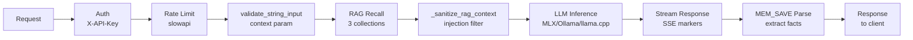
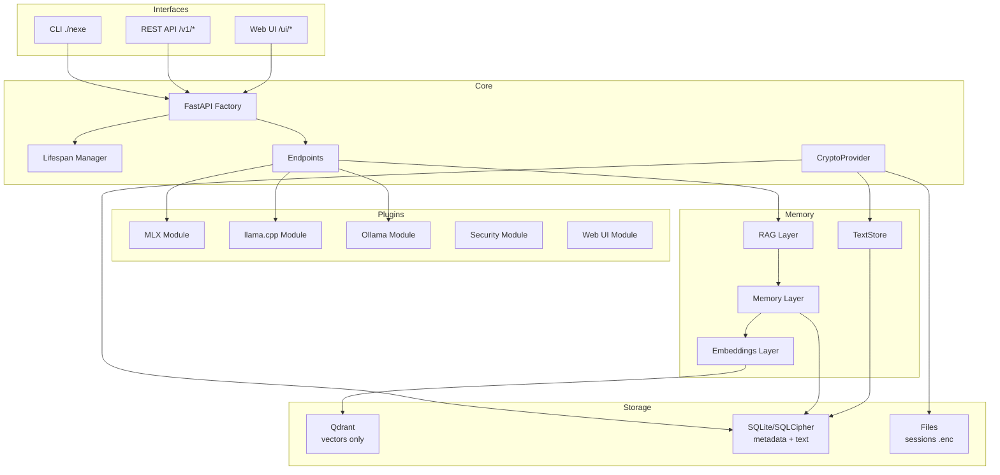
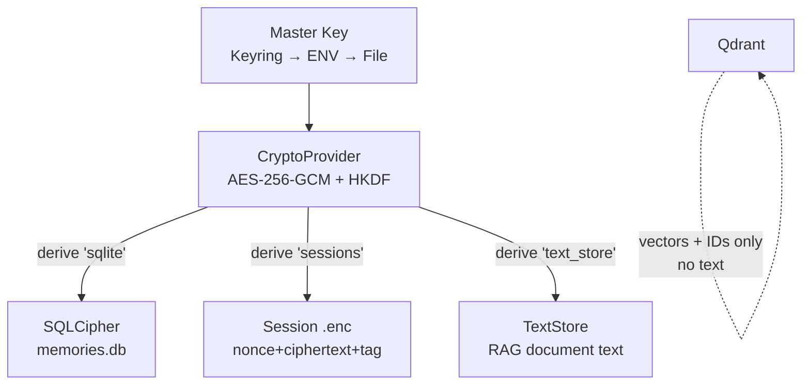

# === METADATA RAG ===
versio: "2.0"
data: 2026-04-16
id: nexe-architecture
collection: nexe_documentation

# === CONTINGUT RAG (OBLIGATORI) ===
abstract: "Internal architecture of server-nexe 1.0.2-beta. Five-layer design: Interfaces, Core (FastAPI factory, split endpoints, lifespan, crypto), Plugins (5 modules with auto-discovery), Base Services (RAG 3-layer memory with TextStore), Storage. Covers modular refactoring, module manager, i18n, encryption pipeline, request sanitization pipeline, VLM 3-signal detector, precomputed KB embeddings, thinking toggle, and Mermaid diagrams."
tags: [architecture, fastapi, plugins, qdrant, memory, lifespan, cli, design, factory, modules, refactoring, i18n, module-manager, crypto, encryption, sanitization, mermaid]
chunk_size: 800
priority: P2

# === OPCIONAL ===
lang: en
type: docs
author: "Jordi Goy with AI collaboration"
expires: null
---

# Architecture — server-nexe 1.0.2-beta

## Table of contents

- [Five-Layer Architecture](#five-layer-architecture)
- [Request Processing Pipeline](#request-processing-pipeline)
- [Component Architecture](#component-architecture)
- [Encryption Pipeline](#encryption-pipeline)
- [Directory Structure (post-refactoring March 2026)](#directory-structure-post-refactoring-march-2026)
- [Factory Pattern](#factory-pattern)
- [Lifespan Manager](#lifespan-manager)
- [Tray launch (NexeTray.app)](#tray-launch-nexetrayapp)
- [Module Manager](#module-manager)
- [CLI Architecture](#cli-architecture)
- [Memory Architecture (3 sublayers)](#memory-architecture-3-sublayers)
- [Chat Endpoint Architecture](#chat-endpoint-architecture)
- [Web UI Module Architecture](#web-ui-module-architecture)
- [System Prompt](#system-prompt)
- [I18n Integration](#i18n-integration)
- [Test Architecture](#test-architecture)
- [How to change the vector store](#how-to-change-the-vector-store)
  - [VectorStore Protocol](#vectorstore-protocol)
  - [Current implementation](#current-implementation)
  - [Adding a new backend](#adding-a-new-backend)
  - [Notes](#notes)
- [VLM 3-signal any-of detector](#vlm-3-signal-any-of-detector)
- [Precomputed KB embeddings](#precomputed-kb-embeddings)
- [Thinking toggle (reasoning tokens)](#thinking-toggle-reasoning-tokens)
- [MLX Models — Compatibility](#mlx-models--compatibility)

## Five-Layer Architecture

```
INTERFACES        CLI (./nexe) | REST API | Web UI
      |
CORE              FastAPI server, endpoints, middleware, lifespan, crypto
      |
PLUGINS           MLX | llama.cpp | Ollama | Security | Web UI
      |
BASE SERVICES     Memory (RAG) | Qdrant | Embeddings | SQLite/SQLCipher | TextStore
      |
STORAGE           models/ | vectors/ | logs/ | cache/ | sessions/ | *.enc
```

Design principles: modularity, plugin-based backends, API-first, native RAG as first-class, simplicity, encryption auto-on (when available).

## Request Processing Pipeline



## Component Architecture



## Encryption Pipeline



## Directory Structure (post-refactoring March 2026)

Four monolithic files were split into 20+ submodules during the March 2026 tech debt refactoring:
- chat.py (1187 lines) split into 8 submodules
- routes.py (974 lines) split into 6 submodules
- lifespan.py (681 lines) split into 4 submodules
- tray.py (707 lines) split into 3 submodules

```
server-nexe/
├── core/
│   ├── app.py                    # Entry point (delegates to factory)
│   ├── config.py                 # TOML + .env configuration loading
│   ├── lifespan.py               # Lifecycle orchestrator
│   ├── lifespan_modules.py       # Memory module and plugin loading
│   ├── lifespan_services.py      # Auto-start services (Qdrant, Ollama)
│   ├── lifespan_tokens.py        # Bootstrap token generation
│   ├── lifespan_ollama.py        # Ollama lifecycle management
│   ├── middleware.py              # CORS, CSRF, logging, security headers
│   ├── security_headers.py       # OWASP headers (CSP, HSTS, X-Frame)
│   ├── messages.py               # i18n message keys for core
│   ├── bootstrap_tokens.py       # Bootstrap token system (DB persist)
│   ├── models.py                 # Pydantic models
│   │
│   ├── crypto/                   # Encryption at rest (new in v0.9.0)
│   │   ├── __init__.py           # Package + check_encryption_status()
│   │   ├── provider.py           # CryptoProvider (AES-256-GCM, HKDF-SHA256)
│   │   ├── keys.py               # Master key management (keyring/env/file)
│   │   └── cli.py                # CLI: encrypt-all, export-key, status
│   │
│   ├── endpoints/                # REST API
│   │   ├── chat.py               # POST /v1/chat/completions (orchestrator)
│   │   ├── chat_schemas.py       # Pydantic models (Message, ChatCompletionRequest)
│   │   ├── chat_sanitization.py  # SSE token sanitization, context truncation
│   │   ├── chat_rag.py           # RAG context builder (3 collections)
│   │   ├── chat_memory.py        # Save conversation to memory (MEM_SAVE)
│   │   ├── chat_engines/         # Per-backend generators
│   │   │   ├── routing.py        # Engine selection logic
│   │   │   ├── ollama.py         # Ollama streaming generator
│   │   │   ├── ollama_helpers.py # Unified auto_num_ctx() for Ollama
│   │   │   ├── mlx.py            # MLX streaming generator
│   │   │   └── llama_cpp.py      # llama.cpp streaming generator
│   │   ├── root.py               # GET /, /health, /api/info
│   │   ├── bootstrap.py          # POST /bootstrap/init
│   │   ├── modules.py            # GET /modules
│   │   ├── system.py             # POST /admin/system/*
│   │   └── v1.py                 # v1 endpoints wrapper
│   │
│   ├── server/                   # Factory pattern (singleton cached)
│   │   ├── factory.py            # Main facade create_app() with double-check locking
│   │   ├── factory_app.py        # Create FastAPI instance
│   │   ├── factory_state.py      # Setup app.state
│   │   ├── factory_security.py   # SecurityLogger, production validation
│   │   ├── factory_i18n.py       # I18n + config setup
│   │   ├── factory_modules.py    # Module discovery and loading
│   │   ├── factory_routers.py    # Core routers registration
│   │   ├── runner.py             # Uvicorn server runner
│   │   └── exception_handlers.py # Error handling patterns
│   │
│   ├── cli/                      # Click CLI with dynamic router
│   │   ├── cli.py                # DynamicGroup (intercepts module CLIs)
│   │   ├── router.py             # CLIRouter (discovers manifest.toml CLIs)
│   │   ├── chat_cli.py           # Interactive chat command
│   │   └── client.py             # HTTP client for local API
│   │
│   ├── ingest/                   # Document ingestion
│   │   ├── ingest_docs.py        # docs/ → nexe_documentation (500/50 chars, destructive)
│   │   └── ingest_knowledge.py   # knowledge/ → nexe_documentation (default, idempotent post-F7, chunk_size per-document via frontmatter)
│   │
│   ├── metrics/                  # Prometheus /metrics
│   ├── resilience/               # Circuit breaker, retry
│   └── paths/                    # Path resolution
│
├── plugins/                      # 5 plugin modules (auto-discovered)
│   ├── mlx_module/               # Apple Silicon backend (MLX)
│   ├── llama_cpp_module/         # GGUF universal backend
│   ├── ollama_module/            # Ollama bridge + auto-start + VRAM cleanup
│   ├── security/                 # Auth, rate limiting, injection detection, Unicode normalization
│   └── web_ui_module/            # Web interface (6 route files, session manager, memory helper)
│
├── memory/                       # 3-sublayer RAG system
│   ├── embeddings/               # Vector generation (Ollama + fastembed ONNX)
│   ├── memory/                   # Memory management (persistence, SQLCipher)
│   │   └── api/
│   │       └── text_store.py     # TextStore (SQLite text for RAG documents)
│   └── rag/                      # RAG orchestration
│
├── personality/                  # System configuration
│   ├── server.toml               # Main config (prompts, modules, models)
│   ├── i18n/                     # I18n manager + translations (ca/es/en)
│   └── module_manager/           # SINGLE SOURCE OF TRUTH for all modules
│
├── installer/                    # macOS installer
│   ├── swift-wizard/             # SwiftUI wizard (12 Swift files, 6 screens)
│   ├── NexeTray.app/             # Official macOS tray bundle (LSUIElement, CFBundleIdentifier=net.servernexe.tray)
│   │   └── Contents/MacOS/NexeTray  # Bash wrapper → exec venv/python -m installer.tray "$@"
│   ├── build_dmg.sh              # DMG builder with signing
│   ├── tray.py                   # System tray app
│   ├── tray_monitor.py           # _RamMonitor (daemon thread for RAM polling)
│   ├── tray_translations.py      # i18n translations for the tray (ca/es/en)
│   ├── tray_uninstaller.py       # Uninstaller with backup
│   └── install_headless.py       # Headless installer (Linux compatible)
│
├── knowledge/                    # Docs for RAG ingestion (ca/es/en × 12 files)
│   └── .embeddings/              # Precomputed KB embeddings (ONNX, 10.7× startup speedup)
├── storage/                      # Runtime data (not in git)
├── tests/                        # 4842 test functions collected (4990 total)
└── nexe                          # CLI executable
```

## Factory Pattern

The app is created via a singleton factory with double-check locking:

- `core/app.py` calls `create_app()` from `core/server/factory.py`
- First call (~0.5s): loads i18n, config, discovers modules, registers routers
- Cached calls (<10ms): returns existing instance
- Factory is split into 6 submodules (factory_app, factory_state, factory_security, factory_i18n, factory_modules, factory_routers)
- `reset_app_cache()` available for tests

## Lifespan Manager

Handles startup and shutdown of the server. Split into 4 submodules.

**Startup sequence:**
1. Load config from server.toml
2. Write PID file atomically (`storage/run/server.pid`, `O_CREAT|O_EXCL`) — aborts if server already running
3. Initialize APIIntegrator (personality system)
4. Initialize Qdrant embedded (singleton pool at `core/qdrant_pool.py`, path `storage/vectors/`)
5. Auto-start Ollama (if available, background mode) — timeout `NEXE_STARTUP_TIMEOUT` (default 30s)
6. Load memory modules (Memory → RAG → Embeddings, correct order) — timeout 30s
7. Initialize plugin modules (MLX, llama.cpp, Ollama, Security, Web UI) — timeout 30s
8. Initialize CryptoProvider per `NEXE_ENCRYPTION_ENABLED` (`auto` by default — active if sqlcipher3 available)
9. Auto-ingest knowledge/ (first run only, marker file) — timeout 30s
10. Generate bootstrap token (256-bit, SQLite persistent, 30min TTL)

**Shutdown sequence (finally — always runs, even on error):**
1. Remove PID file (`storage/run/server.pid`) — always, first step
2. Unload Ollama models (VRAM cleanup via keep_alive:0)
3. Close Qdrant connections
4. Terminate child processes
5. Cancel background tasks (rate limit cleanup, session cleanup)
6. Reset circuit breakers to CLOSED (clean state for next restart)
7. Sync state to disk

**PID file (`storage/run/server.pid`):**
- JSON format: `{"pid": N, "port": P, "started": ISO}`
- Acquired atomically via `os.O_CREAT|O_EXCL|O_WRONLY` (no TOCTOU race)
- Single-instance guard: startup aborts if existing PID is alive
- SIGTERM handler in `core/server/runner.py` ensures clean exit before uvicorn

**Related environment variables:**
- `NEXE_STARTUP_TIMEOUT` — per-phase startup timeout in seconds (default: 30)

## Tray launch (NexeTray.app)

`core/server/runner.py` launches the tray in `--attach` mode once the server is running.

**Launch priority:**

1. **`installer/NexeTray.app/Contents/MacOS/NexeTray`** (official bundle):
   - Gatekeeper-safe, provenance OK on macOS Sequoia
   - Shows up as "server-nexe" in Activity Monitor and Force Quit (CFBundleName)
   - The binary is a bash wrapper that runs `exec venv/python -m installer.tray "$@"`
   - Passes `--attach --server-pid PID` transparently

2. **`python -m installer.tray --attach --server-pid PID`** (dev fallback):
   - Used when the bundle does not exist (dev environment without installation)
   - Shows up as "Python" in Activity Monitor — not recommended in production

**Why a bundle and not `python -m` directly:** macOS Sequoia enforces provenance restrictions on unsigned Python processes without a bundle. The bundle has `LSUIElement=true` and `CFBundleIdentifier=net.servernexe.tray`, which macOS recognises as a legitimate menu-bar app.

**Headless mode (`install_headless.py`):** Headless mode installs the server (`Nexe.app`) and configures the Login Item (auto-start) on macOS. However, it does **NOT install the system tray (`NexeTray.app`)** — there will be no menu-bar icon. If you want the tray on macOS, use the GUI installer (`install.py` + Swift wizard).

## Module Manager

`personality/module_manager/` is the SINGLE SOURCE OF TRUTH for all modules. There is NO `plugins/base.py` or `plugins/registry.py`.

**Components:**
- ConfigManager: config + manifests
- PathDiscovery: module path resolution
- ModuleDiscovery: scans plugins/, memory/, personality/ for manifest.toml
- ModuleLoader: dynamic Python import
- ModuleRegistry: centralized registry
- ModuleLifecycleManager: individual lifecycle with lazy asyncio.Lock() (fix for Python 3.12 deadlock)
- SystemLifecycleManager: system-wide lifecycle

**manifest.toml format** (each plugin has one):
```toml
[module]
name = "module_name"
version = "1.0.2-beta"
type = "local_llm_option"
description = "Module description"
location = "plugins/module_name/"

[module.entry]
module = "plugins.module_name.module"
class = "ModuleClass"

[module.router]
prefix = "/module"

[module.cli]
command_name = "module"
entry_point = "plugins.module_name.cli"
```

## CLI Architecture

Click-based CLI with dynamic router:
- `DynamicGroup` intercepts undefined commands
- `CLIRouter` discovers module CLIs via manifest.toml
- Module CLIs run in subprocess (isolation)
- Commands: go, chat, status, modules, memory, knowledge, rag, encryption

## Memory Architecture (3 sublayers)

```
RAG Layer (memory/rag/)           — orchestrates multi-collection search
      |
Memory Layer (memory/memory/)     — FlashMemory + RAMContext + Persistence (SQLCipher)
      |
Embeddings Layer (memory/embeddings/) — vector generation + Qdrant interface
```

- FlashMemory: temporary cache with TTL (1800s)
- RAMContext: current session context
- PersistenceManager: SQLite/SQLCipher metadata + Qdrant vectors (no text in Qdrant payloads)
- TextStore: SQLite storage for RAG document text (decoupled from Qdrant)
- All vectors: 768 dimensions (DEFAULT_VECTOR_SIZE centralized)

## Chat Endpoint Architecture

`POST /v1/chat/completions` is the main endpoint, split into 8 submodules:

1. **chat_schemas.py** — Pydantic models (Message, ChatCompletionRequest with use_rag=True default)
2. **chat_sanitization.py** — SSE token sanitization (null bytes, control chars), context truncation (MAX_CONTEXT_CHARS=24000)
3. **chat_rag.py** — RAG context builder: searches nexe_documentation (0.4), user_knowledge (0.35), personal_memory (0.3)
4. **chat_memory.py** — MEM_SAVE parsing, save conversation to memory
5. **chat_engines/routing.py** — Engine selection (auto, ollama, mlx, llama_cpp)
6. **chat_engines/ollama.py** — Ollama streaming with thinking token support
7. **chat_engines/mlx.py** — MLX streaming with CancelledError handling
8. **chat_engines/llama_cpp.py** — llama.cpp streaming

**Streaming markers injected by chat endpoint:**
- `[MODEL:name]` — active model name
- `[MODEL_LOADING]` / `[MODEL_READY]` — model load state
- `[RAG_AVG:score]` — average RAG relevance
- `[RAG_ITEM:score|collection|source]` — per-source RAG detail
- `[MEM:N]` — number of facts saved to memory
- `[COMPACT:N]` — context compaction indicator
- `[DOC_TRUNCATED:XX%]` — document truncation warning for context limit (new 2026-04-02)

## Web UI Module Architecture

Split into 6 route files:
- **routes_auth.py** — API key verification, backend listing with model sizes, POST /ui/lang, Ollama auto-start on backend switch
- **routes_chat.py** — SSE streaming, MEM_SAVE parsing, RAG 3-collection search, thinking tokens, input validation, RAG context sanitization
- **routes_files.py** — Document upload with session_id isolation, filename validation, rate limiting
- **routes_memory.py** — Memory save/recall with input validation, rate limiting
- **routes_sessions.py** — Session CRUD with path traversal protection, rate limiting
- **routes_static.py** — Static file serving, cache-busting (?v=timestamp), CSP-safe i18n (data-nexe-lang attribute)

## System Prompt

The system prompt defines Nexe's personality and behavior. It lives in `personality/server.toml` under `[personality.prompt]`.

**6 variants:** 3 languages (ca/es/en) × 2 tiers (small for models ≤4B, full for 7B+).

**Selection logic** (`core/endpoints/chat.py` → `_get_system_prompt()`):
1. `{lang}_{tier}` (e.g., `ca_full`) — from server.toml
2. `{lang}_full` — fallback tier
3. `en_full` — fallback language
4. Hardcoded minimal prompt — last resort

**Key design:** Nexe is a general personal assistant with persistent memory, not just a Server Nexe technical assistant. The prompt says: "You help with anything — conversation, projects, ideas, technical problems, writing, analysis."

**RAG context injection:** Injected into the **user message** (not the system prompt) to preserve MLX/llama.cpp prefix cache. The system prompt stays stable across messages.

## I18n Integration

- Server is source of truth for language (POST /ui/lang)
- 3 languages: ca, es, en
- System prompts: 6 versions (ca/es/en × small/full tier)
- HTTPException messages: i18n keys with fallback pattern
- Web UI: applyI18n() with data attributes, preserves child elements
- CSP-safe: data-nexe-lang attribute instead of inline script

## Test Architecture

- 4842 test functions collected (4990 total — 148 deselected by markers), 0 failures in latest run
- Actual coverage: ~85% global (honest baseline, not inflated)
- Tests collocated with modules (each module has tests/ folder)
- Root conftest.py for shared fixtures
- Closures refactored to functions for patchability (key refactoring decision)
- 68 crypto tests (CryptoProvider, SQLCipher, sessions, CLI)
- 8 MEM_DELETE e2e tests (`tests/integration/test_mem_delete_e2e.py`) with embedded Qdrant + real fastembed
- Coverage tracked via .coveragerc

## How to change the vector store

server-nexe uses Qdrant embedded as the default vector store. The `QdrantAdapter` abstraction layer allows replacing it with another backend (Weaviate, Chroma, Milvus, FAISS, etc.) without touching the consumers.

### VectorStore Protocol

Defined in `memory/embeddings/core/vectorstore.py`. Any implementation must comply with:

```python
def add_vectors(self, vectors, texts, metadatas) -> List[str]
def search(self, request: VectorSearchRequest) -> List[VectorSearchHit]
def delete(self, ids: List[str]) -> int
def health(self) -> Dict[str, Any]
```

### Current implementation

`memory/embeddings/adapters/qdrant_adapter.py` — `QdrantAdapter` implements the Protocol and exposes additional collection management methods for compatibility.

### Adding a new backend

1. Create `memory/embeddings/adapters/weaviate_adapter.py` (or similar)
2. Implement the 4 Protocol methods
3. Create `WeaviateAdapter.from_pool()` or equivalent
4. Replace `QdrantAdapter` at the entry points:
   - `memory/memory/engines/persistence.py:_init_qdrant()` — `QdrantAdapter.from_pool()`
   - `memory/memory/api/__init__.py:initialize()` — `QdrantAdapter(client=raw_client)`
   - `memory/memory/storage/vector_index.py:_init_client()` — `QdrantAdapter.from_pool()`
5. Consumers (`documents.py`, `collections.py`) do not need to be touched

### Notes

- Migrating from Qdrant is NOT plug & play — you need to create the adapter and collection methods
- The substitution path is what matters, not automatic substitution
- Qdrant embedded exposes no network port (`storage/vectors/` must be writable)

## VLM 3-signal any-of detector

Starting in v0.9.8, the MLX backend uses a **"any-of" VLM detector with 3 signals** to identify whether a model is multimodal before loading it (`plugins/mlx_module/core/vlm_detection.py`):

1. **`architectures`** in `config.json` — keywords such as `VL`, `Vision`, `VLM`, `Llava`, `PaliGemma`, `InternVL`, `MiniCPMV`, `Idefics`, `Mllama`, `Qwen2VL`, `Qwen2_5_VL`, `Qwen3VL`.
2. **`vision_config`** in `config.json` — vision configuration block present.
3. **`weight_map`** in `model.safetensors.index.json` — keys such as `vision_tower`, `mm_projector`, `vision_model`, `visual`.

**"Any-of" logic:** if any of the 3 signals matches, the model is considered a VLM and routed to `mlx-vlm` (with `stream_generate` and `GenerationResult` API from `mlx-vlm 0.4.4`). This covers new architectures that lack the classical keys (e.g., models where only `vision_config` appears without an `architectures` keyword).

## Precomputed KB embeddings

Files in `knowledge/` can have **precomputed embeddings** stored in `knowledge/.embeddings/` (post-v0.9.8). At startup, if the hashes match the current `.md` files, the system skips the embedding computation (fastembed ONNX, ~700ms per file) and loads the already-computed vectors directly.

**Measured speedup:** 10.7× on cold boot. Particularly useful in the offline DMG, where embeddings ship inside the bundle for each language (ca/es/en × 12 files).

Embeddings regenerate automatically if the content of the `.md` files or the embedding model changes.

## Thinking toggle (reasoning tokens)

Starting in v0.9.9, server-nexe supports **per-session toggling of thinking tokens**:

- **Endpoint:** `PATCH /ui/session/{id}/thinking` (rate limit 10/min)
- **`THINKING_CAPABLE` safelist:** model families that support reasoning — `qwen3.5`, `qwen3`, `qwq`, `deepseek-r1`, `gemma3/4`, `llama4`, `gpt-oss`.
- **`can_think(model)` function:** checks whether the active model is on the safelist.
- **Default OFF** — must be enabled explicitly per session (UI: ✨ sparkles icon + 🧠 dropdown).
- **400 retry fallback:** if the model is NOT thinking-capable and the user enables it, the server returns 400 and the UI offers automatic retry without thinking.
- **`NEXE_OLLAMA_THINK` env var:** controls the global default for Ollama models (`true`/`false`).

Thinking tokens are emitted in the stream with `[THINKING]…[/THINKING]` markers and the UI renders them as a collapsible orange block.

## MLX Models — Compatibility

The installer catalog (`installer/swift-wizard/Resources/models.json`) includes newer models such as **gemma4** (Google Gemma 4) and **Qwen3.5-VLM** (Alibaba). These models are tagged `"mlx": true` in the catalog, but **have not been verified with `mlx_module`** and do not appear in the MLX model registry (`personality/models/registry.py`).

**Current behavior:**
- Via Ollama: work correctly (if the Ollama tag is valid and the model is available on the Ollama server)
- Via MLX: may fail silently if no corresponding HuggingFace model exists at `mlx-community/`
- `nexe model list` and `nexe model pull` do not show them (not in `MODEL_REGISTRY`)

**Recommendation:** Use Ollama for gemma4 and Qwen3.5-VLM. MLX support will be added to `MODEL_REGISTRY` once compatibility with `mlx-community/` HuggingFace IDs has been verified.
