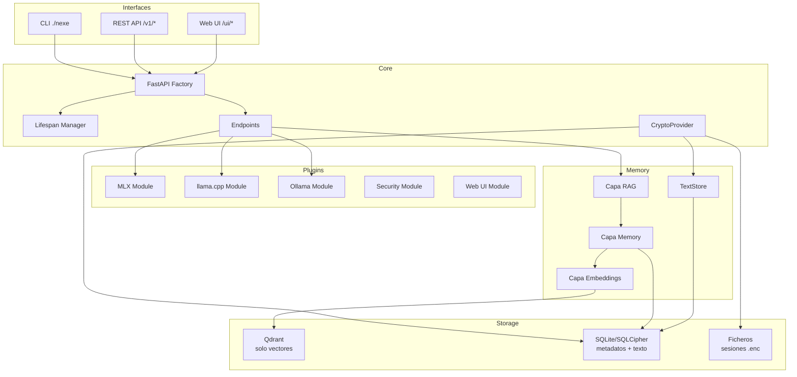
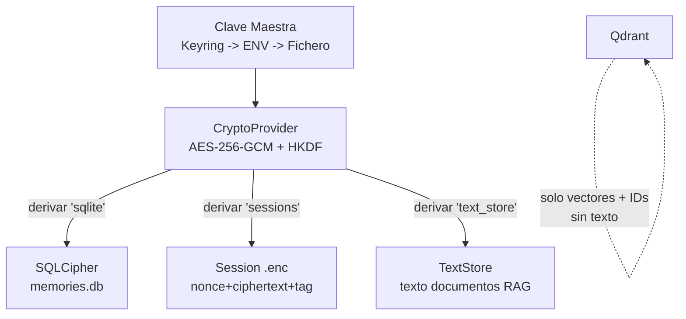

# === METADATA RAG ===
versio: "2.0"
data: 2026-04-02
id: nexe-architecture
collection: nexe_documentation

# === CONTINGUT RAG (OBLIGATORI) ===
abstract: "Arquitectura interna de server-nexe 0.9.7. Diseno de cinco capas: Interfaces, Core (factory FastAPI, endpoints divididos, lifespan, crypto), Plugins (5 modulos con auto-descubrimiento), Servicios Base (RAG memoria de 3 capas con TextStore), Almacenamiento. Cubre refactorizacion modular, module manager, i18n, pipeline de encriptacion, pipeline de sanitizacion de peticiones, y diagramas Mermaid."
tags: [architecture, fastapi, plugins, qdrant, memory, lifespan, cli, design, factory, modules, refactoring, i18n, module-manager, crypto, encryption, sanitization, mermaid]
chunk_size: 800
priority: P2

# === OPCIONAL ===
lang: es
type: docs
author: "Jordi Goy"
expires: null
---

# Arquitectura — server-nexe 0.9.7

## Arquitectura de cinco capas

```
INTERFACES        CLI (./nexe) | REST API | Web UI
      |
CORE              Servidor FastAPI, endpoints, middleware, lifespan, crypto
      |
PLUGINS           MLX | llama.cpp | Ollama | Security | Web UI
      |
SERVICIOS BASE    Memory (RAG) | Qdrant | Embeddings | SQLite/SQLCipher | TextStore
      |
ALMACENAMIENTO    models/ | vectors/ | logs/ | cache/ | sessions/ | *.enc
```

Principios de diseno: modularidad, backends basados en plugins, API-first, RAG nativo como elemento de primera clase, simplicidad, encriptacion auto (cuando disponible).

## Pipeline de procesamiento de peticiones

```mermaid
flowchart LR
    A[Peticion] --> B[Auth<br/>X-API-Key]
    B --> C[Rate Limit<br/>slowapi]
    C --> D[validate_string_input<br/>param context]
    D --> E[RAG Recall<br/>3 colecciones]
    E --> F[_sanitize_rag_context<br/>filtro inyeccion]
    F --> G[Inferencia LLM<br/>MLX/Ollama/llama.cpp]
    G --> H[Stream Response<br/>marcadores SSE]
    H --> I[Parse MEM_SAVE<br/>extraer hechos]
    I --> J[Respuesta<br/>al cliente]
```



## Arquitectura de componentes



## Pipeline de encriptacion



## Estructura de directorios (post-refactorizacion marzo 2026)

Cuatro ficheros monoliticos fueron divididos en mas de 20 submodulos durante la refactorizacion de deuda tecnica de marzo 2026:
- chat.py (1187 lineas) dividido en 8 submodulos
- routes.py (974 lineas) dividido en 6 submodulos
- lifespan.py (681 lineas) dividido en 4 submodulos
- tray.py (707 lineas) dividido en 3 submodulos

```
server-nexe/
├── core/
│   ├── app.py                    # Punto de entrada (delega a la factory)
│   ├── config.py                 # Carga de configuracion TOML + .env
│   ├── lifespan.py               # Orquestador del ciclo de vida
│   ├── lifespan_modules.py       # Carga de modulos de memoria y plugins
│   ├── lifespan_services.py      # Auto-arranque de servicios (Qdrant, Ollama)
│   ├── lifespan_tokens.py        # Generacion de token bootstrap
│   ├── lifespan_ollama.py        # Gestion del ciclo de vida de Ollama
│   ├── middleware.py              # CORS, CSRF, logging, cabeceras de seguridad
│   ├── security_headers.py       # Cabeceras OWASP (CSP, HSTS, X-Frame)
│   ├── messages.py               # Claves de mensajes i18n para core
│   ├── bootstrap_tokens.py       # Sistema de tokens bootstrap (persistencia DB)
│   ├── models.py                 # Modelos Pydantic
│   │
│   ├── crypto/                   # Encriptacion en reposo (nuevo en v0.9.0)
│   │   ├── __init__.py           # Paquete + check_encryption_status()
│   │   ├── provider.py           # CryptoProvider (AES-256-GCM, HKDF-SHA256)
│   │   ├── keys.py               # Gestion de clave maestra (keyring/env/fichero)
│   │   └── cli.py                # CLI: encrypt-all, export-key, status
│   │
│   ├── endpoints/                # REST API
│   │   ├── chat.py               # POST /v1/chat/completions (orquestador)
│   │   ├── chat_schemas.py       # Modelos Pydantic (Message, ChatCompletionRequest)
│   │   ├── chat_sanitization.py  # Sanitizacion de tokens SSE, truncamiento de contexto
│   │   ├── chat_rag.py           # Constructor de contexto RAG (3 colecciones)
│   │   ├── chat_memory.py        # Guardar conversacion en memoria (MEM_SAVE)
│   │   ├── chat_engines/         # Generadores por backend
│   │   │   ├── routing.py        # Logica de seleccion de engine
│   │   │   ├── ollama.py         # Generador streaming Ollama
│   │   │   ├── ollama_helpers.py # auto_num_ctx() unificado para Ollama
│   │   │   ├── mlx.py            # Generador streaming MLX
│   │   │   └── llama_cpp.py      # Generador streaming llama.cpp
│   │   ├── root.py               # GET /, /health, /api/info
│   │   ├── bootstrap.py          # POST /bootstrap/init
│   │   ├── modules.py            # GET /modules
│   │   ├── system.py             # POST /admin/system/*
│   │   └── v1.py                 # Wrapper de endpoints v1
│   │
│   ├── server/                   # Patron factory (singleton cacheado)
│   │   ├── factory.py            # Fachada principal create_app() con double-check locking
│   │   ├── factory_app.py        # Crear instancia FastAPI
│   │   ├── factory_state.py      # Configurar app.state
│   │   ├── factory_security.py   # SecurityLogger, validacion de produccion
│   │   ├── factory_i18n.py       # Configuracion I18n + config
│   │   ├── factory_modules.py    # Descubrimiento y carga de modulos
│   │   ├── factory_routers.py    # Registro de routers de core
│   │   ├── runner.py             # Ejecutor de servidor Uvicorn
│   │   └── exception_handlers.py # Patrones de manejo de errores
│   │
│   ├── cli/                      # CLI Click con router dinamico
│   │   ├── cli.py                # DynamicGroup (intercepta CLIs de modulos)
│   │   ├── router.py             # CLIRouter (descubre CLIs via manifest.toml)
│   │   ├── chat_cli.py           # Comando de chat interactivo
│   │   └── client.py             # Cliente HTTP para API local
│   │
│   ├── ingest/                   # Ingestion de documentos
│   │   ├── ingest_docs.py        # docs/ -> nexe_documentation (500/50 chars, destructivo)
│   │   └── ingest_knowledge.py   # knowledge/ -> nexe_documentation (default, idempotente post-F7, chunk_size por documento via frontmatter)
│   │
│   ├── metrics/                  # Prometheus /metrics
│   ├── resilience/               # Circuit breaker, retry
│   └── paths/                    # Resolucion de rutas
│
├── plugins/                      # 5 modulos de plugins (auto-descubiertos)
│   ├── mlx_module/               # Backend Apple Silicon (MLX)
│   ├── llama_cpp_module/         # Backend universal GGUF
│   ├── ollama_module/            # Bridge Ollama + auto-arranque + limpieza VRAM
│   ├── security/                 # Auth, rate limiting, deteccion de inyecciones, normalizacion Unicode
│   └── web_ui_module/            # Interfaz web (6 ficheros de rutas, session manager, memory helper)
│
├── memory/                       # Sistema RAG de 3 subcapas
│   ├── embeddings/               # Generacion de vectores (Ollama + fastembed ONNX)
│   ├── memory/                   # Gestion de memoria (persistencia, SQLCipher)
│   │   └── api/
│   │       └── text_store.py     # TextStore (almacenamiento SQLite de texto para documentos RAG)
│   └── rag/                      # Orquestacion RAG
│
├── personality/                  # Configuracion del sistema
│   ├── server.toml               # Config principal (prompts, modulos, modelos)
│   ├── i18n/                     # Gestor i18n + traducciones (ca/es/en)
│   └── module_manager/           # FUENTE UNICA DE VERDAD para todos los modulos
│
├── installer/                    # Instalador macOS
│   ├── swift-wizard/             # Wizard SwiftUI (12 ficheros Swift, 6 pantallas)
│   ├── build_dmg.sh              # Constructor de DMG con firma
│   ├── tray.py                   # App de bandeja del sistema
│   ├── tray_monitor.py           # _RamMonitor (hilo daemon para polling RAM)
│   ├── tray_translations.py      # Traducciones i18n de la bandeja (ca/es/en)
│   ├── tray_uninstaller.py       # Desinstalador con backup
│   └── install_headless.py       # Instalador headless (compatible con Linux)
│
├── knowledge/                    # Documentacion para ingestion RAG (ca/es/en x 12 ficheros)
├── storage/                      # Datos en tiempo de ejecucion (no en git)
├── tests/                        # 4770 funciones de test
└── nexe                          # Ejecutable CLI
```

**Nota instalador headless:** `install_headless.py` instala el servidor (`Nexe.app`) y configura el Login Item (inicio automático) en macOS. Sin embargo, **NO instala el tray del sistema (`NexeTray.app`)** — no habrá icono en la barra de menú. Si quieres el tray en macOS, usa el instalador GUI (`install.py` + wizard Swift).

## Patron Factory

La app se crea mediante una factory singleton con double-check locking:

- `core/app.py` llama a `create_app()` de `core/server/factory.py`
- Primera llamada (~0.5s): carga i18n, config, descubre modulos, registra routers
- Llamadas cacheadas (<10ms): devuelve la instancia existente
- La factory esta dividida en 6 submodulos (factory_app, factory_state, factory_security, factory_i18n, factory_modules, factory_routers)
- `reset_app_cache()` disponible para tests

## Lifespan Manager

Gestiona el arranque y apagado del servidor. Dividido en 4 submodulos.

**Secuencia de arranque:**
1. Cargar configuracion de server.toml
2. Escribir PID file atomico (`storage/run/server.pid`, `O_CREAT|O_EXCL`) — aborta si servidor ya en marcha
3. Inicializar APIIntegrator (sistema de personalidad)
4. Inicializar Qdrant embedded (pool singleton en `core/qdrant_pool.py`, path `storage/vectors/`)
5. Auto-arranque de Ollama (si esta disponible, modo background) — timeout `NEXE_STARTUP_TIMEOUT` (default 30s)
6. Cargar modulos de memoria (Memory -> RAG -> Embeddings, orden correcto) — timeout 30s
7. Inicializar modulos de plugins (MLX, llama.cpp, Ollama, Security, Web UI) — timeout 30s
8. Inicializar CryptoProvider segun `NEXE_ENCRYPTION_ENABLED` (`auto` por defecto — activo si sqlcipher3 disponible)
9. Auto-ingestion de knowledge/ (solo en primera ejecucion, fichero marcador) — timeout 30s
10. Generar token bootstrap (256 bits, persistente en SQLite, TTL 30min)

**Secuencia de apagado (finally — siempre ejecuta, incluso en error):**
1. Eliminar PID file (`storage/run/server.pid`) — siempre, primer paso
2. Descargar modelos Ollama (limpieza VRAM via keep_alive:0)
3. Cerrar conexiones Qdrant
4. Terminar procesos hijos
5. Cancelar tareas en background (rate limit cleanup, session cleanup)
6. Reiniciar circuit breakers a CLOSED (estado limpio para proximo reinicio)
7. Sincronizar estado a disco

**PID file (`storage/run/server.pid`):**
- Formato JSON: `{"pid": N, "port": P, "started": ISO}`
- Adquirido atomicamente con `os.O_CREAT|O_EXCL|O_WRONLY` (sin race TOCTOU)
- Single-instance guard: arranque aborta si el PID existente esta vivo
- Handler SIGTERM en `core/server/runner.py` garantiza salida limpia antes de uvicorn

**Variables de entorno:**
- `NEXE_STARTUP_TIMEOUT` — timeout por fase de arranque en segundos (default: 30)

## Module Manager

`personality/module_manager/` es la FUENTE UNICA DE VERDAD para todos los modulos. NO existe `plugins/base.py` ni `plugins/registry.py`.

**Componentes:**
- ConfigManager: config + manifests
- PathDiscovery: resolucion de rutas de modulos
- ModuleDiscovery: escanea plugins/, memory/, personality/ buscando manifest.toml
- ModuleLoader: import dinamico de Python
- ModuleRegistry: registro centralizado
- ModuleLifecycleManager: ciclo de vida individual con asyncio.Lock() lazy (fix para deadlock de Python 3.12)
- SystemLifecycleManager: ciclo de vida a nivel de sistema

**Formato manifest.toml** (cada plugin tiene uno):
```toml
[module]
name = "module_name"
version = "0.9.7"
type = "local_llm_option"
description = "Descripcion del modulo"
location = "plugins/module_name/"

[module.entry]
module = "plugins.module_name.module"
class = "ModuleClass"

[module.router]
prefix = "/module"

[module.cli]
command_name = "module"
entry_point = "plugins.module_name.cli"
```

## Arquitectura CLI

CLI basado en Click con router dinamico:
- `DynamicGroup` intercepta comandos no definidos
- `CLIRouter` descubre CLIs de modulos via manifest.toml
- Los CLIs de modulos se ejecutan en subproceso (aislamiento)
- Comandos: go, chat, status, modules, memory, knowledge, rag, encryption

## Arquitectura de memoria (3 subcapas)

```
Capa RAG (memory/rag/)           — orquesta busqueda multi-coleccion
      |
Capa Memory (memory/memory/)     — FlashMemory + RAMContext + Persistencia (SQLCipher)
      |
Capa Embeddings (memory/embeddings/) — generacion de vectores + interfaz Qdrant
```

- FlashMemory: cache temporal con TTL (1800s)
- RAMContext: contexto de sesion actual
- PersistenceManager: metadatos SQLite/SQLCipher + vectores Qdrant (sin texto en payloads de Qdrant)
- TextStore: almacenamiento SQLite para texto de documentos RAG (desacoplado de Qdrant)
- Todos los vectores: 768 dimensiones (DEFAULT_VECTOR_SIZE centralizado)

## Arquitectura del endpoint de chat

`POST /v1/chat/completions` es el endpoint principal, dividido en 8 submodulos:

1. **chat_schemas.py** — Modelos Pydantic (Message, ChatCompletionRequest con use_rag=True por defecto)
2. **chat_sanitization.py** — Sanitizacion de tokens SSE (bytes nulos, caracteres de control), truncamiento de contexto (MAX_CONTEXT_CHARS=24000)
3. **chat_rag.py** — Constructor de contexto RAG: busca en nexe_documentation (0.4), user_knowledge (0.35), personal_memory (0.3)
4. **chat_memory.py** — Parsing de MEM_SAVE, guardar conversacion en memoria
5. **chat_engines/routing.py** — Seleccion de engine (auto, ollama, mlx, llama_cpp)
6. **chat_engines/ollama.py** — Streaming Ollama con soporte de thinking tokens
7. **chat_engines/mlx.py** — Streaming MLX con manejo de CancelledError
8. **chat_engines/llama_cpp.py** — Streaming llama.cpp

**Marcadores de streaming inyectados por el endpoint de chat:**
- `[MODEL:name]` — nombre del modelo activo
- `[MODEL_LOADING]` / `[MODEL_READY]` — estado de carga del modelo
- `[RAG_AVG:score]` — media de relevancia RAG
- `[RAG_ITEM:score|collection|source]` — detalle RAG por fuente
- `[MEM:N]` — numero de hechos guardados en memoria
- `[COMPACT:N]` — indicador de compactacion de contexto
- `[DOC_TRUNCATED:XX%]` — aviso de documento truncado por limite de contexto (nuevo 2026-04-02)

## Arquitectura del modulo Web UI

Dividido en 6 ficheros de rutas:
- **routes_auth.py** — Verificacion de API key, listado de backends con tamanos de modelo, POST /ui/lang, auto-arranque de Ollama al cambiar de backend
- **routes_chat.py** — Streaming SSE, parsing de MEM_SAVE, busqueda RAG de 3 colecciones, thinking tokens, validacion de entrada, sanitizacion de contexto RAG
- **routes_files.py** — Upload de documentos con aislamiento por session_id, validacion de nombre de fichero, rate limiting
- **routes_memory.py** — Guardar/recuperar memoria con validacion de entrada, rate limiting
- **routes_sessions.py** — CRUD de sesiones con proteccion contra path traversal, rate limiting
- **routes_static.py** — Servir ficheros estaticos, cache-busting (?v=timestamp), i18n compatible con CSP (atributo data-nexe-lang)

## System prompt

El system prompt define la personalidad y comportamiento de Nexe. Se encuentra en `personality/server.toml` bajo `[personality.prompt]`.

**6 variantes:** 3 idiomas (ca/es/en) x 2 niveles (small para modelos <=4B, full para 7B+).

**Logica de seleccion** (`core/endpoints/chat.py` -> `_get_system_prompt()`):
1. `{lang}_{tier}` (ej., `ca_full`) — de server.toml
2. `{lang}_full` — fallback de nivel
3. `en_full` — fallback de idioma
4. Prompt minimo hardcoded — ultimo recurso

**Diseno clave:** Nexe es un asistente personal general con memoria persistente, no solo un asistente tecnico de Server Nexe. El prompt dice: "Ayudas con cualquier cosa — conversacion, proyectos, ideas, problemas tecnicos, escritura, analisis."

**Inyeccion de contexto RAG:** Se inyecta en el **mensaje del usuario** (no en el system prompt) para preservar la prefix cache de MLX/llama.cpp. El system prompt se mantiene estable entre mensajes.

## Integracion i18n

- El servidor es la fuente de verdad para el idioma (POST /ui/lang)
- 3 idiomas: ca, es, en
- System prompts: 6 versiones (ca/es/en x nivel small/full)
- Mensajes HTTPException: claves i18n con patron de fallback
- Web UI: applyI18n() con data attributes, preserva elementos hijos
- Compatible con CSP: atributo data-nexe-lang en lugar de script inline

## Arquitectura de tests

- 4770 funciones de test recopiladas (4810 totales), 0 fallos en la ultima ejecucion
- Tests colocados junto a los modulos (cada modulo tiene carpeta tests/)
- conftest.py raiz para fixtures compartidas
- Closures refactorizadas a funciones para permitir patching (decision clave de refactorizacion)
- 68 nuevos tests de crypto (CryptoProvider, SQLCipher, sesiones, CLI)
- Cobertura rastreada via .coveragerc

## Cómo cambiar el vector store

server-nexe usa Qdrant embedded como vector store por defecto. La capa de abstracción `QdrantAdapter` permite sustituirlo por otro backend (Weaviate, Chroma, Milvus, FAISS, etc.) sin tocar los consumidores.

### Protocolo VectorStore

Definido en `memory/embeddings/core/vectorstore.py`. Cualquier implementación debe cumplir:

```python
def add_vectors(self, vectors, texts, metadatas) -> List[str]
def search(self, request: VectorSearchRequest) -> List[VectorSearchHit]
def delete(self, ids: List[str]) -> int
def health(self) -> Dict[str, Any]
```

### Implementación actual

`memory/embeddings/adapters/qdrant_adapter.py` — `QdrantAdapter` implementa el Protocolo y expone métodos adicionales de gestión de colecciones para compatibilidad.

### Añadir un nuevo backend

1. Crear `memory/embeddings/adapters/weaviate_adapter.py` (o similar)
2. Implementar los 4 métodos del Protocolo
3. Crear `WeaviateAdapter.from_pool()` o equivalente
4. Sustituir `QdrantAdapter` en los puntos de entrada:
   - `memory/memory/engines/persistence.py:_init_qdrant()` — `QdrantAdapter.from_pool()`
   - `memory/memory/api/__init__.py:initialize()` — `QdrantAdapter(client=raw_client)`
   - `memory/memory/storage/vector_index.py:_init_client()` — `QdrantAdapter.from_pool()`
5. Los consumidores (`documents.py`, `collections.py`) no necesitan modificarse

### Notas

- Migrar de Qdrant NO es plug & play — hay que crear el adapter y los métodos de colección
- Lo importante es el camino de sustitución, no la sustitución automática
- Qdrant embedded no expone ningún puerto de red (`storage/vectors/` debe ser escribible)

## Modelos MLX — Compatibilidad

El catálogo del instalador (`installer/swift-wizard/Resources/models.json`) incluye modelos nuevos como **gemma4** (Google Gemma 4) y **Qwen3.5-VLM** (Alibaba). Estos modelos están marcados con `"mlx": true` en el catálogo, pero **no han sido verificados con `mlx_module`** y no aparecen en el registro de modelos MLX (`personality/models/registry.py`).

**Comportamiento actual:**
- Via Ollama: funcionan (si el tag Ollama es válido y el modelo está disponible en el servidor Ollama)
- Via MLX: pueden fallar silenciosamente si no existe el modelo HF correspondiente en `mlx-community/`
- `nexe model list` y `nexe model pull` no los muestran (no están en `MODEL_REGISTRY`)

**Recomendación:** Usa Ollama para gemma4 y Qwen3.5-VLM. El soporte MLX se añadirá a `MODEL_REGISTRY` cuando se verifique la compatibilidad con HuggingFace IDs de `mlx-community/`.
